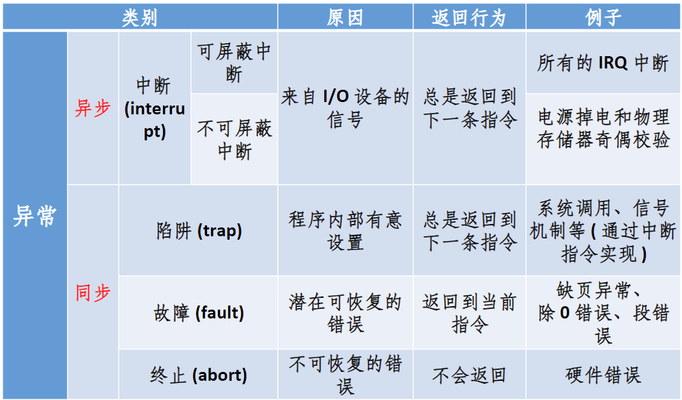
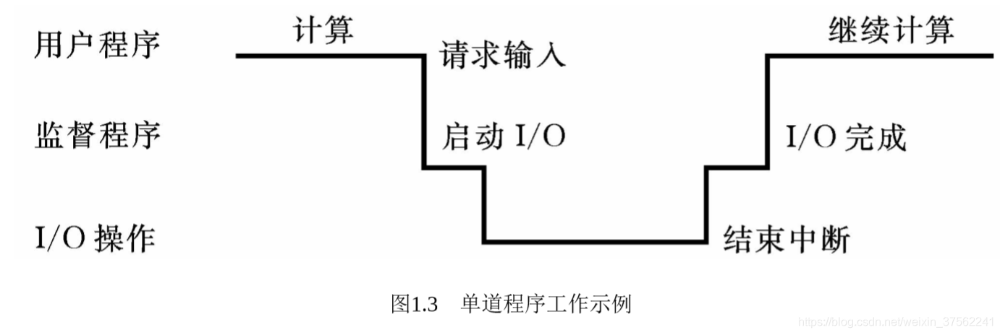
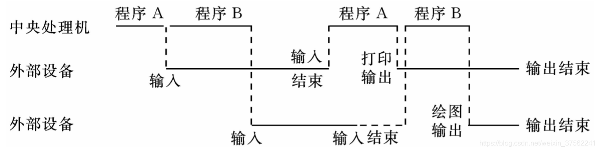

# 1-引论

> ### Week 1-2 :sweat_smile:

## 引言

### 操作系统的工作

+ 程序的加载与执行调度
+ 完成与硬件有关的工作
+ 完成与应用无关的工作
+ 计算机系统的效率与安全问题

> 多任务调度、进程调度、响应中断和管理外设（键盘、打印机etc）都是操作系统所做的工作，而具体的图像处理和数据库查询等是交由用户程序完成的。

## 第一章 操作系统引论

### 1.1 什么是操作系统

+ 操作系统定义：操作系统是一组**管理计算机硬件资源**的软件集合，它向计算机程序提供共性的服务。

  ​	1）**使用者**：用户与计算机硬件系统间的**接口**。

  ​	2）**资源管理者**：控制管理计算机系统中的各种软硬件资源，得到更有效利用。

  ​	3）改善系统**性能**。

+ **作用**：用户与硬件的接口；管理系统资源；对计算机资源的抽象。

+ **设计目标**：方便性（易学易用），有效性（提高计算机系统使用效率：资源利用率、吞吐量）

+ 自顶向下：抽象，eg文件系统

+ 自底向上：支持多用户多程序，资源竞争、复用，eg打印机

### 1.2 计算机硬件简介
+ 存储结构
+ 3级cache：L1->L3，读取时钟周期:arrow_up:，容量:arrow_up:
+ **磁盘**：柱面->磁道->扇区。**一个扇区512字节**  
+ I/O设备 总线
+ **计算**与**访存及IO速度**失配：计算快，访存及IO慢

### 1.3 操作系统的基本实现机制
1. **硬件中断与设备驱动**：设备控制器、设备驱动程序

  CPU快，I/O慢：忙等待、中断、DMA（Direct Memory Access）

2. **异常(exception): 陷阱(trap)和中断(interrupt)**

   + **中断**：就是**异步异常**，随时发生，与处理器执行内容**无关**，主要由I/O设备、处理器时钟或定时器等硬件产生。**软硬件均可产生**中断。

   + **同步异常**：某一特定指令执行的结果。在相同条件下，异常可以重现。例如内存访问错误、调试指令以及被零除。

   + **陷阱（trap）**是用户进程中某特定指令触发的一种**同步异常**，它会导致执行流程从用户态切换到内核态，以便执行某些由操作系统提供的服务。是**预期内（有意设置）**的，通常用于实现**系统调用**或调试功能。在相同条件下，异常可以重现。

   + **系统调用**视作同步异常，或陷阱(trap)。

   + 陷阱(trap)帧：完整的线程描述表的子集，用于现场保护

   + 陷阱处理程序处理少量事件，多数转交给其他的内核或执行体模块处理

     

3. **内存管理单元（MMU, Memory Management Unit）**：

   + 为多道程序的并发提供良好的环境

   + 便于用户使用存储器

   + 提高存储器利用率

   + 为尽量多的用户提供足够大的存储空间 

4. **系统调用（system call）：提供操作系统服务的编程接口。**
   是**用户态和内核态**之间的接口。用户程序通过系统调用来请求操作系统内核提供的通常受保护的服务，如文件操作、进程控制等。系统调用将用户进程的请求传达给内核，待内核处理完毕后再将结果送回给用户空间。

> x86平台中，Linux系统调用中断号是`int 0x80`； x64：`syscall`.

> 与函数调用的区别：a) 用户态到内核态，切换堆栈； b) 移植性差； c) 开销较大。
5. **Meltdown & Specture**:

   + **Meltdown**的根源是**CPU设计缺陷**，利用的是处理器的乱序执行功能，可在未被授权的情况下读取内存。

   + **Specture**利用处理器的投机执行机制，通过诱导处理器错误地执行某些指令，从而泄露其他程序的数据。Spectre更难修复，因为它涉及到处理器的核心性能特性。

   + Meltdown和spectre**可以通过升级操作系统来修复**（损失性能）

### 1.4 操作系统简史
+ 冯·诺依曼体系结构（**Princeton Architecture**）：指令和数据共同存储，访问彼此干扰，**存储程序**
+ **Harvard architecture**进行改进，将指令存储与数据存储分离（或增加指令Cache，与数据Cache独立）

#### 1.4.1 批处理系统：
> 批处理：把用户提交的作业成批送入计算机，由作业调度程序自动选择作业运行。

**批处理系统**：加载在计算机上的一个**系统软件**，在 它的控制下，计算机能够自动地、成批地处理一个或多个用户的作业（这作业包括程序、数据和命令）。

***目的***:
1. 缩短作业之间的交接时间
2. 减少处理机的空闲等待，提高系统效率

#### 1.4.2 联机批处理系统

**联机**：由CPU直接控制

**联机批处理**：由CPU直接控制作业流和I/O设备，作业从**输入机**读入**磁带**，依次把磁带上的用户作业读入**主机**内存并执行，然后把计算结果向**输出机**输出。完成一批再重复下一批。

**优点**：监督程序不停地处理各个作业，从而实现了作业到作业的自动转接，减少了作业建立时间和手工操作时间，有效克服了人机矛盾，提高了计算机的利用率。

**不足**：在作业输入和结果输出时，主机的高速CPU仍处于空闲状态，即等待慢速的输入/输出设备完成工作：此时主机处于“忙等”状态。

#### 1.4.3 脱机批处理系统

**特征**：增加一台不与主机直接相连而专门用于与输入/输出设备打交道的卫星机。

**卫星机功能**：（1）从输入机上读取用户作业并放到输入磁带上。（2）从输出磁带上读取执行结果并传给输出机。

**与联机批处理系统相比**，主机摆脱慢速I/O，系统处理能力显著提高。

**优势**：主机不直接与慢速的I/O设备打交道，而是与速度相对较快的磁带机发生关系，有效缓解了主机与设备的矛盾。主机与卫星机可并行工作，二者分工明确，可以发挥主机的高速计算能力。

**不足**：每次主机内存中仅存放一道作业，每当它运行期间发出I/O请求后，高速的CPU便处于等待低速的I/O完成状态，致使CPU空闲。

#### 1.4.4 多道程序系统
>**单道程序**：同一时间内存中只有一个程序。**多道程序**：内存空间中同时驻留多道程序。

+ 多道程序设计技术，就是指**允许多个程序同时进入内存并运行**（前提是内存放的下）。它们共享系统中的各种硬、软件资源。当一道程序因I/O请求而暂停运行时，CPU便立即转去运行另一道程序。
+ 多道程序设计技术不仅**使CPU得到充分利用**，同时也改善**I/O设备和内存的利用率**，从而提高了整个**系统的资源利用率和系统吞吐量**（即单位时间内处理作业（程序）的个数），最终提高了整个系统的效率。

**单道程序系统**：A工作完B才能工作，串行。$T=T_1+T_2$

**多道程序系统**：A、B两道程序同时存放在内存中，它们在系统的控制下，可相互穿插、交替地在CPU上运行。CPU和I/O设备都处于“忙”状态，大大提高了资源的利用率，从而也提高了系统效率。$T<<T_1+T_2$。

***运行时特点***：
1. **多道**：计算机内存中同时存放几道相互独立的程序；
2. **宏观上并行**：同时进入系统的几道程序都处于运行过程中，即它们先后开始了各自的运行，但都未运行完毕；
3. **微观上串行**：实际上，各道程序轮流地用CPU，并交替运行。

问题：连续内存中同时驻留多道程序；争夺处理机；分配I/O设备；如何有效组织不同程序运行；管理各种介质。

#### 1.4.5 多道*批*处理系统，1965s

**优点**：系统吞吐量大；资源利用率高。
**缺点**：平均周转时间长；不能提供交互作用能力（多用户）。 

#### 1.4.6 分时系统 appeared in 1957

**分时**：多个用户分享使用同一台计算机。多个程序分时共享硬件和软件资源。
**分时技术**：把处理机的运行时间分成很短的时间片（eg几百ms），按时间片轮流把处理机分配给各联机作业使用。
***特点***：

1. **多路性**。若干个用户同时使用一台计算机。**微观上**看是各用户**轮流**使用计算机；**宏观上**看是各用户**并行工作**。
2. **交互性**。用户可根据系统对请求的响应结果，进一步向系统提出新的请求。这种**能使用户与系统进行人机对话**的工作方式，明显地有别于批处理系统。因而，分时系统又被称为交互式系统。
3. **独立性**。用户之间可以**相互独立，互不干扰**。系统保证各用户程序运行的完整性，不会发生相互混淆或破坏现象。（书P11：好像只有自己独占计算机一样）
4. **及时性**。系统可对用户的输入**及时作出响应**。分时系统性能的主要指标之一是**响应时间**，它是指：从终端发出命令到系统予以应答所需的时间。（3s内）

> 选择题：设计分时操作系统时，首先应考虑系统的（交互性和响应时间）。

影响响应时间的因素：系统开销、用户数目、时间片、对换信息量、采用可重入代码、引入虚存减少对换

    典例：Multics/Unix（1968/1970），IBM VM 360/370（1966/1972）
    Multics - Multiplexed Information and Computing Service - FAILED
    Unix - Dennis Ritchie & Ken Thompson - 1983 图灵奖
    IBM 360 - Frederick Brooks - 提出瀑布模型 - 1999 图灵奖

> 在计算机系统发展中，网络带宽(Net bandwidth)增长最快。

> 分时系统与批处理系统相比，主要的开销是管理时间片的系统开销、管理多用户的系统开销、管理硬件的系统开销（引入了虚存）、交互IO的系统开销等等。

#### 1.4.7 分布式与嵌入式/系统，1990~2000

分两类(Tanenbaum, 1985):
+ **Network Operating System 网络操作系统，NOS**：在传统单机OS上加单独软件层，主要提供联网功能和资源的远程访问，实现多机互联。
+ **Distributed Operating System 分布式操作系统，DOS**：多台机器统一管理形成单一系统，相比网络操作系统，对用户和应用高度透明(看不到也不需要看到)。**透明性**：数据、执行、保护

+ 分布式系统：一体化，有一个全局的操作系统，有网络作为底层支持；比计算机网络**具有多机合作和健壮性**

#### 1.4.8 实时系统

***特点***：
+ **及时响应**，响应时间毫秒级
+ **高可靠性和安全性**
+ 系统的整体性强
+ 交互会话活动较弱
+ **专用系统**
+ 种类：实时信息处理、实时控制

### 1.5 操作系统的基本类型

批处理系统 分时系统 实时系统 混合型

### 1.6 操作系统的特征和功能

#### 1.6.1 操作系统的特征
并发、共享、虚拟、异步性（程序执行“停停走走”）

#### 1.6.2 操作系统的功能
1. **处理机管理**：进程控制，进程同步，进程通信，进程调度
2. **存储器管理（内存）**：内存分配、内存保护、内存扩充，地址影射
3. **设备管理**：I/O设备，人机界面。功能：缓冲管理，设备分配，设备处理，虚拟设备功能
4. **文件管理**：文件存储空间，目录，文件读写，文件保护，向用户提供接口
5. **作业控制**：作业调度，作业控制

**操作系统应解决的基本问题**：提供解决各种冲突（资源竞争引起）的策略，协调并发活动的关系，保证数据的一致性，实现数据的存取控制

### 1.7 操作系统结构

1. **模块接口**：高内聚低耦合。优点：加速研制、增加灵活性、便于维护；缺点：接口定义困难、无序性
2. **有序分层法**：自底向上法、自顶向下法
3. **虚拟机**：
   *基本思想*：1）多道程序；2）一个比裸机有更方便扩展界面的计算机
   *优缺点*：1）可实现完全保护；2）用软件从硬件逐层扩展；3）多道程序和扩充机器功能完全分开，简单灵活易维护；4）性能开销大。
4. **微内核结构**：只包括中断处理、进程通信（IPC）、基本调度等**不得不完成的功能**。
   文件系统、网络功能、内存管理、设备管理等作为服务(**放在用户态空间**)在微内核上运行。
   *优缺点*：内核易于实现、可移植性好、配置灵活、适应分布式环境。**速度慢**。
> L4、Mach 3.0、Minix属于微内核结构。

5. **机制与策略分开**：灵活、可扩展

### 1.8 目前常用操作系统的介绍
+ CP/M（Control Program Monitor）
+ Windows操作系统
+ UNIX操作系统
+ Linux操作系统

### 补充

1. **操作系统工作模式**：内核态(管态)，用户态(目态)，切换过程：通过异常(陷阱或中断)，进入内核态。
2. **操作系统内核**：是一个操作系统的核心。它负责管理系统的进程、内存、设备驱动程序、文件和网络系统，决定着系统的性能和稳定性。通过异常来陷入内核态。