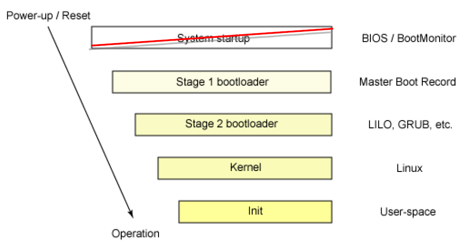
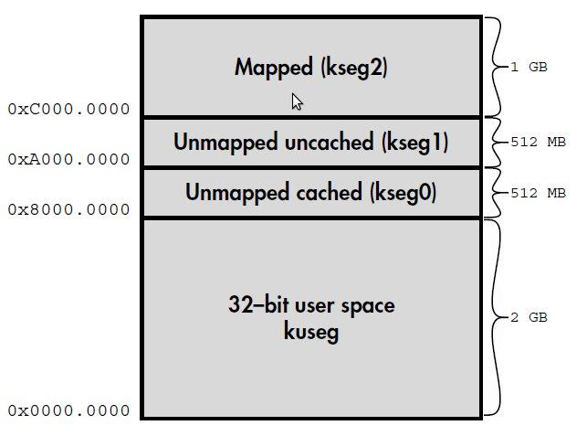
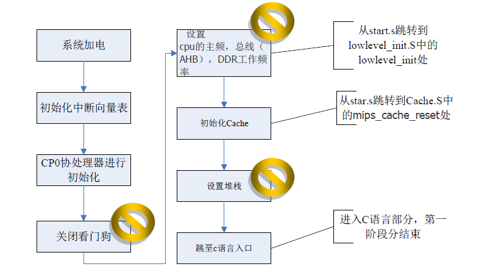
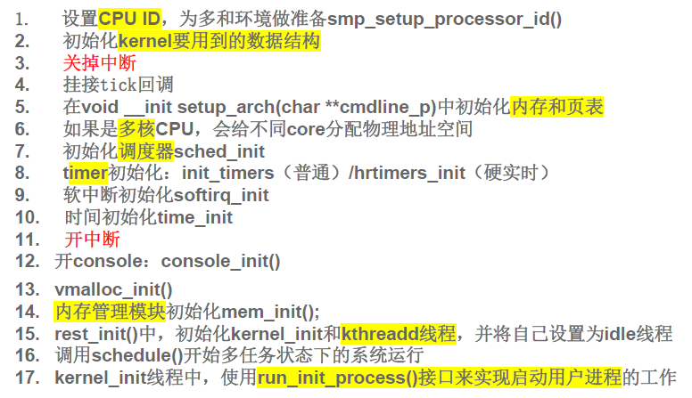
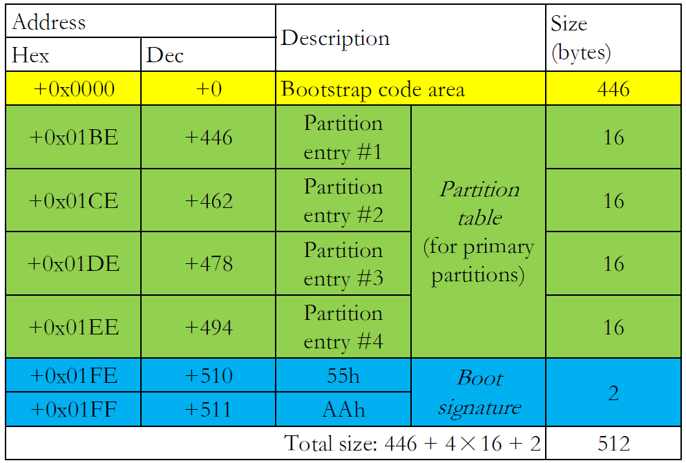
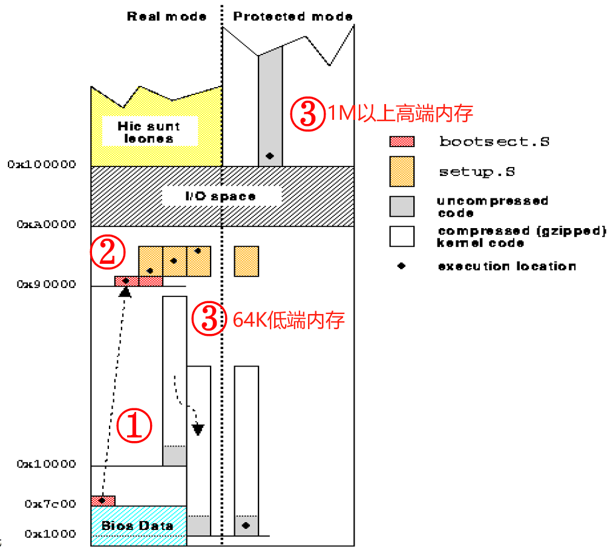

# 2-启动

# 第二章 启动及OS引导

>###  Week 3 :sweat:

## 2.1 开机第一个程序： BOOTLOADER

### 2.1.1 BOOTLOADER的作用和特点

英文： Bootstrapping （简称 boot）

- “纠结”：==计算机功能== 的 **多样性和灵活性** vs ==启动状态== 的 **单一性**
- 一方面：必须通过程序控制使得计算机进入特定工作状态；另一方面：程序必须运行在设置好工作模式的硬件环境上
- 因此：启动前硬件状态必须假设在一个最安全、通用，因此也是功能最弱的状态，需要**逐步设置硬件** ，以提升硬件环境能力。
- OS 启动是一个逐步释放系统**灵活性**的过程。

**Bootloader**：引导加载程序，是**系统加电后、操作系统内核运行前运行的第一段软件代码**

**Booter**：**初始化系统硬件**使之（部分）运行起来

**Loader**：将**操作系统映像**加载到内存中，并跳转到操作系统的代码运行

> [!CAUTION]
>
> Bootloader 的实现严重依赖于具体硬件，在嵌入式系统中**硬件配置千差万别**，所以**不可能**有一个Bootloader **支持所有的 CPU、所有的开发板** 。
>
> 即便是支持CPU架构较多的U-Boot，也不能拿来就用，**需要进行一些移植**。
>
> **但是bootloader可以支持不同CPU<u>架构</u>和不同<u>操作系统</u>**！

### 2.1.2 UBOOT（Universal Boot Loader）

- 优势：开放源码；支持多种嵌入式操作系统内核；支持多个处理器系列；可靠性稳定性；功能设置灵活；丰富的设备驱动源码；丰富的开发调试文档与网络技术支持

- 启动流程：
  - stage1：用**汇编语言**，**依赖于CPU体系**的代码（设备初始化等）
  - stage2：用**C语言**，实现复杂的功能，有**更好的可读性和移植性**

### 2.1.3 OS的启动过程

逐级引导、逐步释放灵活性

## 2.2 计算机的启动过程（MIPS）

### 2.2.1 MIPS 地址空间和启动入口地址

#### 1. MIPS的基本地址空间

在32位下，程序地址空间 （4GB）划分为四大区域，不同区域有不同的属性

- **kuseg**：是**用户态可用的地址**，在有MMU的机器里，一概被MMU作转换，除非MMU的设置被建立好，否则这2GB的地址不可用。

- **kseg0**：==最高位清零==即可映射到物理地址段`512M(0x00000000~0x1fffffff)`。“非转换的”地址区域，几乎全部对这段地址的存取**都会通过 cache**，因此 cache 设置好之前**不能随便使用这段地址**
  
  - **没有MMU的系统**：使用该段地址作为其绝大多数程序和数据的存放位置
  - **有 MMU 的系统**：操作系统**核心**会**存放在**这个区域
  
- **kseg1**：同kseg0，**高三位清零**可映射到**相应的物理地址**上，但kseg1是非cache存取的。

  > **kseg1是唯一在系统重启时能正常工作的地址空间**，MIPS平台外设IO空间通常映射到kseg1段

- **kseg2**：只能在核心态下使用并且**要经过MMU 的转换**（除非在写一个真正的操作系统，否则没有理由用kseg2）。出现kseg3时，强调kseg2可供运行在管理态的程序使用。

#### 2. MIPS ROM/Flash启动地址

- MIPS上电启动时，OS尚未接管系统，不能采用TLB、cache等机制，只能kseg1：**唯一**的在**系统重启时**能**正常工作**的内存映射地址空间

- MIPS 的**启动入口地址**是 `0xBFC00000`（对应物理地址是`0x1FC00000`），通过将最高三位清零，将ROM所在地址区映射到物理内存低端512M`（A0000000~BFFFFFFF & 1FFFFFFF = 00000000~1FFFFFFF）`，也是“非翻译无需转换的”（Unmapped）地址区域。

### 2.2.2 MIPS下的两阶段启动过程

#### MIPS 启动过程1

#### MIPS 启动过程2（C代码）

- 调用` board.c `中的函数 `board_init_f`做一系列初始化：**时钟、环境变量、串口速率**、串口、控制台、显示u-boot启动信息、**初始化内存**
- 上述完成后，进行**内存划分**，对**堆和栈初始化**，并留出u-boot代码大小的空间，把**代码从 flash 上搬到 ram 上**，继续执行（`relocate_code`）。
- 之后进入`board.c`的`board_init_r`函数，在这个函数里 **初始化 flash, pci 以及外设**（如网口），最后进入命令行或者直接**启动 Linux kernel**

### 2.2.3 MIPS下Linux系统引导过程

- Linux启动第一阶段`Head.s`

  - Bootloader将Linux内核映像**拷贝到RAM中**某空闲地址处，然后**将内核移到指定的物理地址处**，即内核取得控制权后执行的第一条指令的地址。
  - 从` /arch/mips/kernal/head.s `文件开始的。而此处正是**内核入口函数**`kernal_entry()`。它是体系结构相关的汇编语言，首先**初始化内核堆栈段** ，为创建系统中的第一个进程进行准备，接着用一段循环**将内核映像的未初始化数据段清零**，最后跳转到 `init/main.c`中的 `start_kernel()`**初始化硬件平台**相关的代码。

- Linux启动第二阶段`start_kernal`

  

## 2.3 计算机的启动过程（X86）

### 第一步 加载 BIOS

####  BIOS (Basic Input/Output System)

**BIOS 设置程序**：被**固化**到电脑主板上的**ROM 芯片**（只读存储器，断电后内容不丢失）中的**一组程序**，为电脑提供最底层、最直接的硬件设置和控制。通常与硬件系统集成在一起，又被称为**固件**。

系统上电或被重置时，处理器要执行**第一条指令**的地址会被定位到BIOS的存储器中，让初始化程序开始运行。跳转到**固定物理地址0xFFFF0**。

BIOS 中包含了 **CPU** 的相关信息、 **设备启动顺序**信息、 **硬盘**信息、**内存**信息 、 **时钟**信息、 **PnP 特性**等等。

- **硬件自检（Power-On Self-Test）**：**诊断功能**，保证重要硬件组件正常工作并初始化；保存**用户自定义设置数据**：时间、日期、硬盘细节
- **读取启动顺序（Boot Sequeue）**：让用户选择由哪个设备引导电脑
- 问题：**16~20**位实模式寻址能力，实现结构、可移植性

> BIOS的执行过程与操作系统无关

#### UEFI（Unified Extensible Firmware Interface，统一可扩展固件接口），2000

与BIOS区别：模块化、**C语言**风格，较BIOS更容易实现；运行于32或64位模式，突破BIOS的16位代码的**寻址能力**

### 第二步 读取 MBR

**MBR（Master Boot Record，主引导记录）：硬盘上第0磁头第0磁道第1个扇区**（固定的），大小512字节，存放了预启动信息、分区表信息。

- 前446字节：**启动代码及数据**
- 第447-510字节（64字节）：**分区表（DPT, Disk Partition Table）**，4个16字节的分区项，记录了启动时需要的分区参数
- 紧接两个字节`AA`和`55`：**幻数（Magic Number）**，BIOS读取MBR时若无这两个幻数，则认为是没有被分区的硬盘。

MBR只能有**4个主分区**，**系统必须装在主分区上面**。

硬盘分区有三种：主磁盘分区、扩展磁盘分区、逻辑分区

**主分区至少1个**，最多4个；**扩展分区**可以没有，**最多1个**；主+扩展不超过4个；逻辑分区可若干。**主分区只能有1个是激活的**（active），其余为inactive

### 第三步 Boot Loader

Boot Loader：操作系统内核运行前运行的小程序，可以**初始化硬件设备、建立内存空间的映射图**，将系统软硬件环境带到合适状态，最终调用操作系统内核。也可称为操作系统内核加载器（OS kernal loader）

**GRUB（GRand Unified Bootloader）和 LILO（Linux Loader）**最重要的 Linux 加载器。

- LILO：优点：快速启动安装在主启动记录中的Linux操作系统；局限：**LILO配置文件被反复更改时，MBR也要反复重写**，可能发生错误，使系统无法引导。
- GRUB：有交互式命令界面，支持网络引导，配置文件错误默认转到命令行界面
- GRUB磁盘引导过程：
  - stage1：BIOS读取MBR
  - stage1.5：识别各种不同的文件系统格式
  - stage2：加载系统引导菜单，加载内核映像和RAM磁盘initrd（可选）
- 运行主引导程序

> [!NOTE]
>
> MBR存放在**整个硬盘**的**第一个扇区**，Boot Sector是硬盘上**每个分区**的**第一个扇区**

Kernal Image：资源管理、用户服务

### 第四步 加载内核

根据 grub 设定的内核映像所在路径，系统读取内存映像，并进行解压缩操作。系统将解后的内核放置在内存之中，初始化函数并初始化各种设备，完成 Linux 核心环境的建立。

加载过程：不断装载下一段可执行代码：扇区拷贝、支持文件系统、设置内存、解压缩、切换CPU模式

- Bootsect.s -> Setup的入口点（PPT-67）
- Setup.S：初始化硬件设备，为内核程序的执行建立环境，-> ... -> Head.S
- Head.S
- 调用Start_kernal()

==至此，Linux 内核已经建立起来了，基于 Linux 的程序应该可以正常运行了==

### 第五步 用户层init依据inittab文件来设定运行等级

内核被加载后，第一个运行的程序是`/sbin/init`，该文件会读取`/etc/inittab`文件，依据此文件来进行初始化工作。inittab主要是设定Linux的运行等级：`id:5:initdefault:`。

等级0~6，0关机，6重启，5为有网络支持有X-Windows支持的多用户模式。

### 第六步  init进程执行rc.sysinit

在设定了运行等级后，Linux 系统执行的第一个**用户层文件**就是`/etc/rc.d/rc.sysinit`脚本程序，工作包括设定 PATH、设定网络配置etc/sysconfig/network、 启动 swap 分区、设定 /proc 等等 。

### 第七步  启动内核模块

一句`/etc/modules.conf`或`/etc/modules.d`目录下的文件来装载内核模块

### 第八步  执行不同运行级别的脚本程序

系统会运行`rc0.d`到`rc6.d`中的相应的脚本程序来完成相应的初始化工作和启动相应的服务 。

### 第九步  执行etc/rc.d/rc.local

`rc.local`就是在一切初始化工作后Linux留给用户进行个性化的地方。你可以把你想设置和启动的东西放到这里 。

### 第十步  执行/bin/login程序，进入登录状态

用户输入username和password，登入系统