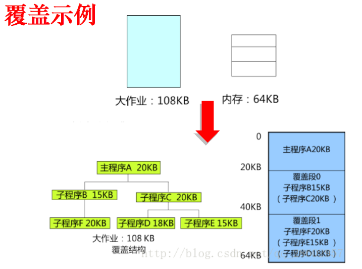

# 第三章 内存管理

# 3.1 存储管理基础

> ### Week 3 :stuck_out_tongue_winking_eye:

[TOC]

## 3.1.1 程序的链接与加载

### 一、程序的链接与加载

#### 1. 过程原理分析

一个程序本质上由bss段、data段、text段组成。

- **bss段（Block Started by Symbol）**：存放程序中**未初始化的全局变量**。bss段属于静态内存分配
- **data段（数据段）**：存放程序中**已初始化的全局变量**。数据段属于静态内存分配
- **text段（代码段）**：存放程序执行代码的一块内存区域。大小在程序运行前就已经确定，通常只读，也可能包含字符串常量等只读的常数变量。

##### （1）ELF文件格式

**ELF（Executable and Linkable Format）**：可执行和链接格式

##### （2）链接

##### （3）加载

进程地址映射问题（以32位Linux为例）

**进程的逻辑空间**：内核虚存（是用户不可见的进程空间，由OS使用）+ 进程虚存（用户可见的进程逻辑空间：程序、数据、堆栈）

使用分段或分页实现加载

程序以段加载：代码段和数据段都在segment中，一个segment在**文件中**的大小**小于等于**其在**内存中**的大小。若“小于”，在载入内存时通过**补零**使其达到其在内存中应有的大小（lab1）

程序的装载流程：

- 读取魔数（0x7f,E,L,F）以确认文件确实是ELF文件
- 找到段表项（在头部给出信息找到每一个段表项）
- 解析各个段应当被加载的虚地址、文件中的偏移、在内存中的大小和在文件中的大小
- 对于每一个段，根据其在内存中的大小，为其分配足够的物理页，并映射到指定的虚地址上。再将文件中的内容拷贝到内存中。
- 若MemSize > FileSize，用0填充
- 设置进程控制块中的PC为ELF文件中记载的入口地址
- 控制权交给进程开始执行

加载后，text和data段都在可执行文件中，从可执行文件中加载；而**bss不在，由系统初始化**。

**栈 （stack）**：存放、交换临时数据的内存区。存放局部变量，但不存放static声明的变量。**static意味着在数据段中存放变量**。调用函数结束后，函数返回值会被存放回栈中

**堆（heap）**：存放进程运行中动态分配的内存段

#### 2. C程序实例分析（MIPS）

gcc调用包含的工具： cc1 - 预处理器和编译器；as - 汇编器；collect2 - 链接器

##### （1）符号表和重定位表

用objdump反汇编ELF文件：偏移、机器码、汇编指令

函数调用在汇编文件里就是jal指令

##### （2）链接

- 编译：.c -> .o

  编译时函数定义在不同文件，无法知道地址：

  	- E 重定位目标文件
  	- U 未解析符号
  	- D 已定义符号

- 链接的过程：将.o文件链接到一起，形成最终的可执行文件

  - 扫描各个目标文件，将之前未填写的地址写上，生成一个真正可执行的文件

- 重定位：将之前未填写的地址填写的过程

##### （3）加载

执行程序的过程：

- shell 调用` fork() `系统调用，创建出一个子进程（装载前）
- 子进程调用 `execve()` 加载 program（装载工作）

实际的处理动作在`do_execve()`

> 地址空间：源程序经过编译后得到的目标程序，存在于它所限定的地址范围内。逻辑地址的集合——现代计算机中CPU访问内存所使用的地址
>
> 存储空间：主存中一系列存储信息的物理单元的集合。物理地址的集合

## 3.1.2 存储器硬件发展

存储器的发展方向：

- 用户角度：高速、大容量和小体积。
- 资源管理角度：为多用户提供服务，效率、利用率、能耗

在访问速度方面的发展：DRAM SDRAM SRAM；在大容量方面的发展：接口标准、存储密度等

SRAM（静态）：快，贵，容量小——构成高速缓存的基本存储器件

DRAM（动态）：慢，集成度高，便宜，容量大

存储组织：在存储技术和 CPU 寻址技术许可的范围内组织合理的存储结构。其依据是访问速度匹配关系、容量要求和价格。

最佳状态：各层次的存储器都处于均衡的繁忙状态

## 3.1.3 存储管理的目标

研究对象：以**内存**为中心的存储资源

用户角度（程序员）：容量大；速度快（性能）；**独立拥有，不受干扰**（安全）

资源管理角度：**为多用户提供服务**；效率、利用率、能耗

> [!IMPORTANT]
>
> 存储管理的基石：
>
> - **地址独立**（程序发出的地址与物理地址无关）
> - **地址保护**（一个程序不能访问另一个程序的地址空间）

存储管理要解决的问题：**分配和回收**

> 从内存管理的角度看，一个程序成功加载到内存，如果没有足够的内存可以分配，该程序也不一定能够成功运行。

## 3.1.4 存储器分配方法

存储分配三种方式：

**直接指定**：程序员在编程序时，或编译程序（汇编程序）对源程序进行编译（汇编）时，所用的是实际地址。

**静态分配**：程序员编程时，或由编译程序产生的目的程序，均可从其地址空间的零地址开始；当==装配程序对其进行连接装入时才确定它们在主存中的地址==。

**动态分配**：==作业在存储空间中的位置，在其装入时确定==，在其执行过程中可根据需要申请附加的存储空间，而且一个作业已占用的部分区域不再需要时，可以要求归还给系统。

### 单道程序的内存管理

条件：此时，整个内存里只有2个程序：1个用户程序和操作系统，操作系统所占空间固定，因此用户程序永远从同一地方开始运行。

结论：**用户程序的地址在运行之前可以计算。**

方法：**静态地址翻译**，在程序运行之前就计算出所有物理地址，由加载器实现。

- 优点：执行时无需地址翻译，程序运行速度快
- 缺点：比物理内存大的程序无法加载，因而无法运行；小程序空间浪费，I/O时间长造成资源浪费

### 多道程序的内存管理

空间分配：==分区（partition）式分配==，每个应用程序占一个或多个分区。操作系统占用其中一个分区。

适用于多道程序系统和分时系统，支持多个程序并发执行，**但难以进行内存分区的共享。**

#### 固定式分区

把内存划分为若干个固定大小的连续分区。——==程序适应分区==

- 分区大小相等：只适合于**多个相同程序**的并发执行
- 分区大小不等：多个小分区、适量中等分区、少量大分区。根据程序的大小，分配当前**空闲的、适当大小**的分区。

单一队列分配方式：当需要加载程序时，选择一个当前闲置且容量足够大的分区进行加载，可采用共享队列的固定分区（**多个用户程序排在一个共同的队列里面**等待分区）分配。

多队列分配方式：**给每个分区一个队列**，程序按照大小排在相应的队列里（以防一个小程序占用一个大分区，使得大程序无法加载）。

固定式分区管理，

- 优点：易于实现，开销小

- 缺点：**内碎片**造成浪费，分区总数固定，限制了并发执行的程序数目

- 采用的数据结构：分区表——记录分区的大小和使用情况

  

#### 可变式分区

分区的边界可以移动，即分区的大小可变。——==分区适应程序==

- 优点：没有内碎片
- 缺点：有外碎片

跟踪内存（管理闲置空间）的办法：**位图表示法（分区表）、链表表示法（分区链表）**

- 位图表示法：给每个分配单元赋予一个字位（0/1），用来记录该分配单元是否闲置。
  - 空间成本固定，时间成本低
  - 没有容错能力：若一个分配单元为1，不能肯定是1还是因错误变成1
- 链表表示法：将分配单元按照是否闲置链接起来。
  - 空间成本取决于程序数量，时间成本高（链表增删改遍历）
  - 有一定容错：链表有被占空间和闲置空间的表项，可以相互验证

内存分配采用两张表：已分配分区表和未分配分区表。每张表表项为存储控制块 MCB（Memory Control Block），包括 AMCB（Allocated）和 FMCB（Free）

> 分配内存：
>
> - 事先规定 size 是不再切割的剩余分区的大小。
> - 设请求的分区大小为 u.size ，空闲分区的大小为 m.size 。
> - 若 $m.size-u.size≤size$ ，将整个分区分配给请求者。
> - 否则，从该分区中按请求的大小划分出一块内存空间分配出去，余下的部分仍留在空闲分区表/链中。（意思就是留下的部分大小不能小于size）

##### 基于顺序搜索的匹配算法

> 一般只是适合于较小的系统

1. **首次适应（First Fit）**：所有空白区按地址**递增顺序连在一起**，分配存储区域时从**始端**查找，选择**第一个满足请求的**空白块
   - 优点：分配和释放时间性能好，较大空闲分区保留在内存高端
   - 缺点：随着内存不断分配，会产生很多小分区，查找空闲分区的开销增大
2. **下次适应（Next Fit）**：空白区构成**循环链**，**总是从上次查找结束的地方开始**，找到满足要求的就划分出去。
   - 不致使小的空闲区集中在存储区的一端，但会导致**缺乏大的空闲分区**
3. **最佳适应（Best Fit）**：容量递增次序排列，寻找最接近于作业要求的存储区域
   - **保留了大的空闲分区**，但留下**许多难以利用的小空闲区**（碎片）
4. **最坏适应（Worst Fit）**：容量递减次序排列，寻找最大的空白区
   - 分给作业后剩下的空闲分区较大，**可装下其他作业**；但**大作业的存储空间申请往往得不到满足**

> [!CAUTION]
>
> 1. 内存分配和释放平均时间之和最大的是**最佳适应算法**
> 2. 可变分区又称为动态分区，它是在系统运行过程中**在作业装入**时动态建立的（2024 OS期中选择题）

回收空白分区时需要进行分区合并，系统开销大。

##### 基于索引搜索的匹配算法

> 用于大中型系统

- **快速适应算法（分类搜索法）**：空闲分区**按容量大小分类**，**常用长度**设立单独空闲区链表，系统为多个空闲链表设立一张**管理索引表**
  
  - **优点**：查找效率高，仅需要根据程序的长度，寻找到能容纳它的最小空闲区链表，取下第一块进行分配即可。保留大的分区，不会产生内存碎片
  - **缺点**：分区归还主存时算法复杂，系统开销较大；一个分区只属于一个进程，浪费。空间换时间。
  
- **伙伴系统（buddy system，Linux）**：介于固定分区和可变分区之间。分配存储块时将大的**分裂成的**两个等大小块，称为伙伴。
  
  > 并不是任意2个相同大小的内存块都称为“伙伴”
  
  - *大小均为2的k次幂，分配时向上取整次幂，找不到则分配更大的并分裂。*
  - *内存回收的时候，首先考虑将被释放的块**与其伙伴**（如果空闲的话）合并成一个大的空闲块，合并后的块再与其伙伴合并，直至不能再合并*
  - *速度快，但内部碎片严重。*

##### 紧凑技术

- 内部碎片：**分配给作业的存储空间中**未被利用的部分。无法被整理，已经被分配出去了，只是未被利用。固定分区存储管理会出现，作业完成后会释放
- 外部碎片：**系统中**无法利用的小的空闲分区，**是内存系统性能下降的主要原因**。消除方法：紧凑技术。动态分区管理会产生。
- **紧凑技术（Compaction）**：通过移动作业把多个分散的小分区拼接成一个大分区
  - 目标：消除外部碎片，使多个小空闲区连成大空闲区
  - 紧凑时机：**找不到**足够大的空闲分区且总空闲分区容量可以**满足作业要求**
  - ==实现支撑：动态重定位==，修改或变换作业地址

#### 多重分区

多重分区分配：一个作业由相对独立的程序段和数据段组成，将这些片断**分别装入**到存储空间中不同的区域内的分配方式。

分区的存储保护：防止一个作业破坏操作系统或其他作业。方法：

- 界限寄存器：上下界寄存器方法；基址、限长寄存器方法
- 存储保护键（每个存储块上锁（保护键），每个作业给一把钥匙（同样赋予保护键），运行时检查是否匹配）

> [!TIP]
>
> 多道程序环境下，**程序成型时可能需要更多空间**，怎么办？——覆盖与交换，扩充内存

- **覆盖**（Overlay，早期）：
  - 一个程序划分为一系列功能独立的程序段，执行时**不要求同时装入**内存的程序段组成一组覆盖段，**共享主存的一个区域**。
  - **程序员要向系统指明覆盖结构**，**对用户不透明**，增加负担。

- **交换**（Swapping，现代）：把暂时不用的程序及其数据的部分或全部**从主存移到辅存，腾出必要的存储空间**；再把指定程序或数据**从辅存读到相应的主存中**，并将控制转给它，让其在系统上运行。
  - 优点：增加并发运行的程序数目，并且给用户提供适当的响应时间；编写程序时不影响程序结构
  - 缺点：对换入和换出的控制增加处理机开销；程序整个地址空间都进行传送，没有考虑执行过程中地址访问的统计特性。

覆盖与交换的区别：

|                      覆盖                      |                          交换                          |
| :--------------------------------------------: | :----------------------------------------------------: |
|                 大作业，小内存                 |                     多作业，小内存                     |
|            减少一个程序运行所需空间            |           让整个程序暂存于外存，让出内存空间           |
| 由程序员实现，操作系统据此完成程序段之间的覆盖 | 不要求程序员给出程序段之间的覆盖结构。**对程序员透明** |
|            主要对同一作业或程序进行            |                主要在作业或程序之间进行                |
