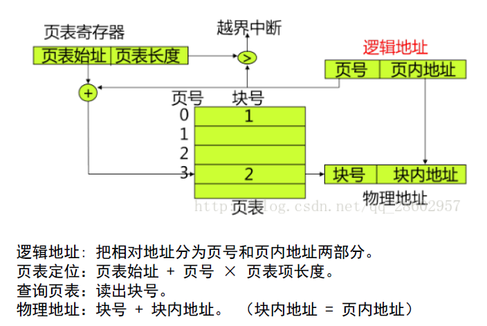
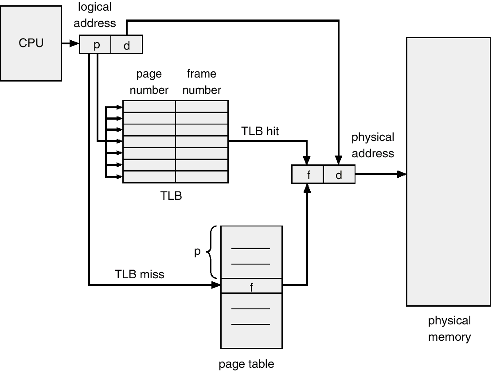
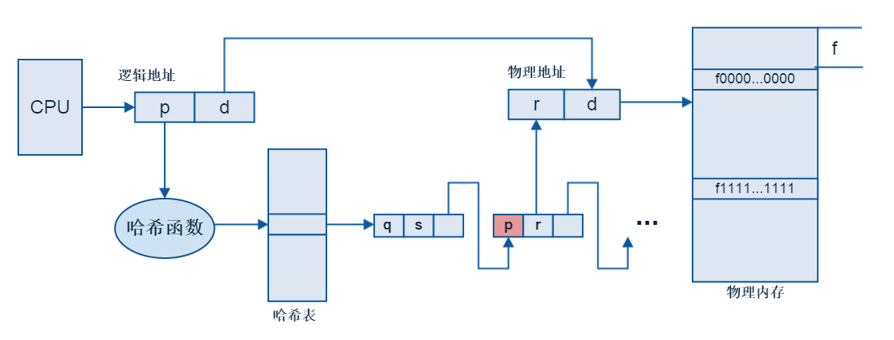
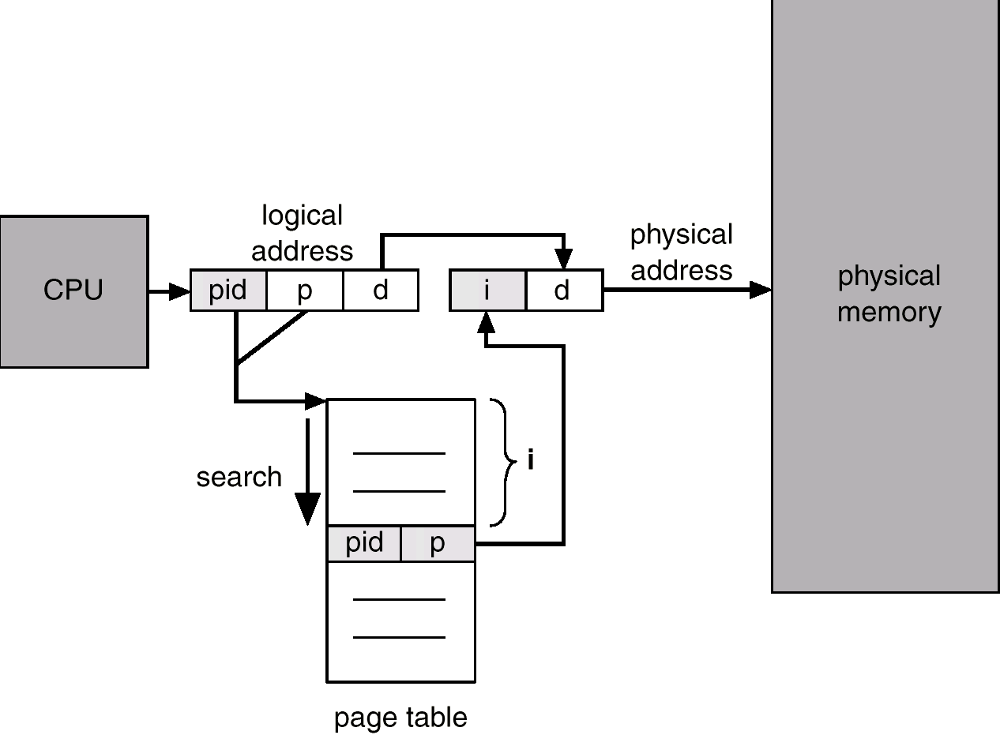

# 第三章 内存管理

# 3.2 页式内存管理

> ### Week 4 :sweat:

## 3.2.1 回顾存储管理概要

- **程序**：静止的，存放在磁盘上的可执行文件
- **进程**：动态的，包括程序和程序处理对象（程序集），是一个程序对某个数据集的执行过程，**是分配资源的基本单位。**分类：
  - **系统进程**：完成操作系统功能的进程
  - **用户进程**：完成用户功能的进程
- **作业**：用户需要计算机完成的某项任务，是要求计算机所做工作的集合
- 程序与进程的区别

|                         进程                         |                程序                |
| :--------------------------------------------------: | :--------------------------------: |
| 是竞争计算机系统有限资源的基本单位，更能真实描述并发 |                不能                |
|     是程序在处理机上一次执行的过程，是动态的概念     |            是静态的概念            |
|          有生存周期，有诞生有消亡，是短暂的          |            是相对长久的            |
|               一个进程可以运行多个程序               | 一个程序可以作为多个进程的运行程序 |
|                具有创建其他进程的功能                |                没有                |

- 作业与进程的区别

|                            作业                            |                        进程                        |
| :--------------------------------------------------------: | :------------------------------------------------: |
|            要经过提交、收容、执行、完成4个阶段             | 是对已提交程序所执行过程的描述，资源分配的基本单位 |
| 是**用户向计算机提交任务的任务实体**，可能在外存中等待执行 |   是完成用户任务的执行实体，总有相应部分在内存中   |
|      一个作业可由**多个**且必须由**至少一个进程组成**      |                     反之不成立                     |
|                    主要用在批处理系统中                    |            用在几乎所有的多道程序系统中            |

- 三者联系
  - 一个作业通常包括**程序、数据和操作说明书**3部分
  - 每一个进程由**进程控制块PCB、程序和数据集合**组成
  - 说明程序是进程的一部分，是进程的实体。一个作业可划分为若干进程来完成，每个进程有其实体——程序和数据集合。

## 3.2.2 页式内存基本思想

- 把**逻辑地址连续**的程序分散存放到**若干不连续的内存区域**内，并保证程序正确执行：既充分利用内存空间，又减少移动带来的开销。

## 3.2.3 基本概念

### 页、页框、页表

- **页（面）（page）**：每个==作业==的地址空间分成一些**大小相等的片**，从0开始编号
- **页框（frame）**：把==主存==的存储空间分成**与页相同大小的片**，这些片称作存储块或页框，从0开始编号
- **页表**：**每个进程一张**，进程**逻辑地址空间**中的每一页在页表中都对应一个页表项
  - 存放**在内存中**，属于进程的**现场信息**
  - 用途：记录进程的**内存分配情况**，实现进程运行时的**动态重定位**
  - ==访问一个数据需访问内存**2次**：页表1次，内存1次==
  - 页表的**基址**和**长度**由**页表寄存器**给出

### 地址变换

- 已知逻辑地址$A$求页号$P$和页内地址$d$：$P=\lfloor\frac{A}{L}\rfloor,\;d=A\;mod\;L$​
- 分页的数据结构
  - **进程页表**：每个进程一个，描述该进程占用的**物理页面**和**逻辑排列顺序**
  - **物理页框表**：整个系统一个，描述**物理内存空间的分配使用状况**
  - **请求表**：整个系统一个，描述系统内各个**进程页表的位置和大小**，用于地址转换，也可以结合到各进程的PCB里

- 上图解释：逻辑地址分为页号和页内地址；**页号>=页表长度则越界中断**；页表定位方法如图计算，得到该表项在页表中的位置；将得到的物理**块号**装入物理地址寄存器中，页内地址即块内地址。
- **纯分页系统**（基本分页存储管理方式）：**不具备页面对换功能、不支持虚拟存储器功能**的分页存储管理方式。调度作业时必须**把所有页一次装到主存的页框内**，若页框数不足则等待，系统调度其他作业
  
  - > 纯分页系统也支持多级页表！只不过不能动态装入页面了，多级页表纯属浪费时间，不省空间
  - 优点：没有外碎片，每个内碎片不超过页大小；一个程序不必连续存放；便于改变程序占用空间的大小。
  - 缺点：程序全部装入内存。
  
- 现代OS常用4KB页面大小
- **页面小**：

  - 减少页内碎片和总的内存碎片，有利于提高内存利用率
  - 但页面数增多，页表长度增加，占用内存多
  - 页面换进换出速度降低。

- 页面大则反之。
- ==一级页表的问题：逻辑地址空间很大，则页表就很大，占用存储空间大。==
- 解决问题的方法：
  - **动态调入**页表：只将当前需用的部分页表项调入内存，其余的用时在调入
  - **多级页表**

### 多级页表

- 32位，4KB页面大小，4MB页表
- 多级页表结构中，指令所给出的地址除偏移地址之外的各部分全是各级页表的页表号或页号，而**各级页表中记录的全是物理页号** ，指向下级页表或真正的被访问页。
- 指令给出的地址：一级页表号 + 二级页表号 + 偏移地址

> 多级页表会采用动态调入机制，有一些页表在不需要的时候不调入内存，解决了页表占用大量内存的问题
>
> 本质：用时间换空间

### 快表（Translation Lookaside Buffer，TLB）

- 又称联想存储器，是一种特殊的cache（页表的cache），只包括页表中的一小部分条目（64~1024）。若满，则替换（LRU）。允许有些条目固定下来**（通常内核代码的条目）**
- 部分TLB保存地址空间标识码（ASID，Address Space Identifier），允许TLB同时包含多个进程的条目，确保当前运行进程的ASID与虚拟页相关的ASID相匹配
- 有效内存访问时间：$EAT = (\tau+ε )*α+(2τ+ε)*(1-α) = 2τ + ε-τα$

## 3.2.4 页表类型

### 哈希页表

处理超过32位地址空间的常用方法，用虚拟页码作为哈希值。哈希页表每条目都包括一个链表的元素，这些元素哈希成同一位置（要处理器碰撞）。每个元素有3个域：

- 虚拟页码
- 所映射帧号
- 指向链表中下一元素的指针

该算法按照如下方式工作：虚拟地址中的**虚拟页号转换为哈希表号**，用虚拟页号与链表中的每一个元素的第一个域相比较。如果匹配，那么相应的**帧号（第二个域）就用来形成物理地址**，如果不匹配，那么就对链表中的下一个节点进行比较，以寻找一个匹配的页号。

### 反置页表

依据该进程在内存中的**物理页面号**（而非逻辑页号）来组织，表项内容：逻辑页号**P** + 隶属进程标志符**pid**

反置页表的**大小只与物理内存的大小相关，与逻辑空间大小和进程数无关**。

地址变换时，**用pid和P检索反置页表**。若未找到，请求调页中断/出错；若检索到，则**表项序号i就是该页物理块号**，其与页内地址构成物理地址。

优点：页表占用的内存空间小，64MB主存，页面大小4KB，页表项4B，反向页表仅需64KB

缺点：

- 按照物理地址排序，查找依据虚拟地址，所以可能需要查找整个表来寻找匹配（查找速度慢）
  - 查找时，可用哈希页表或TLB来改善

- ==采用反向页表的系统**很难**共享内存 ，因为每个物理帧只对应一个虚拟页条目。==

## 3.2.5 页共享

页的保护：

- 页式存储管理系统提供2种方式：
  - 地址越界保护
  - 在页表中设置保护位（定义操作权限：只读、读写、执行等）

共享数据可能和不共享数据划在同一块中，不易保密。

实现数据共享最好的方法：分段存储管理

> **共享内存一般通过多个虚拟页指向同一物理页来实现**

> ###### 在请求式分页管理中，如果一个页表项的Valid标志位是0，说明：（多选）ACD
>
> A. 还未给相应页面分配物理页框
>
> B. 相应页面的内容已经装入内存
>
> C. 访问该页内容时，系统将会产生缺页异常
>
> D. 相应页的内容可能存储在磁盘上
