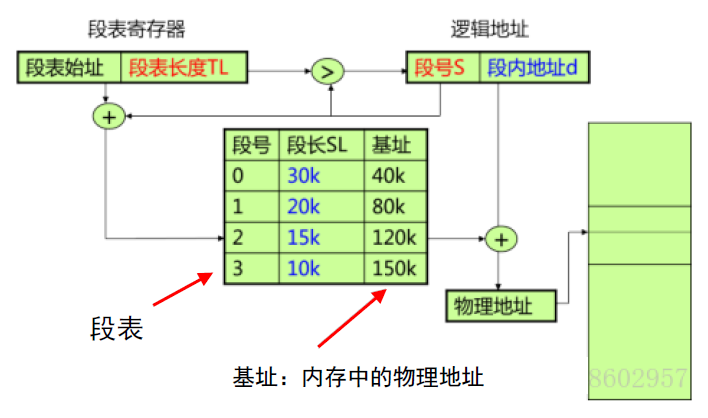
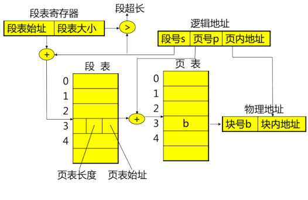

# 第三章 内存管理

# 3.3 段式内存管理

> ### Week 4 :crying_cat_face:

## 3.3.1 基本原理

- 段式存储管理的目标
  - **方便编程**：一个作业由多个**程序段和数据段**组成，用户按逻辑关系对作业分段
  - **信息共享**：共享以信息的**逻辑单位**为基础。
    
    - 页（一维）是存储信息的物理单位，段是信息的逻辑单位
    - 页式管理中地址空间是一维的，子程序都顺序排列，共享公用子程序比较困难，共享过程需要太多页面
  - **信息保护**：**以信息的逻辑单位进行保护**
  - **动态增长**：段不断增长，前面的存储管理方法都难以实现
  - 我不熟的——**动态链接**：程序运行时才把主程序和目标程序（程序段）链接起来
    
    > 基于动态链接实现共享库函数的优点有：（多选）ABC
    >
    > A. 减少可执行程序的文件大小
    >
    > B. 节约运行时所需的内存
    >
    > C. 便于库函数的升级维护
    >
    > D. 提高程序的运行效率——段式内存实现的动态链接会让访问库函数增加一次访问段表的开销
- 分段的两维地址空间
  - 每个作业由分段构成，有自己名字（usually 段号）、**一段连续的地址空间、首地址0**
  - 一个段可以定义为一组**逻辑信息**

## 3.3.2 地址变换

- 分段的地址结构

  - 分段的**逻辑地址：段号 + 段内地址**
  - **段表**：记录了段与内存位置的对应关系；保存在**内存**中。
  - **段表寄存器**：给出段表的基址及长度
  - ==访问一个字节的数据/指令**需要访问内存2次**（段表1次，内存1次）==

- 地址变换机构

  

- 地址变换过程：

  1. 系统将逻辑地址中的**段号S**与**段表长度TL**进行比较
     - 若S>TL，产生越界中断信号
     - 否则根据**段表始址和段号**计算对应段表项的位置，从中读出该段在内存的始址。
  2. 再检查**段内地址d**是否超过该段**段长SL**，超过则越界中断，否则**物理地址=基址+段内地址d**

## 3.3.3 段共享

信息共享：共享时，可重入代码（不需任何进程对其进行修改，允许多个进程同时访问的代码）只需加载一次

> 1. 即使只有一个用户进程，使用不可重入代码也可能是不安全的（还有一个一直在运行的操作系统内核进程）
> 2. 可重入代码中一般不能使用全局和静态变量
> 3. 在多道程序下，共享可重入代码可以减少程序对内存的占用

- 分段管理的**优点**：
  - 易于**共享**，对段的**保护**十分简单

- **缺点**：
  - 地址变换**花费时间**，要为表格提供附加**存储空间**；
  - 为满足分段的动态增长和减少外部碎片，需要采取**拼接**手段；
  - 在辅存中管理不定长度的分段困难多
  - 分段的最大尺寸受主存可用空间的限制

## 3.3.4 与页式管理优缺点对比

|              |                         页式存储管理                         |                       段式存储管理                       |
| :----------: | :----------------------------------------------------------: | :------------------------------------------------------: |
|     目的     |                 实现非连续分配，解决碎片问题                 |                     更好满足用户需要                     |
|   信息单位   |                      页（**物理单位**）                      |                    段（**逻辑单位**）                    |
|     大小     |                       固定（由系统定）                       |                   不定（由用户程序定）                   |
| 内存分配单位 |                              页                              |                            段                            |
| 作业地址空间 |                  一维：根据程序空间连续编址                  | 二维：一个程序拆分成各段，独立编址（各段都从零开始编址） |
|     优点     | 有效解决碎片问题（无外碎片，内碎片不超过页大小）；有效提高内存利用率；程序不必连续存放 |   更好实现数据共享与保护；段长可动态增长；便于动态链接   |

## 3.3.5 段页式管理

- 进程拥有段页式特性

- **基本思想**：用分段方法来分配和管理*虚拟存储器*，而用分页方法来分配和管理*实存储器*。
- 实现原理
  - 分段和分页管理的结合：把用户程序分为若干段、为每个段赋段名，再把每个段分成若干页
  - 地址结构：**<u>段号S + 段内页号P + 页内地址（偏移）W</u>**
  - 读一字节的指令或数据要访问内存3次。可设cache以提高执行速度。
  - **每个进程一张段表，每个段一张页表**

- 段页式存储管理的地址变换

  

实例：x86的段页式地址映射

- 分为两个部分：

  - 段映射机制：将逻辑地址映射到线性地址；
  - 页映射机制：将线性地址映射到物理地址

- x86的**控制存储器**（CR0~CR3）用于控制和确定处理器的操作模式及当前执行任务的特性

  - CR0含有控制处理器操作模式和状态的系统控制标志；
  - CR1保留不用；
  - CR2含有导致页错误的线性地址；
  - CR3中含有页目录表物理内存基地址，因此该寄存器也被称为**页目录基地址寄存器PDBR**

- STAGE 1：段式地址映射

  - 段映射机制，逻辑地址映射为线性地址
  - **GDT（Global Descriptor Table）：全局描述符表**，是全局性的，为所有的任务服务，不管是内核程序还是用户程序，我们都是把段描述符放在 GDT 中。
  - **LDT（Local Descriptor Table）：局部描述符表** ，为了有效实施任务间的隔离，处理器建议每个任务都应该有自己的描述符表，并且把专属于这个任务的那些段描述符放到 LDT 中。

  > 在Intel x86下从段式地址到线性地址的转换中需要查找的对象可能是：GDT和LDT

  过程：

  1. 根据指令的性质来确定应该使用哪一个 **段寄存器**（Segment Selector），例如转移指令中的地址在代码段，而取数据指令中的地址在数据段；
  2. 根据段存器的内容，找到相应的 **地址段描述结构**（Segment Descriptor），段描述结构都放在一个表 （Descriptor Table）中（**GDT 或 LDT 等**），而表的起始地址保存在 GDTR 、LDTR 等寄存器中。
  3. 从地址段描述结构中找到基地址（Base Address）
  4. 将指令发出的地址作为位移，与段描述结构中规定的段长度相比，看看是否越界；
  5. 根据指令的性质和段描述符中的访问权限来确定是否越权；
  6. 将指令中发出的地址作为位移，与基地址相加而得出线性地址（ Linear Address ）。

- STAGE 2：页式地址映射
  - 页映射机制，线性地址映射到物理地址
  - 过程：
    1. 从 **CR3 寄存器**中获取页面 **目录表（Page Directory）**的基地址
    2. 以线性地址的 Directory 位段为下标，在目录（Page Directory）中取得相应 **页面表（Page Table）**的基地址
    3. 以线性地址中的 Table 位段为下标，在所得到的页面表中获得相应的页面描述项；
    4. 将页面描述项中给出的页面基地址与线性地址中的 offset 位段相加得到物理地址。