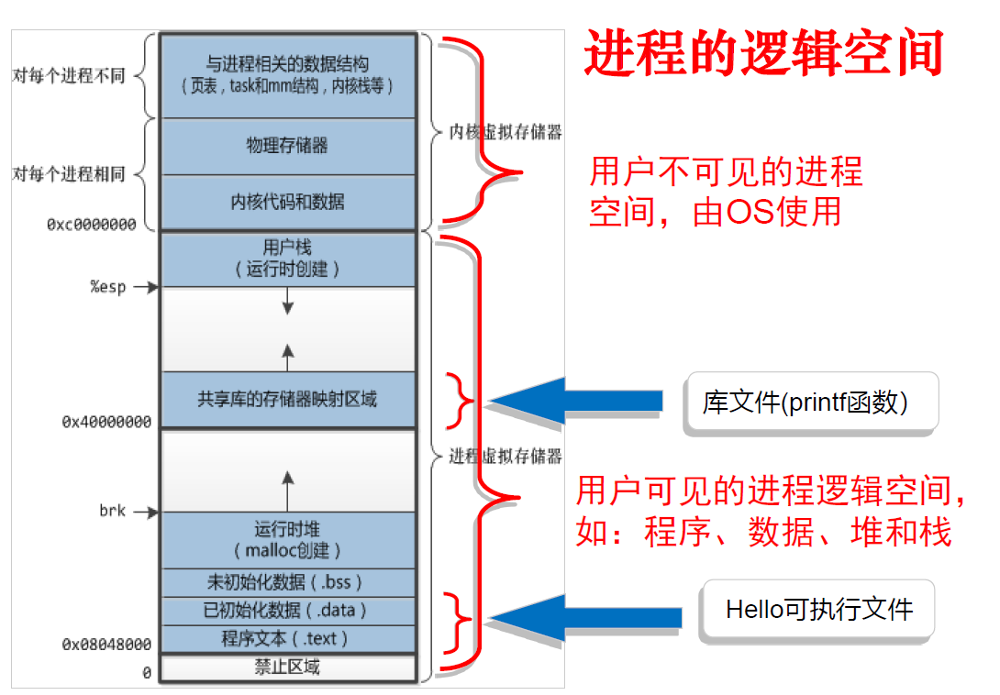
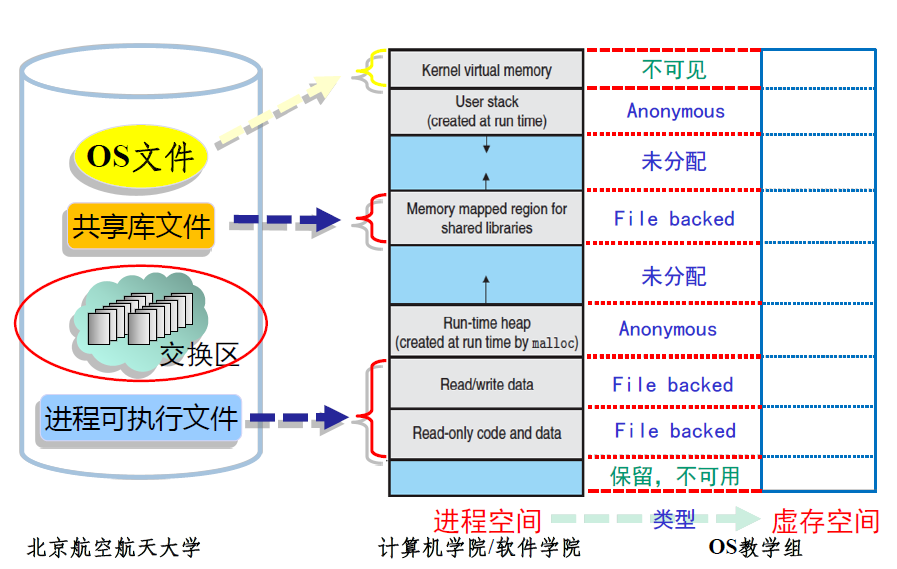
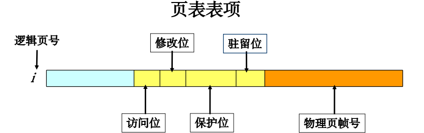
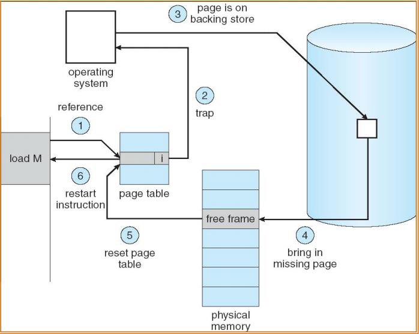
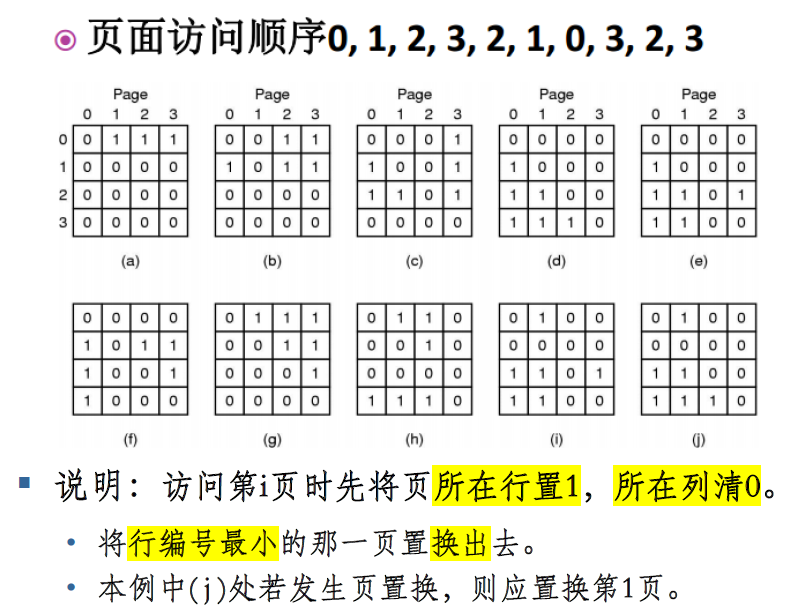

# 第三章 内存管理

# 3.4 虚拟存储管理

[TOC]

> ### Week 4~5 :sob:

常规存储管理的特征：

- 装入一次性：要求一个作业全部装入内存后方能运行。
- 全程驻留性：作业装入内存后一直驻留内存，直至结束。

问题：

- 大作业内存空间大于总容量，使作业无法运行
- 大量作业要求运行，但内存容量不足只能让一部分先运行，其他在外存等待

已有方案：增加内存容量；覆盖、对换

> 大尾端先读高地址处的低位（左边）例：按字节读取0x234567，则读出的数据是0x00；小尾端读出的是0x67

## 3.4.1 局部性原理

程序的局部性特征：

- 大部分顺序执行，少部分转移和过程调用
- 过程调用的嵌套深度一般不超过5，故执行范围不超过这组嵌套的过程
- 循环结构多，指令少但被多次执行
- 对一定数据结构的操作多（例：数组），往往局限在较小范围内

局部性原理：

- 时间局部性：**一条指令**的一次执行和下次执行， **一个数据**的一次访问和下次访问都集中在一个较短时期内
- 空间局部性：当前指令和邻近的几条指令，当前访问的数据和邻近的数据都集中在一个较小区域内。

## 3.4.2 虚存基本原理

- **基本原理**：
  
  - **程序加载只装入必需的页**：装入程序不全部读入内存，只需读当前需要执行的部分页
  - **请求调页**：若需执行的指令or访问的数据未在内存（**缺页**或缺段），则CPU通知OS将**相应的页**或段调入内存，然后继续执行程序
  - **置换**：OS将内存中**暂时不用的页**或段调出，保存在外存，腾出空间给**将要调入的页或段**或**将装入的程序**
  
- 虚拟内存的**定义**：是计算机系统存储管理的一种技术。它为每个进程提供了一个**大的 、一致的 、连续可用 的和私有的**一个**连续完整**的地址空间。（虚存比物理存储大）

- 提供了3个能力：
  1. 给所有进程提供**一致的地址空间**，各进程认为自己独占单机系统的存储资源
  2. **保护每个进程的地址空间**不被其他进程破坏，隔离了进程的地址访问
  3. 上层存储是下层存储的缓存；虚存把**主存作为磁盘的高速缓存**，在主存和磁盘间根据需要来回传送数据，高效利用主存
  
- **目标**（compare with 覆盖&交换）：不必把程序所有内容都放在内存中，但由OS自动完成，对程序员透明；能实现进程在内外存的交换，因而获得更多空闲内存空间，但只交换部分内容（更小的粒度）

- **特征**：

  - 离散性：物理内存分配的不连续，虚拟地址空间使用的不连续

  - **多次性**：作业被分成多次调入内存运行，使得虚拟存储器具备了逻辑上扩大内存的功能。是虚存最重要的特征

  - 对换性：允许在作业运行过程中进行换进、换出。可提高内存利用率。

  - 虚拟性：虚拟存储器机制允许程序从逻辑的角度访问存储器，而不考虑物理内存上可用的空间数量。

  - 虚拟性以多次性和对换性为基础，多次性和对换性必须以离散分配为基础

- 优点、代价和限制

  - **优点**：
    - 可在较小的可用（物理）内存中执行**较大的用户程序**

    - 可在（物理）内存中容纳**更多**程序**并发**执行

    - **不必影响**编程时的**程序结构**（与覆盖技术比较）

    - 提供给用户可用的虚拟内存空间==通常==**大于物理内存**（也就是可以小于）

  - **代价**：虚拟存储量的扩大是以 **牺牲** CPU 处理 **时间** 以及内外存交换时间为代价。

  - **限制**：虚拟内存的最大容量主要由计算机的 **地址结构** 决定。例如 32 位机器的虚拟存储器的最大容量就是 4GB。

- 与cache-主存机制的相同点：

  - 出发点相同：提高存储系统性价比
  - 原理相同：利用局部性原理，将最近常用的信息快从**大慢**存储器调入**快小**存储器

  不同点：

  - 侧重点不同：cache解决主存与CPU的**速度差异问题**，虚存解决**存储容量问题**

  - 数据通路不同：cache不命中时**可直接访问主存**，虚存所依赖的辅存与CPU之间不存在数据通路，当主存不命中时**只能通过调页解决**， CPU 最终还是要访问主存。

  - 透明性不同：cache管理由硬件完成（**透明**），虚存对实现存储管理的系统程序员不透明，只对应用程序员透明（**半透明**）

  - 未命中时的损失不同：故主存未命中时系统的性能损失要远大于 cache 未命中时的损失

    > cache ----- 5~10倍 ----- 主存；主存 ----- 上千倍 ----- 辅存

## 3.4.3 虚存机制要解决的关键问题

> ### 重点是前三个：地址映射问题、调入问题、替换问题

### 基本概念

1. 进程的逻辑空间（虚拟空间）

2. 虚拟地址空间和虚拟存储空间

   进程的**虚拟地址空间**即为进程在内存中存放的逻辑视图；一个进程的**虚拟地址空间**的大小与**虚拟存储（内存）空间**的大小相同，且都从0开始编址。

   > 含有空白的虚拟地址空间成为**稀疏**地址空间

3. 交换分区（交换文件）：在物理内存不够的情况下，操作系统先把内存中暂时不用的数据，存到硬盘的交换空间，腾出物理内存来让别的程序运行。

### 1. 地址映射问题：进程空间到虚拟存储的映射问题

- 程序装入时，**由装载器（Loader）完成**
- 分配是以段为单位（需页对齐）进行的
- 每个进程加载时，内核只是为进程**创建了虚拟内存布局，**实际上并不立即就把虚拟内存对应位置的程序数据和代码（比如.text .data 段）拷贝到物理内存中，**只是建立好虚拟内存和磁盘文件之间的映射**
- **可执行文件及共享库**在页表中的类型为file backed，地址为相应文件的位置
- **堆和栈**在磁盘上没有对应文件，类型为anonymous，地址为空
- 未分配部分没有对应的页表项，只有在申请时（如使用 malloc() 申请内存或用 mmap() 将文件映射到用户空间）才建立相应的页表项。）

### 2. 调入问题：决定哪些程序和数据应被调入主存，以及调入机制

- **调入主存的数据和程序**：
  - OS 的核心部分的程序和数据、正在运行的用户进程相关的程序及数据。
- **何时调入**：
  - OS在系统启动时调入
  - 用户程序的调入取决于调入策略。常用调度策略：

1. **预调页**（prepaging）：事先调入页面。

   实际应用中，可以为每个进程维护一个当前工作集合中的页的列表，如果进程在暂停之后需要重启时，根据这个列表使用预调页将所有工作集合中的页一次性调入内存。

2. **按需调页**（Demand Paging，更常用）：仅当需要时才调入页面。

   类似于使用交换的分页系统，进程驻留在二级存储器上（磁盘），进程执行时使用懒惰交换（ lazy swapper ）换入内存。按需调页需要使用备份存储，保存不在内存中的页，通常为快速磁盘，用于和内存交换页的部分空间称为交换空间（ swap space ）。

- **请求式分页管理的页表**

> 驻留位： 1 表示该页位于内存当中， 0 表示该页当前还在外存当中。
> 保护位：只读、可写、可执行。
> 修改位：表明此页在内存中是否被修改过。
> 访问（统计）位：用于页面置换算法。

- **如何调入**：**缺页错误（Page Fault）处理机制**：

  1. **现场保护**：陷入内核态，保存必要的信息（OS及用户进程状态相关的信息）。
  2. **页面定位**：查找出来发生页面中断的虚拟页面（进程地址空间中的页面）。这个虚拟页面的信息通常会保存在一个硬件寄存器中，如果没有的话，操作系统必须检索程序计数器，取出这条指令，用软件分析该指令，通过分析找出发生页面中断的虚拟页面。
  3. **权限检查**：检查虚拟地址的有效性及安全保护位。如果发生保护错误，则杀死该进程。
  4. **新页面调入1**：查找一个空闲的页框（物理内存中的页面），如果没有空闲页框则需要通过页面置换算法找到一个需要换出的页框。
  5. **旧页面写回**：如果找的页框中的内容被修改了，则需要将修改的内容保存到磁盘上。（注：此时需要将页框置为忙状态，以防页框被其它进程抢占掉）
  6. **新页面调入 2**：页框“干净”后，操作系统将保持在磁盘上的页面内容复制到该页框中 。
  7. **更新页表**：当磁盘中的页面内容全部装入页框后，向操作系统发送一个中断。操作系统更新内存中的页表项，将虚拟页面映射的页框号更新为写入的页框并将页框标记为正常状态。
  8. **恢复现场**：恢复缺页中断发生前的状态，将程序指针重新指向引起缺页中断的指令。
  9. **继续执行**：程序重新执行引发缺页中断的指令，进行存储访问。
  
  

### 3. 替换问题：决定哪些程序和数据应被调出主存

> [!NOTE]
>
> **考试会考以下几种算法！！！**

页面置换算法

- **最优置换（Optimal）**

  - 从主存中移出永远不再需要的页面，如无这样的页面存在，则应选择最长时间不需要访问的页面
  - **是所有页置换算法中页错误率最低的，无法被实现**。通常用于比较研究，衡量其他算法的效果

- **先进先出算法（First-in, First-out）**

  - 总选择作业中在主存驻留时间最长的一页淘汰

  - 最简单的算法。必须换掉某页时，选择最旧的页换出。*性能较差，有Belady现象*

  - > Belady现象：FIFO算法中，分配的缺页增多，缺页率反而提高

  - 改进：**Second Chance（二次机会）**：

    - 每个页面增加一个访问标志位，标识此数据放入缓存队列后是否被再次访问过。==对最旧的页面，若未再次访问，淘汰；被访问过，移到FIFO队列头，清除访问标志位==

  - 再改进：**Clock（Not Recently Used, NRU，最近未使用算法）**：

    - 环形队列，若**没有缺页错误**则将相应页面**访问位置1**，指针不动
    - 产生缺页错误，当前指针指向C：若==被访问过==，则清除C的访问标志，指针指向D；若==没被访问过==，则将新页面放入C的位置，置访问标志，将指针指向D

- > 算法之间没有高下之分，但Second Chance和Clock算法效果一样

- **最近最少使用算法（Least Recently Used, LRU）**​​

  - 当需要置换一页面时，选择在最近一段时间内最久不用的页面予以淘汰
  - 方法之一：设置一特殊栈，保存各页面号：**每访问某页面，将其从栈中移出压入栈顶**，栈底始终是LRU的页面号
  - 一个硬件实现
  
  
  
- **老化算法（AGING）**：LRU的简化，性能接近

### 4. 换出时更新问题：确保主存与辅存的一致性

在虚存系统中，主存作为辅存（磁盘）的高速缓存，保存了磁盘信息的副本，因此页面换出时需要信息更新

- 换出页面是**file backed**类型
  - **未被修改**：直接丢弃，因为磁盘上有相同副本
  - **已被修改**：直接写回原有位置
- 换出页面是**anonymous**类型
  - **第一次换出**：写入Swap区
    - **非第一次且未被修改**：丢弃
  - **已被修改**：写入Swap区

### 5. 其他问题

1. **最小物理内存问题**（工作集与驻留集管理）

   **工作集**：当前**正在使用页面**的集合

   - 引入目的：依据进程在过去一段时间内访问的页面来调整驻留集大小
   - 定义：是一个进程执行过程中所访问页面的集合。$W(t,\Delta)$，$\Delta$是窗口尺寸；工作集是在$[t-\Delta,t]$时间段内所访问的页面的集合，$|W(t,\Delta)|$指工作集大小即页面数目

   **驻留集**：虚存系统中**每个进程驻留在内存的页面集合**或进程分到的物理页框集合

   - 进程驻留集管理主要解决的问题是：系统应当为 **每个活跃进程** 分配 **多少个页框**
   - 影响页框分配的主要因素：
     - 分配给每个活跃 **进程的页框数** 越少，同时驻留内存的 **活跃进程数** 就越多，进程调度程序能调度就绪进程的概率就越大。
     - 然而，这将导致进程发生 **缺页中断的概率** 较大；为进程分配 <u>过多的页框</u> 并 ==不能== 显著地降低其缺页中断率

2. **页面分配策略**（固定、可变）**与页面置换策略**（局部、全局）

   - **固定分配策略**：分配固定数量页框，缺页只能从分给该进程的内存块中进行页面置换

   - **可变分配策略**：系统 **首先** 给进程 **分配一定数量的页框** ，运行期间可以 **增/减页框**。缺页率很高时，驻留集太小，需要增加页框

   **评价**：可变比固定更灵活，提高系统吞吐量、保证内存有效利用；但增加系统额外开销，判断缺页率高低困难；需要OS软件专门支持、硬件支持

   **局部置换**：系统在进程自身的驻留集中判断当前是否存在空闲页框，并在其中进行置换。

   **全局置换**：在整个内存空间内判断有无空闲页框，并允许从其它进程的驻留集中选择一个页面换出内存。

    搭配：可变分配+局部置换。

   全局置换中，进程在内存中的一组页面还要取决于其他进程的页面走向

3. **抖动与负载控制**——常考！

   **现象**：随着驻留内存的**进程数目增加**（进程并发水平的上升），==处理器利用率==先上升后下降。

   **原因**：虚存发生抖动（thrashing），也即：每个进程的驻留集不断减小，当驻留集小于工作集后，**缺页率急剧上升**频繁调页使得调页开销增大

   **消除与预防**：

   - <u>局部置换策略</u>（微观）：如果一个进程出现抖动，它不能从另外的进程那里夺取内存块，**从而不会引发其他进程出现抖动**，使抖动局限于一个小的范围内。——不能消除抖动的发生
   - 引入工作集算法（微观）
   - 预留部分页面（微观\宏观）
   - 挂起若干进程（宏观）：当出现 CPU 利用率、而磁盘 I/O 非常频繁的情况时，就可能因为多道程序度太高而造成抖动。为此，可挂起一个或几个进程，以便腾出内存空间供抖动进程使用，从而消除抖动现象

   **负载控制**：

   - 系统负载的判断：
     - L=S准则：通过调整多道程序的度，使发生**两次缺页之间的**<u>平均时间（L）</u>等于**处理一次缺页**所需要的<u>平均时间（S）</u>
     - 50%准则：当 **分页单元的利用率** 保持在 **50% 左右**时，处理机的利用率将达到最大。
   - 可挂起的进程：
     - 优先级最低的进程
     - 缺页进程
     - 最后一个被激活的进程
     - 驻留集最小的进程
     - 最大的进程
   - 页面清除策略：需要决定系统何时 **把被置换页面写回外存** 。
   - 页面缓冲算法：是对FIFO算法的发展，通过被置换页面的缓冲，有机会找回刚被置换的页面

   > 即：如果页面未被修改，就将其归入到空闲页面链表的末尾，否则将其归入到已修改页面链表。

   - 改善时间性能的途径：
     - 降低缺页率：缺页率越低，虚拟存储器的平均访问时间延长得越小
     - 提高外存的访问速度
     - 提高高速缓存命中率
   - 请求页式系统的性能：考试常考，因为有唯一答案

4. **写时复制与内存映射文件**

   写时复制技术（copy-on-write）：两个进程共享同一块物理内存，每个页面都被标志成了写时复制 。共享的物理内存中每个页面都是只读的。如果某个进程想改变某个页面时，就会与只读标记冲突，而系统在检测出页面是写时复制的，则会在内存中复制一个页面，然后进行写操作。

   - 资源的复制只有在需要写入的时候才进行

   内存映射文件（Mem-Mapped File）：进程通过一个系统调用（ mmap ）将一个文件（或部分）映射到其虚拟地址空间的一部分，访问这个文件就像访问内存中的一个大数组，而不是对文件进行读写。

   - 便于共享

5. **存储保护**

   **界限保护**（上下界界限地址寄存器）：所有访问地址必须在上下界之间

   用户态与内核态
   
   存取控制检查
   
   **环保护**：处理器状态分为多个环 (ring)，分别具有不同的存储访问特权级别。内环级别高、编号小，可调用同环或更高级别环的服务

# 3.5 存储管理实例

## 3.5.1 Unix

介绍Solaris2.x的存储管理系统：

- 对换系统：页表、硬盘快描述表、页面表、对换表
- 内核存储分配器
- 惰性动态分区算法

## 3.5.2 Windows NT

内存管理方式：

- 保留与提交
- 内存映射文件
- 内存堆

页面调度策略：

- 取页策略
- 置页策略
- 淘汰策略

工作集策略