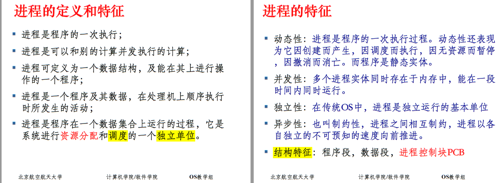
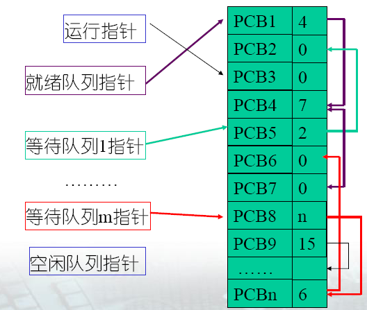
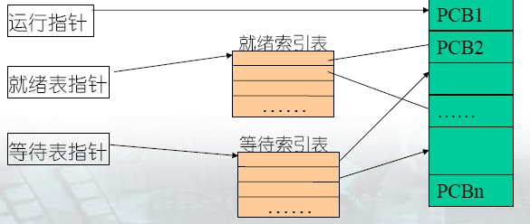
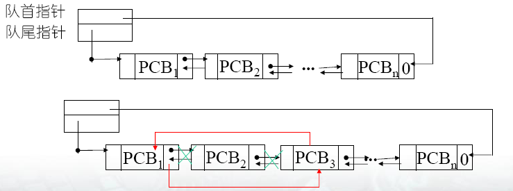
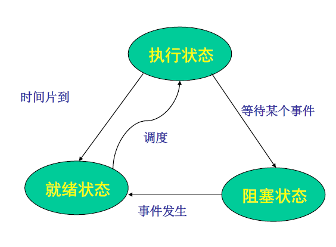
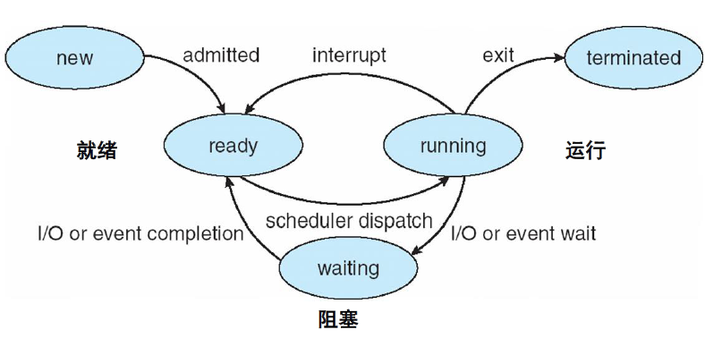
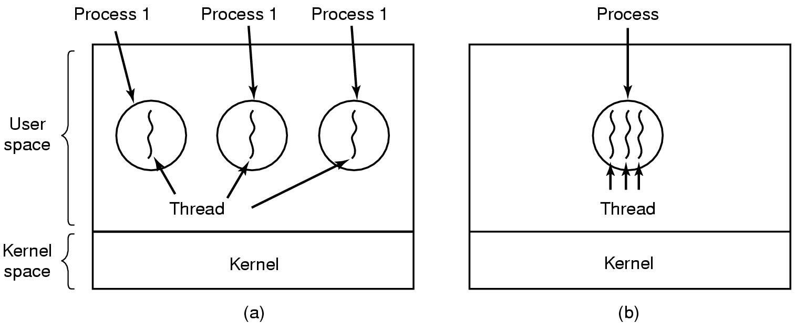
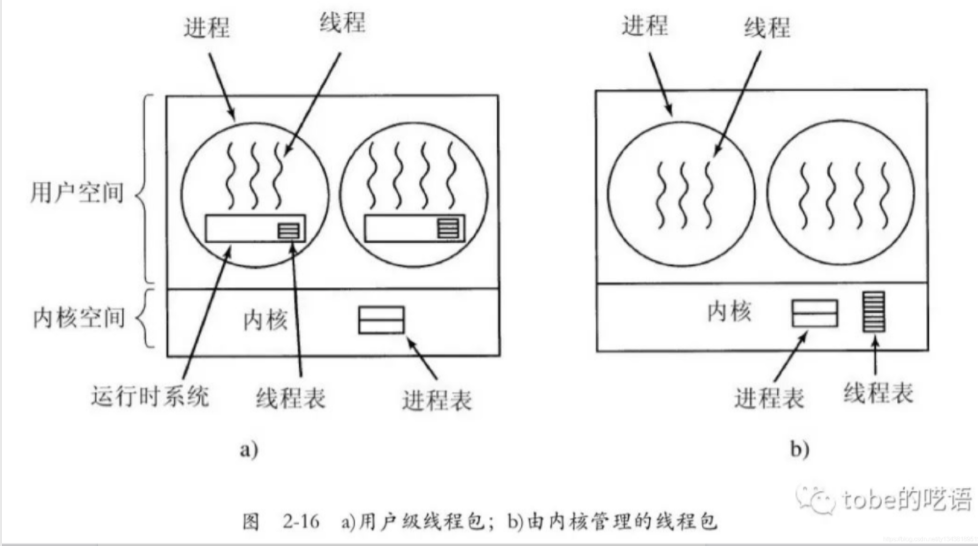
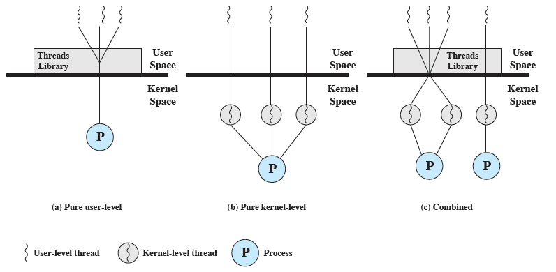

# 第四章 进程管理

# 4.1 进程与线程

> ### Week 7~8 :persevere:

[TOC]

## 4.1.1 进程概念的引入

### 并发与并行（通常强调并发，这一概念包括了并行）：

- **并发**（Concurrent）：设有两个活动 a1 和 a2 ，如果在某一指定的时间 t ，**无论** a1 和 a2 是在**同一**处理机上还是**不同**的处理机上执行，只要 a1 和 a2 都处在各自的起点和终点之间的某一处，则称 a1 和 a2 是并发执行的。
- **并行**（Parallel）：如果考虑两个程序，它们在同一时间度量下同时运行在不同的处理机上，则称这两个程序是并行执行的。——并发可能是伪并行。并行是并发的特例

程序顺序执行：顺序性、封闭性、可再现性

程序并发执行：

- **间断性**：并发程序具有 “执行 -- 暂停 -- 执行” 这种**间断性的活动规律**。
- **非封闭性**：多个程序共享系统中的资源，这些资源的状态将由多个程序来改变，致使**程序之间相互影响**。
- **不可再现性**：在初始条件相同的情况下，程序的执行结果**依赖于执行的次序**。

**竞争** ：多个进程在读写一个共享数据时结果依赖于它们执行的相对时间。

+ 条件：多个进程并发访问和操作同一数据且执行结果与访问的特定顺序有关

**并行性的确定－Bernstein 条件 - 判断程序并发执行结果是否可再现的充分条件**：
$$
两个进程S1和S2可并发，当且仅当:\\
[R(S1)∩W(S2)]∪[R(S2)∩W(S1)]∪[W(S1)∩W(S2)]=\Phi
$$
“程序”与“计算”不是一一对应的关系，一个程序段可能对应多个“计算”。用“程序”不能揭示多道程序、分时系统引发的动态特性，故引入“进程”

### 进程

> 进程 = 数据 + 程序 + PCB（ + PC + 寄存器、堆栈 + 一组系统资源）

### PCB

系统为每个进程定义了一个数据结构：**进程控制块PCB（Process Control Block）**

- 作用：进程创建、撤消；进程唯一标志；限制系统进程数目。
- 进程控制块是进程管理和控制的最重要的数据结构，每一个进程均有一个 PCB ，在创建进程时，建立 PCB ，伴随进程运行的全过程，直到进程撤消而撤消。

PCB的内容

- 进程标识符：唯一，字符串/数字。Linux中为整型数，进程创建时由系统赋予
- 程序和数据地址：把PCB与其程序和数据联系起来
- 现行状态：相同状态的进程组成一个队列。就绪进程队列、等待队列：等待打印机、等待磁盘I/O完成……
- 现场保留区：进程不能继续占用CPU而要释放时，将CPU各种状态信息保护起来，以便将来恢复CPU继续运行
- 互斥和同步机制：实现进程间互斥、同步、通信所需的信号量等
- 进程通信机制
- 优先级：反映进程紧迫程度，由用户指定或系统设置
- 资源清单：列出除CPU外的资源记录：I/O设备、打开的文件列表等
- 链接字：指出该进程所在队列中下一个进程PCB的首地址
- 家族关系

PCB的组织方式

- 线性表：不论进程的状态如何，将所有的 PCB 连续地存放在内存的系统区。适用于系统中进程数目不多的情况 。

  

- 索引方式：是线性表方式的改进。系统按照进程的状态分别建立就绪索引表、阻塞索引表等。

  

- 链接方式：系统按照进程的状态将进程的 PCB 组成队列，从而形成就绪队列、阻塞队列、运行队列等。

  

进程与程序的区别：动态 vs 静态，暂时 vs 永久，PCB vs code，程序对应多个进程 & 进程包括多个程序

## 4.1.2 进程状态与控制

### 进程的3种基本状态：

- **就绪状态**：进程**已获得**除处理机外的所需**资源**，**等待分配处理机资源**，只要分配CPU即可执行
- **执行状态**：占用处理机资源；**处于此状态的进程的数目小于等于 CPU 的数目**。在没有其他进程可以执行时（如所有进程都在阻塞状态），通常会自动执行系统的 idle 进程（相当于空操作）。
- **阻塞状态**：正在执行的进程，由于发生某种事件而**暂时无法执行**，便放弃处理机处于暂停状态。

> [!IMPORTANT]
>
> **必考：进程状态转换图**
>
> 
>
> 没有阻塞到执行、就绪到阻塞！！
>
> **就绪-->运行**：时间一到，调度程序选择一个进程运行
>
> **运行-->就绪**：运行用完了时间片；运行进程被==中断==，因为一**高优先级进程处于就绪状态**
>
> **运行-->阻塞**：——“等待”
>
> - 当**一进程所需的东西必须等待**时
> - OS尚未完成服务
> - 对一资源的访问尚不能进行
> - 初始化 I/O 且必须等待结果
> - 等待某一进程提供输入（IPC）
>
> **阻塞-->就绪**：当所等待的事件发生时，==唤醒==（2022期末）进程
>
> 

### 进程控制

进程控制的主要任务：**创建**和**撤销**进程，以及实现进程的**状态转换**。由内核来实现。

- 进程的创建：

  - 提交一个批处理作业
  - 用户登录
  - 由OS创建，用以向用户提供服务
  - 由已存在的进程创建

- 进程撤销：用户退出登录，进程执行中止服务请求，出错，正常结束，给定时限到……
- ***原语***：是操作系统的一个组成部分，由若干条指令所组成的指令序列，来实现某个特定的操作功能

  - **指令序列执行是连续的，不可分割**：要么全部执行成功，要么全部不执行
  - 是操作系统核心组成部分
  - 必须在管态（内核态）下执行，且常驻内存
  - > 不可中断。一旦原语开始执行，它将一直执行完毕
    >
    > 引入目的：主要是为了实现进程的通信和控制

#### 进程树

- 进程图
- 创建原语（fork, exec）
- 撤消原语（kill）
  - 释放资源、撤消子进程、重新调度。

进程图是一棵有向树，结点代表进程， 一棵树表示一个家族，根结点为该家族的祖先（Ancestor）。

`Fork()`函数使用（要自学！）

> `fpid = fork()`：创建新进程，若成功，则有一个子进程、一个父进程。
>
> - 子进程中：`fork()`返回0
> - 父进程中：`fork()`返回新创建子进程的进程ID。
> - 出现错误，返回一个负值
> - 可以通过 `fork` 返回的值来判断当前进程是子进程还是父进程。
> - `fpid`的值为什么在父子进程中不同？其实就相当于链表，进程形成了链表，父进程的 `fpid`指向子进程的进程 id，因为子进程没有子进程，所以其 `fpid`为 0。

辨析：进程上下文切换 vs 陷入内核

> 进程上下文切换和系统调用一定会陷入内核

进程上下文切换（Process Context Switch）：

- 通常由调度器执行
- 保存进程执行端点
- 切换内存映射（页表基址、flush TLB）

陷入/退出内核（模态切换，Mode Switch）——寄存器上下文切换，消耗比进程上下文切换小得多：

- CPU 状态改变
- 由中断、异常、Trap 指令（**系统调用**）引起
- 需要保存执行现场（寄存器、堆栈等）

## 4.1.3 线程概念的引入

### 线程（thread）

进程的不足：

- 进程只能在一个时间干一件事，对多件事无能为力
- 进程在执行的过程中如果阻塞，例如等待输入，整个进程就会挂起，即使进程中有些工作不依赖于输入的数据，也将无法执行。

我们需要新的实体：实体之间可以并发执行，实体之间共享相同地址空间

现代操作系统中：**资源拥有者**称为<u>进程</u>，**可执行单元**称为<u>线程</u>

引入线程的目的：减小进程切换的开销，提高进程内的并发程度，共享资源

> 线程：将资源与计算分离，提高并发效率

#### 进程线程对比

- 进程：
  - 创建进程
  - 撤销进程
  - 进程切换
  - 引入进程好处：多个程序可以并发执行，改善资源使用率，提高系统效率
- 线程：
  - 进程中的一个实体
  - ==是一个CPU调度和分派的单位==
  - 基本上不拥有资源，只有必不可少的少量资源
  - 可与其他同进程的线程共享进程拥有的所有资源
  - 引入线程好处：**减少并发程序执行时所付出的时空开销，使得并发粒度更细、并发性更好**

进程拥有虚空间、进程映像、处理机保护、文件、I/O 空间。

线程额外的资源：运行状态、保存上下文（程序计数器）、**执行栈**、**资源共享机制**。

> [!IMPORTANT]
>
> 每个线程都有自己的栈

> 创建一个进程时，默认至少有一个线程在用户空间，一个线程在内核空间

三种线程模型：

- 1:1（一个用户线程对应于一个内核线程）（UNIX）
- M:1（M用户线程对应于一个内核线程）（NT、OS/2、Solaris、Linux）
- M:N（M用户线程对应于N个内核线程）（TRIX）

#### 小结

引入线程的好处：线程比进程轻量，容易创建、撤销

- 有些应用要求并行实体共享同一个地址空间和所有可用数据的能力
- 创建一个线程比一个进程快 10 - 100 倍
- 对于存在大量计算和大量 I/O 处理的应用，大幅度提高性能
- 在多 CPU/ 多核 CPU 系统中更有优势，提高CPU利用率

线程 vs 进程：

- 一个进程可以拥有多个线程，而**一个线程同时只能被一个进程所拥有** 。
- 进程是**资源分配**的基本单位，线程是**处理机调度**的基本单位，**所有的线程共享其所属进程的所有资源与代码**。
- 线程执行过程之中**很容易进行协作同步**，而进程需要通过**消息通信**进行同步 。
- 线程的划分尺度更小，**并发性更高**。
- 线程共享进程的数据的同时，**有自己私有的栈**。
- 线程**不能单独执行**，但是每一个线程**都有程序的入口、执行序列以及程序出口**。它**必须组成进程**才能被执行 。

> 线程安全：不与是否调用全局变量和静态变量绑定，也不与可重入的概念相互绑定

## 4.1.4 线程的实现方式

### 用户级线程：User level threads（ULT）

典例：POSIX，Mach，JAVA（familiar，线程的轮换运行需要用户控制）

线程在用户空间，通过library模拟的thread，不需要或仅需极少kernel支持。==图示在下面==。

用户级的线程库的主要功能：

- **创建和销毁**线程
- 线程之间**传递消息和数据**
- **调度**线程执行
- **保存和恢复**线程上下文

用户级线程的优缺点：

- 优点：
  - 线程切换与内核无关
  - 线程的**调度由应用决定**，容易进行优化
  - 可运行在任何操作系统上，**只需要线程库的支持**
- 缺点
  - 很多系统调用会**引起阻塞**，内核会因此而阻塞所有**相关的线程** 。
  - **内核只能将处理器分配给进程**，即使有多个处理器，也无法实现一个进程中的多个线程的并行执行 。

### 内核级线程：Kernel level threads（KLT）

典例：Windows 2000 / XP, Linux, Solaris, Mac OS X, etc.

- 内核级线程就是 kernel 有好几个分身，一个分身可以处理一件事
- 这用来处理非同步事件很有用，kernel 可以对每个非同步事件产生一个分身来处理
- 支持内核线程的操作系统内核称作**多线程内核**

内核级线程的优缺点:

- 优点：
  - 内核可以在==**多个处理器上**== 调度**一个进程的多个线程**，实现同步并行执行
  - 阻塞发生在**线程级别**，==与其在同一进程中的其他内核级线程不会被阻塞==
  - 内核中的一些处理可以通过多线程实现
- 缺点：
  - 一个进程中的线程切换需要内核参与，线程的切换涉及到两个模式的切换（进程 - 进程、线程 - 线程）
  - 降低效率

比较：

|                          用户级线程                          |                          内核级线程                          |
| :----------------------------------------------------------: | :----------------------------------------------------------: |
|                       OS 内核不可感知                        |                        OS 内核可感知                         |
| 用户级线程的创建、撤消和调度不需要 OS 内核的支持，是在**语言或用户库这一级**处理的 | 线程创建、撤消和调度都需 OS 内核提供支持，而且**与进程大体是相同**的。 |
|         执行系统调用指令时将导致其**所属进程**被中断         |          执行系统调用时，只导致**该线程**被中断 。           |
| CPU 调度还是**以进程为单位**，处于运行状态的进程中的多个线程，**由*用户程序*控制线程的轮换运行** | CPU 调度**以线程为单位**，由OS的**线程调度程序**负责线程的调度 。 |
|                程序实体是运行在用户态下的程序                |         程序实体是可以运行在**任何状态下**的程序 。          |

### 混合实现方式

线程**在用户空间创建和管理**

需要实现从**用户空间的线程到内核空间线程**（轻量级进程）的映射

上图从左至右：用户级线程、内核级线程、混合实现

## 4.1.5 线程模型

### Many-to-One Model

将多个用户级线程映射到一个内核级线程，线程管理在用户空间完成。此模式中，用户级线程对操作系统不可见（即透明）。

- 优点：线程管理是在用户空间进行的，因而**效率比较高**。
- 缺点：当一个线程在使用内核服务时被阻塞，那么整个进程都会被阻塞；多个线程不能并行地运行在多处理机上 。

### One-to-One Model

将每个用户级线程映射到一个内核级线程 。

- 优点：当一个线程被阻塞后，允许另一个线程继续执行，所以**并发能力较强**。
- 缺点：每创建一个用户级线程都需要创建一个内核级线程与其对应，这样创建线程的**开销比较大**，会影响到应用程序的性能 。

### Many-to-Many Model

将 n 个用户级线程映射到 m 个内核级线程上 要求m <= n 。

- 特点：在多对一模型和一对一模型中取了个折中，克服了多对一模型的并发度不高的缺点，又克服了一对一模型的一个用户进程占用太多内核级线程，开销太大的缺点。又拥有多对一模型和一对一模型各自的优点，可谓集两者之所长 。