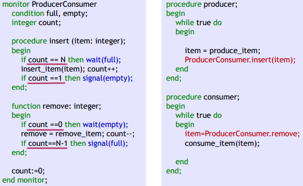

# 第四章 进程管理

# 4.2 进程同步

> ### Week 8~9 :kissing_closed_eyes:

[TOC]

## 4.2.1 同步与互斥问题

> 特别是4.2.1，期中考试涉及很多

进程的三个特征：

- ==并发==：进程的执行是间断性的；进程的相对执行速度是不可测的（**间断性**）
- ==共享==：进程/线程之间的制约性（**非封闭性**）
- ==不确定性==：进程执行的结果与其执行的相对速度有关，是不确定的 （**不可再现性**）

并发执行，**会有多个进程访问同一个共享资源，造成资源争夺**。概念：

- 竞争：两个或多个进程对同一共享数据同时进行访问，而最后的结果是**不可预测的**，它取决于各个进程**对共享数据访问的相对次序**。这种情形叫做竞争。
- 竞争条件：多个进程并发访问和操作同一数据，且执行结果**与访问的特定顺序有关**。

- 临界资源：一次**仅允许一个进程访问**的资源

- 临界区：**每个进程中**访问临界资源的那段代码称为临界区


打印机的例子：word和WPS都想打印，往spooling系统送文件，但WPS先放入槽中，word不知道，会把WPS文件冲掉。

----

进程互斥（间接制约关系）：

- 两个或两个以上的进程，**不能同时进入** 关于 **同一组共享变量** 的 **临界区域**，否则可能发生与时间有关的错误，这种现象被称作 **进程互斥** 。

- 进程互斥是进程间发生的一种间接性作用，一般是程序不希望的。

- > 某一资源同时只允许一个访问者访问：唯一性、排他性。无法限制访问顺序，**是无序访问**

进程同步（直接制约关系）：

- 系统中各进程之间能有效地共享资源和相互合作，从而使程序的执行具有==可再现性==的过程称为 **进程同步** 。

- 进程同步是进程间的一种刻意安排的直接制约关系。即为完成同一个任务的各进程之间，因8需要协调它们的工作而 **相互等待**、**相互交换信息** 所产生的制约关系。

- > 同步：是指在互斥的基础上（大多数情况），通过其它机制实现访问者对资源的**有序访问**。
  >
  > 多数情况下，同步已经实现了互斥（同步包含互斥）

临界区管理应满足的条件

1. 没有进程在临界区时，想进入临界区的进程可进入。
2. 任何两个进程都不能同时进入临界区（Mutual Exclusion，互斥）
3. ==当一个进程运行在它的临界区外面时，不能妨碍其他的进程进入临界区（Progress）==
4. 任何一个进程进入临界区的要求应该在有限时间内得到满足（Bounded Waiting ）。

机制设计上应遵循的准则：前三个必须满足，第四个可选

- 空闲让进： 临界资源处于空闲状态，允许进程进入临界区。如，临界区内仅有一个进程执行
- 忙则等待： 临界区有正在执行的进程，所有其他进程则不可以进入临界区
- 有限等待： 对要求访问临界区的进程，应在保证在有限时间内进入自己的临界区，避免死等。
- 让权等待： 当进程（长时间）不能进入自己的临界区时，应立即释放处理机，尽量避免忙等。


## 4.2.2 基于忙等待的互斥方法

### 软件方法

实际实现我们都不用软件方法，只是用来思考问题的，课下慢慢看

Dekker


Peterson，适合抢占式调度。


Lamport面包店算法：发号器（给进程）发号，重号则按姓名（进程编号）排序。适合分布式系统

### 硬件方法（利用硬件提供的特性）

#### 方案1：中断屏蔽

方法：使用“开关中断”指令

- 执行“关中断”指令，进入临界区操作；退出临界区之前，执行“开中断”指令

优缺点：简单；但不适用于多CPU，性能损失大；仅适用于少量使用的**内核进程**，用户进程使用可能很危险

#### 方案2：使用test and set指令（最重要！）

TS是一种不可中断的基本原语。

- 会写值到某个内存位置并传回其旧值
- 在多进程可同时存取内存的情况下，若一个进程正在进行检查并设置，在它执行完成前，其他进程不可执行检查并设置。
- IBM370 - `TS`；INTEL8086 - `TSL`；MIPS - `ll & sc`
- 语义：

  ```java
  TestAndSet(boolean_ref lock) {
      boolean initial = lock;
      lock = true;
      return initial; }
  ```

自旋锁Spinlocks：利用`test_and_set`硬件原语提供互斥支持；通过对总线的锁定实现对某个内存位置的原子读与更新

```c
acquire(lock){
	while(test_and_set(lock) == 1)
}	// if lock==1，一直死循环；
	// lock==0则会跳出，但同时置1，让后面想用TS的程序死循环，从而达到互斥效果，忙则等待
/** critical section **/
release(lock){
	lock = 0;
}	// 释放lock，空闲让进
```


#### 方案3：使用`swap`指令

`Swap`（对换）指令与 `TSL` 指令一样，是不会被中断的原子指令，其功能是交换两个字的内容

```java
Swap(boolean *a, boolean *b) {
    Boolean temp;
    Temp = *a;
    *a = *b;
    *b = temp;
}
```

使用`Swap` 指令实现进程互斥的描述如下：

```java
Boolean k = true;		// 初始化为 1
Boolean use = false;	// 初始资源空闲。若另有进程访问临界区，将use置为true，此后循环内k永为true
while(k != 0)
	Swap(&use, &k);		// 进入区，如果use==1则产生死循环
Critial_region();		// 临界区
Use = 0;				// 退出区
Other_region();			// 剩余区
```

共性问题：

1. 忙等待：浪费CPU时间
2. 优先级反转：低优先级进程先进入临界区，高优先级进程一直忙等

## 4.2.3 基于信号量的同步方法

> 同步中，进程经常需要等待某个条件的发生，如果使用忙等待的解决方案，势必浪费大量 CPU 时间。

解决方法： 将忙等 变为 阻塞，可使用两条进程间的通信原语：`Sleep`和 `Wakeup`

- `Sleep`原语引起调用进程的阻塞，直至另一个进程用`Wakeup`原语将其唤醒。很明显，`Wakeup` 原语的调用需要一个参数——被唤醒的进程 ID

信号量：P（信号变量S）操作（Down）和V（信号变量S）操作（Up）。程序对信号量的访问都是原子操作，只允许进行P和S操作

### 信号量是一个确定的二元组 (s,q)：

- s 是一个具有非负初值的整型变量：
  - s 为正，则该值等于发 P 操作后可立即执行的进程的数量；
  - s 为 0 ，那么发出 P 操作后进程被继续执行完；
  - s 为负，那么发出 P 操作后的进程被阻塞，│s│是被阻塞的进程数。
- q 是一个初始状态为空的队列，当有进程被**阻塞时**就会进入此队列 。

### 信号量的分类

- 二元信号量和一般信号量

  - 二元信号量：取值仅为“ 0” 或“ 1”，主要用作实现互斥；

    - 通常使用二元信号量的 PV 操作实现两个进程的互斥。

    > 每个进程中用于实现互斥的 P 、V 操作必须成对出现，先做 P 操作，进临界区，后做 V 操作，出临界区。
    >
    > P 、V 操作应分别紧靠临界区的头尾部，临界区的代码应尽可能短，不能有死循环。
    >
    > 互斥信号量的初值一般为 1 。

  - 一般信号量：初值为 **可用物理资源的总数** ，用于进程间的协作同步问题。

    - 其上定义了三个 **原子** 操作：
      - 初始化 s
      - 申请信号量 s：`semWait(s)`（P操作），使信号量减 1 。若（减1后）值为负，则执行`semWait`的进程被阻塞。否则进程继续执行。
      - 释放信号量 s：`semSignal(s)`（V操作），使信号量加 1 。若（加1后）值小于或等于零，则被 `semWait` 操作阻塞的进程被解除阻塞。

    > P操作分配资源，V操作释放资源

- 强信号量和弱信号量

  - 强信号量：进程从被阻塞队列释放时采取 **FIFO**
  - 弱信号量：没有规定进程从阻塞队列中移除顺序

- **信号量机制的实现**

  

  信号量在进程互斥/有限并发中：两个程序的循环里都是：wait(P) -> Critical Section -> signal(V)

  ```
  var sem_CS: semaphore := 1(互斥) c(并发)
  Parbegin
  	repeat
  		wait(sem_CS);		// P操作
  		{Critical Section}
  		signal(sem_CS);		// V操作
  		{Remainder of the cycle}
  	forever; 				// repeat-forever内，两进程皆如此
  Parend;
  end.
  ```

  但是在同步中：

  ```
  var sem_CS: semaphore := 0;
  # 进程Pi
  Parbegin
  	...
  	wait(sync);
  	{Performaction ai}
  Parend;
  end.
  # 进程Pj
  Parbegin
  	...
  	{Performaction aj}
  	signal(sync);
  Parend;
  end.
  ```

使用信号量实现汇合（rendezvous）：使用信号量 实现进程 A 和进程 B 的汇合。使得 a1 永远在 b2 之前，而 b1 永远在 a2 之前 。两个信号量：`aArrived`、`bArrived`初始化为 0


多进程同步原语：**屏障 Barriers**，对 rendezvous 进行泛化，使其能够用于多个进程，用于进程组的同步

```c
n = the number of threads
count = 0 					// 到达汇合点的进程数
mutex = Semaphore(1)		// 保护 count
barrier = Semaphore(0)		// 进程到达之前都是 0 或者负值。到达后取正值

mutex.wait()
count = count + 1
mutex.signal()

if (count == n)
	barrier.signal ()	// 唤醒一个进程
barrier.wait()
barrier.signal() 		// 一旦进程被唤醒，有责任唤醒下一个进程
```

> 进程同步/互斥类问题解题步骤：
>
> - 分析问题
>   - 确定哪些操作是并发的。
>     - 在并发的操作中，哪些是互斥的，哪些是同步的
>   - 多个进程操作同一个临界资源就是 **互斥**
>   - 多个进程要按一定的顺序执行就是 **同步**
> - 根据同步和互斥规则设置信号量，说明其含义和初值；
> - 用 P、V 操作写出程序描述。

“信号量集”机制：同时需要多个资源时的信号量操作。（信号量机制：解决单个资源的互斥访问）

- “AND 型”信号量集
  - 基本思想：将进程需要的所有共享资源一次全部分配给它；待该进程使用完后再一起释放。
- 一般信号量集
  - 基本思想：在 AND 型信号量集的基础上进行扩充：
    - 进程对信号量 $S_i$ 的 **测试值为 $t_i$（用于信号量的判断，即 $S_i>= t_i$ ，表示资源数量低于 $t_i$ 时，便不予分配）
    - 占用值为 $d_i $（用于信号量的增减，即 $S_i = S_i-d_i$ 和 $S_i = S_i + d_i$​）

## 4.2.4 基于管程的同步与互斥

PV操作：

- 优点：简单、表达能力强==**（用 P.V 操作可解决任何同步互斥问题）**==

- 缺点：不够安全，P. V 操作使用不当会出现**死锁** ；遇到复杂同步互斥问题时实现复杂

> 管程是一种高级同步原语
>
> 管程需要依赖编译器和语言的支持（C不支持，但Java和Object C支持）
>
> 同一时刻，只有一个进程可以在管程内运行

**管程（Monitor）**组成：

1. 管程的名称；
2. 局部于管程内部的共享数据结构（变量）说明；
3. 对该数据结构进行操作的一组互斥执行的过程；
4. 对局部于管程内部的共享数据设置初始值的语句。

需要解决三个问题：

- 互斥：**只能有一个进程**可对其内部数据结构进行相应的操作，即**管程进入是互斥的**。由编译器来保证（管程是一个语言机制）
- 同步：通过设置条件变量（CV）以及在条件变量上实施的 `wait`和 `signal`操作，它可以使一个进程或线程，当条件不满足/满足的时候在条件变量上等待/唤醒。
- 条件变量：为了**区别等待的不同原因**，管程引入了条件变量。不同的条件变量，**对应不同原因的进程阻塞等待队列**，初始时为空。条件变量上能作 `wait`和 `signal`原语操作，若条件变量名为 X ，则调用同步原语的形式为 `wait(X)` 和 `signal(X)`。

> 条件变量的值不可增减，但P-V操作的信号量值可以增减
>
> 条件变量的`wait`操作一定会阻塞当前进程，但信号量 P 操作只有当信号量小于0时才会阻塞
>
> 如果没有等待的进程，条件变量`signal`将丢失；而信号量 V 操作增加了信号量的值，不会丢失。

**Hoare管程**

入口等待队列、紧急等待队列

条件变量：每个条件变量表示一种等待原因，不取具体数值，每个原因对应一个队列

同步原语：对条件变量`x`，

- `x.wait()`将自己阻塞在`x`队列中。如果紧急等待队列非空，则唤醒第一个等待者；否则**释放管程的互斥权**，执行此操作的进程排入`x`队列尾部（紧急等待队列是由于管程的互斥进入而等待的队列，而 x 队列是因资源被占用而等待的队列）
- `x.signal()`将`x`队列中的一个进程唤醒。如果`x`队列为空，则**相当于空操作**，执行此操作的进程继续；否则唤醒第一个等待者，执行`x.signal()`操作的进程排入紧急等待队列的尾部。

信号量：

- `mutex`（初值为1，用于互斥）
  - 进程调用管程中的任何过程时：执行`P(mutex)`，进程退出管程时执行`V(mutex)`开放管程，让其他调用者进入
  - `wait`操作中也必须执行`V(mutex)`，使其他进程进入管程

- `next`（初值为0）
  - 凡发出`signal`操作的进程应该用`P(next)`挂起自己，直到被释放进程退出管程或产生其他等待条件。
  - 进程在退出管程的过程前，须检查是否有别的进程在信号量`next`上等待，若有，则用 `V(next)` 唤醒它。`nextcount`（初值为 0 ），用来记录在 `next` 上等待的进程个数。

- `x-sem`（初值为0）
  - 申请资源得不到满足时，执行`P(x-sem)`挂起。由于释放资源时，需要知道是否有别的进程在等待资源，用计数器`x-count`（初值为 0）记录等待资源的进程数。
  - 执行 `signal`操作时，应让等待资源的诸进程中的某个进程立即恢复运行，而不让其他进程抢先进入管程，这可以用 `V(x-sem)` 来实现


Hoare管程的实现：


## 4.2.5 进程通信的主要方法

**进程间通信：Inter Process Communication，IPC**

- 低级通信：信息量小，编程复杂，包括进程互斥和同步所采用的**信号量和管程机制**

- 高级通信：适用于分布式系统，传送任意数量的数据，三类：管道、共享内存、消息系统

**管道**：

- **无名管道**（Pipe）：管道是**半双工**的（数据只能向一个方向流动），只能用于父子/兄弟进程（具有亲缘关系的进程）之间，单独构成独立的文件系统，==只存在内存中==（2021期末）。
  - 数据的读出和写入：一个进程向管道中写的内容被管道另一端的进程读出。写入的内容每次都添加在管道缓冲区的末尾，并且每次都是从缓冲区的头部读出数据。

- **有名管道**（Named Pipe）：FIFO，克服亲缘关系的限制，因为提供一个路径名与之关联，以FIFO的文件形式存在文件系统中。对管道及FIFO的读总是从开始处返回数据，对它们的写则把数据添加到末尾。

**消息传递**（message passing）：

- 两个原语：`send(destination, &message)`、`receive(source, &message)`
- 阻塞/非阻塞调用
- 主要解决消息丢失、延迟问题（ TCP 协议），编址问题： mailbox

**共享内存**：是**最有用的进程间通信方式，也是最快的 IPC 形式**（因为它避免了其它形式的 IPC 必须执行的开销巨大的缓冲复制）。

- ==同一块物理内存被映射到进程A、B各自的进程地址空间。==
- 共享内存可以同时读但不能同时写，故需要同步机制约束（互斥锁或信号量）
- 共享内存通信效率高
- 进程之间共享内存时，保持共享区域直到通信完毕
- > 但是安全性较差，面临同步互斥问题

## 4.2.6 经典的进程同步与互斥问题

### 生产者-消费者问题

问题描述：若干进程通过有限的共享缓冲区交换数据。其中，“生产者”进程不断写入，而生产者进程不断写入、消费者进程不断读出，共享缓冲区共有N个，任何时刻**只能有一个进程可对共享缓冲区进行操作**。

- 生产者和消费者数量不固定，不能同时使用缓冲区
- **生产者**：==生产==产品，有空缓冲区时==放置==产品
- **消费者**：有产品时==取出==产品，==消费==产品
- **生产者之间**：互斥（放置产品）；**消费者之间**：互斥（取出产品）
- **生产者与消费者之间**：互斥（放/取产品）、同步（放置->取出）

用PV操作解决：

**伪代码：考试会考！！！**

```cpp
/* 信号量设置 */
Semaphore mutex = 1;	// 互斥
Semaphore empty = N;	// 空闲数量
Semaphore full = 0;		// 产品数量, full + empty == N
/* 缓冲区 */
ItemType buffer[0...n-1];
int in = 0, out = 0;

producer(){		/* 生产者 */
    while(true){
        nextp = produce();
        P(empty);	// empty--
        P(mutex);	// handle mutual exclusion
        buffer[in] = nextp;
        in = (in + 1) mod n;
        V(mutex);
        V(full);	// full++
    }
}
consumer(){		/* 消费者 */
    while(true){
        P(full);	// full--
        P(mutex);
        nextc = buffer[out];
        out = (out + 1) mod n;
        V(mutex);
        V(empty);	// empty++
        consume(nextc);
    }
}
/* main */
main(){
    Cobegin
        producer();
    	consumer();
    Coend
}
```

用`Sleep`和`Wakeup`原语：


用管程：



### 读者-写者问题

问题描述：任意时刻写者至多允许一个，读者允许多个：

<center><strong>“读－写”互斥，“写－写”互斥，“读－读”允许</strong></center>

行为分析：

- **读进程**：
  - 系统中会有多个读进程同时访问共享数据
  - 三类：第一个进入的（占有资源）、最后一个离开的（释放资源）、其他读进程
  - 需要计数器`readcount`来记录读进程的数目
- **写进程**：排他性的使用资源
- **同步与互斥关系**：
  - 读者-读者：共享`Data`，互斥访问`readcount`
  - 读者-写者：互斥访问`Data`
  - 写者-写者：互斥访问`Data`

- **确定临界资源**：`Data`, `readcount`

信号量机制伪代码（读者优先）：

```cpp
/* 信号量设置 */
int readcount = 0;		// “正在读”的进程数，初值是 0
semaphore rmutex = 1;	// 信号量，用于 readcount 访问的互斥。
semaphore write = 1;	// 信号量，用于 Data 访问的互斥。解决读-写、写-写互斥

writer(){
    P(write);
    // writing;
    V(write);
}

reader(){
    P(rmutex);		// 对 readcount 互斥
    if readcount == 0 then 
        P(write);		// 是第一个读者：申请使用 data 资源
    readcount++;
    V(rmutex);		// 释放 readcount
    // reading;
    P(rmutex);		// 对 readcount 互斥
    readcount--;
    if readcount == 0 then 
        V(write); 		// 是最后一个读者：释放 data 资源。
    // 此处体现读者优先，只有最后一个读者走后，才能让写者进来
    V(rmutex); 		// 释放 readcount
}
```

写者优先：在读者优先基础上，

- 一群读者在读取时若有写者进来，会在队列占有`quemutex`，等待最后一个正在读的人离开释放`write`，然后立刻开始写
- 使用一个`readcount`整型变量计数器，记录读者数量，用信号量`rmutex`控制该变量的访问；`writecount`记录写者数量，需要信号量`wmutex`控制该变量访问
- 为了实现写者优先，那么不能按照读者写者来的先后顺序排队，故设置两个队列，优先队列`quemutex`和读者等待队列`readEntry`。

```c
int readcount=0, writecount=0; 
semaphore rmutex=1, wmutex=1, readEntry=1, write=1, quemutex=1;
 
reader(){
    P(readEntry);
       	P(quemutex);
			P(rmutex);
				if (readcount == 0) 
					P(write);
    			readcount++;
			V(rmutex);
		V(quemutex);
    V(readEntry);
          // reading
    P(rmutex);
		readcount--;
		if (readcount == 0)
			V(write);
	V(rmutex);
}
writer(){ 
    P(wmutex);
        if (writecount == 0)
			P(quemutex);
    	writecount++;
    V(wmutex);
    P(write);
       	// writing
    V(write);
    P(wmutex);
        writecount--;
        if (writecount == 0)
			V(quemutex);
    V(wmutex); 
}
```

读写公平：

- 设置信号量 fair 实现读者和写者的公平竞争（令牌）。
- 设置信号量 write 实现只有读者队列或写者阻塞在 fair（对资源的访问控制）

```c
int readcount=0; 
semaphore rmutex=1, write=1 fair=1; 
reader(){
	P(fair);
    P(rmutex);
    if(readcount == 0)
        P(write);
    readcount++;
    V(rmutex);
    V(fair);
    // reading
    P(rmutex);
    readcount--;
    if(readcount == 0)
        V(write);
    V(rmutex);
}
writer(){
	P(fair);
    P(write);
	// writing
    V(write);
    V(fair);
}

```

总结：

- 写者：
  - 开始后，没有其他写者、读者可以进入
  - 必须确保没有正在读的读者，才能开始写
  - 写完之后允许其他读写者进入
- 读者开始读之前需要确保：
  - 第一个读者开始读，到最后一个读者结束读之间不允许有写进程进入写过程

给定读写序列： r1,w1,w2,r2,r3,w3…

- 读者优先： r1,r2,r3,w1,w2,w3…
- 写者优先： r1,w1,w2,w3,r2,r3…
- 读写公平： r1,w1,w2,r2,r3,w3…

### 哲学家进餐问题

5 个哲学家围绕一张圆桌而坐，桌子上放着 5 支筷子，每两个哲学家之间放一支；哲学家的动作包括思考和进餐，进餐时需要同时拿起他左边和右边的两支筷子，思考时则同时将两支筷子放回原处。

如何保证哲学家们的动作有序进行？如：不出现相邻者同时要求进餐；不出现有人永远拿不到筷子

```cpp
Semaphore chopsticks[5] = {1,1,1,1,1}
Semaphore mutex = 1;
void Pi(){
  do{
    P(mutex);				// 取筷子前先占用互斥量，每次只有一个人能拿筷子
    P(chopsticks[i]);				// 拿左边筷子，后面拿该筷子的人等待
    P(chopsticks[(i+1)%5]); // 要能够也拿起右边筷子才能吃
    V(mutex);				// 当一个人拿起两根筷子，才能让下一个人拿
    
    Eat();
    V(chopsticks[i]);				// 放下左边筷子，使等着该筷子人拿起
    V(chopsticks[(i+1)%5]); // 放下右边筷子
    // think
  }while(true)
}
```

解题思路：

- 至多只允许四个哲学家同时（尝试）进餐 以保证至少有一个哲学家能够进餐 最终总会释放出他所使用过的两支筷子 从而可使更多的哲学家进餐。设置信号量`room=4` 。（破除 **资源互斥**）
- 对筷子进行编号，奇数号先拿左，再拿右；偶数号相反。（破除 **循环等待**）
- 同时拿起两根筷子，否则不拿起。（破除 **保持等待**）
