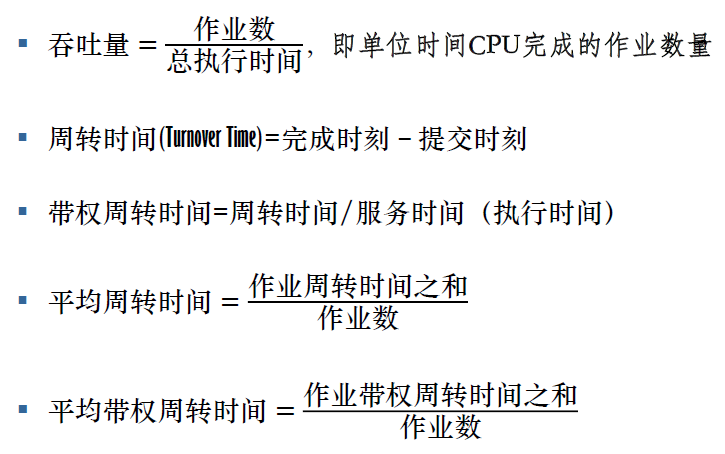
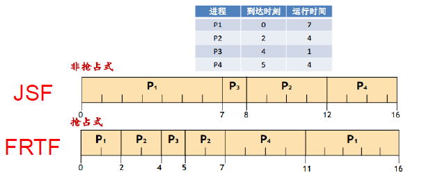
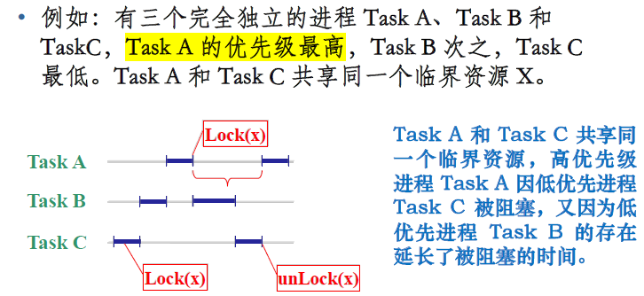
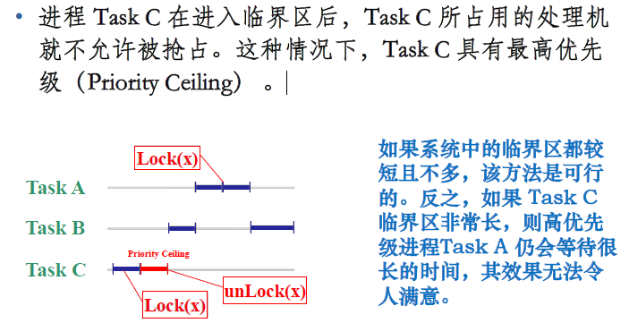
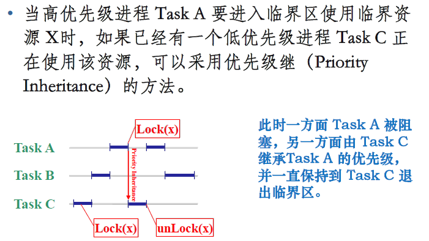
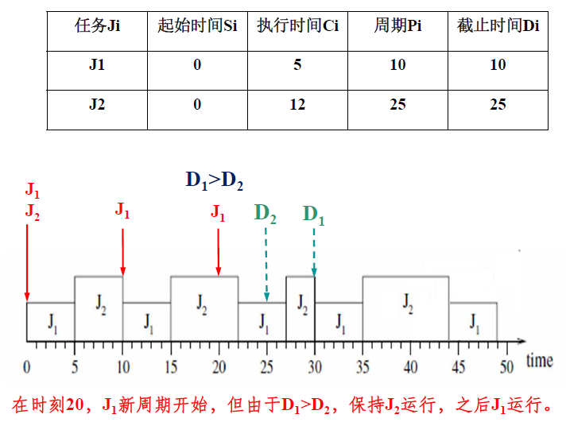

# 第四章 进程管理

# 4.3 调度

> ### Week 9~10 :stuck_out_tongue_winking_eye:
>
> 调度和死锁是OS期末最爱考的地方！

[TOC]

## 4.3.1 基本概念

处理机：合理分配使用CPU资源，**提高处理机利用率，使各用户公平得到处理机资源**

CPU调度：任务是控制、协调多个进程对CPU的竞争，亦即**按照一定的策略（调度算法），从就绪队列中选择一个进程**，并把CPU的控制权交给被选中的进程。

场景：N个进程就绪，等待上CPU运行，M（M >= 1）个CPU9，OS决策给哪个进程分配哪个CPU ​​

### WHEN

何时调度：

- **新的进程被创建；**
- **进程运行完毕时**；
- 一个进程当一个进程由于 I/O 、信号量或其他的某个原因**被阻塞**时；
- 当一个 I/O 中断发生时，表明某个 I/O 操作已经完成，而等待该 I/O 操作的**进程转入就绪状态**
- 在分时系统中，当一个**时钟中断发生**时。

> 操作系统进行进程调度的时机：下列全选
>
> A. 进程被创建时
>
> B. 进程结束时
>
> C. 进程被阻塞时
>
> D. 进程主动让出CPU时
>
> E. 时钟中断发生时
>
> F. 进程执行了除以0的指令时
>
> G. 进程进行系统调用时

何时切换：只要OS取得对CPU的控制

- 用户调用、陷阱、中断

### HOW

在进程（上下文）中切换的步骤：

- **保存** 处理器的 **上下文** ，包括程序计数器和其它寄存器；
- 用新状态和其它相关信息 **更新正在运行进程的PCB**
- 把进程 **移至** 合适的 **队列：就绪、阻塞**
- **选择另一个** 要执行的进程；
- 更新被选中进程的 PCB
- 从被选中进程中 **重装入 CPU 上下文** 。

CPU三级调度：

- **高级调度**：亦称**宏观调度/作业调度**，从**用户工作流程**的角度，一次提交的若干个作业，对每个作业进行调度。时间上通常是分钟、小时或天。
- ==**中级调度**==：亦称**内外存交换**。从**存储器资源**的角度。将进程的部分或全部换出到外存上，将当前所需部分换入到内存。指令和数据必须在内存里才能被 CPU 直接访问。

  > 决定哪些作业何时被换出主存
- **低级调度** ：又称为 “**微观调度**”、“**进程或线程调度** ”。从 **CPU 资源**的角度，时间上通常是毫秒。因为执行频繁，要求在实现时达到高效率。

  - 非抢占式
  - 抢占式：时间片原则、优先权原则、短作业（进程）优先

调度性能准则

- 面向用户

  - **周转时间**：作业 ==从提交到完成（得到结果）所经历的时间==——批处理系统

  - **响应时间**：用户输入一个请求（如击键）到系统给出首次响应（如屏幕显示）的时间——分时系统

    - > YCZ：响应时间是**从接到中断到开始处理中断**的时间

  - **截止时间**：**开始** 截止时间和 **完成** 截止时间——实时系统，与周转时间有些相似。

  - **优先级**：可以使关键任务达到更好的指标。

  - **公平性**：不因作业或进程本身的特性而使上述指标过分恶化。如长作业等待很长时间。

- 面向系统
  - **吞吐量**：单位时间内所完成的作业数，跟作业本身特性和调度算法都有关系——批处理系统
  - **处理机利用率**：大中型主机
  - **各种资源的均衡利用**：如 CPU 繁忙的作业和 I/O繁忙（指次数多，每次时间短）的作业搭配——大中型主机

> 关于吞吐量：**单处理机系统**，**在不可抢夺调度机制下**，如果处理机被**100%利用**，其吞吐量是系统中作业平均周转时间的倒数，倒数条件缺一不可

## 4.3.2 设计调度算法要考虑的问题

### 进程的分类

分类1：

- **I/O密集型**：频繁的进行 I/O ，通常会花费很多时间等待 I/O 操作完成
- **CPU密集型**：计算量大，需要大量的 CPU 时间。

分类2：

- **批处理进程**：无需与用户交互，通常在后台运行；不需很快的响应
  - 编译器、科学计算
- **交互式进程**：与用户交互频繁，因此要花很多时间等待用户输入。响应时间要快，平均延迟要低于50~150ms
  - Word，触控型GUI
- **实时进程**：有实时要求，不能被低优先级进程阻塞；响应时间要短且要稳定
  - 音视频，控制类

### 进程优先级（数）

优先级：进程的重要性和紧迫性；优先数：是个数值，反映某个优先级

静态优先级：进程创建时指定，运行时不再改变。

动态优先级：进程创建时指定，运行时可动态变化。

### 进程就绪队列的组织

按优先级排队方式：创建多个进程后按照不同的优先级进行排列， CPU 调度优先级较高的进程进行执行。

另一种方式：所有进程创建之后都进入到第一级就绪队列，随着进程的运行，可能会降低某些进程的优先级，如某些进程的时间片用完了，那么就会将其降级。

### 占用CPU的方式

**不可抢占式** 方式：

- 一旦处理器分配给一个进程，它就一直占用处理器，直到该**进程自己**因调用原语操作或等待 I/O等原因而**进入阻塞状态**，或**时间片用完**时才让出处理器，重新进行。

**抢占式** 方式：

- 就绪队列中一旦有优先级高于当前运行进程**优先级**的进程存在时，便**立即进行**进程调度，把处理器转给优先级高的进程。

### 时间片

是允许该进程运行的时间长度。需要考虑的因素：

- 进程切换的开销
- 对响应时间的要求
- 就绪进程个数
- CPU 能力
- 进程的行为

## 4.3.3 批处理系统的调度算法

> 区分：提交时刻 < 开始时刻 < 完成时刻；周转时间$\;\ge\;$服务时间

常用调度算法：

### 先来先服务（FCFS，First Come First Serve）

——最简单，按先后顺序调度

- 按提交或变为就绪态的先后次序分派CPU；
- 当前作业或进程占用CPU，直到执行完或阻塞，才让出CPU（非抢占式）
- 在作业或进程唤醒后，不立即恢复执行，通常等当前作业或进程让出CPU
- 特点：
  - 较有利于长作业，不利于短作业
  - 有利于CPU繁忙的作业，不利于I/O繁忙的作业

### 最短作业优先（**SJF**/SPN，Shortest Job First / Shortest Process Next）

- 是FCFS的改进，目的减少平均周转时间
- 对预计执行时间短的作业优先分派处理机；后来的短作业**不抢先**正在执行的作业
- 优点：

  - 提高系统吞吐量；改善平均周转时间，缩短作业等待时间

  缺点：

  - 对长作业非常不利，“饿死”，可能长时间无法执行
  - 未能依据作业紧迫程度划分优先级
  - 难以准确估计作业执行时间，影响调度性能

### 最短剩余时间优先（SRTF，Shortest Remaining Time First）

- 改进SJF，成为抢占式，即一个新就绪的进程比当前运行进程具有更短的完成时间，系统抢占当前进程，选择新就绪的进程执行。
- 缺点：源源不断的短任务到来，可能使长的任务长时间得不到运行，导致产生“饥饿”现象。

### 最高响应比优先（HRRF，Highest Response Ratio First）

- FCFS和SJF的折中：同时考虑作业等待时间和运行时间，既照顾短作业又不使长作业等待时间过长，改善调度性能

- 每次选择作业投入运行时，先计算后备作业队列中每个作业的响应比 RP ，然后选择其值最大的作业投入运行。
  $$
  RP=\frac{已等待时间+要求运行时间}{要求运行时间}=1+\frac{已等待时间}{要求运行时间}
  $$

- 响应比的计算时机：每当调度一个作业运行时，都要计算后备作业队列中每个作业的响应比，选择响应比最高者投入运行。

- 效果：

  - 短作业容易得到较高的响应比，长作业等待足够长时间也会获得足够高的响应比
  - 无饥饿现象
  - 缺点：每次计算各道作业的响应比会有一定的时间开销，性能比 SJF 略差。

## 4.3.4 交互式系统的调度算法

### 时间片轮转 (**RR**，Round Robin）

用于微观调度，目的是提高资源利用率。基本思路是通过时间片轮转，提高进程并发性和响应时间特性，从而提高资源利用率

- 所有就绪进程按照FCFS原则排成队列
- 每次调度时给CPU分派队首进程，让其执行一个时间片。时间片结束发生时钟中断
- 调度程序暂停进程，将其移到就绪队列队尾，通过上下文切换执行当前队首进程
- **进程可以未用完一个时间片就让出CPU**

时间片长度：

- **过长则退化为FCFS**，进程在一个时间片内都执行完，响应时间长
- 过短则需要多个时间片才处理完一次请求，上下文切换次数增加，响应时间长
- $T(响应时间)=N(进程数目)*q(时间片)$，应当使用户输入通常在一个时间片内能处理完​

#### 优先级算法（Priority Scheduling）

平衡各进程对响应时间的要求，适用于作业、进程调度，分为抢先式、非抢先式

- 静态优先级，创建时确定，进程终止前都不变
  - 依据：进程类型（系统进程高），对资源需求（越少越高），用户要求

- 动态优先级：进程运行时可改变
  - 等待时间延长则优先级提高，进程执行一个时间片就降低一个优先级

### 多级队列（**MQ**，Multi level Queue）

- 引入**多个就绪队列**，各队列区别对待，达到综合调度目标
  - 根据作业或进程的性质或类型的不同，将就绪队列**再分为若干个子队列**。每个作业固定归入一个队列。
- 不同队列可有不同的优先级、时间片长度、调度策略等；在运行过程中还可改变进程所在队列。

### 多级反馈队列（**MFQ**，Multi level Feedback Queue）

- 多级反馈队列算法是时间片轮转算法和优先级算法的综合和发展。
  - 为提高系统吞吐量和缩短平均周转时间而照顾短进程
  - 为获得较好的 I/O 设备利用率和缩短响应时间而照顾 I/O 型进程
  - 不必估计进程的执行时间，动态调节
- 设置多个就绪队列，分别**赋予不同优先级**：优先级越低则时间片越长
- 对进入内存的新进程：**先投入队列1末尾**，按**FCFS**调度；若一个时间片未执行完，投入队列2，**FCFS**调度……降低到最后的队列，**按时间片轮转调度直到完成**
- 仅当**较高优先级的队列为空**，才调度较低优先级的队列中的进程执行。如果进程执行时有新进程进入较高优先级的队列，则==**抢先执行新进程**==，并把**被抢先的进程投入原队列的末尾**。

> [!NOTE]
>
> **I/O型进程**：进入==最高优先级==队列，一个小时间片处理完一次I/O请求的数据，然后转入阻塞队列
>
> **计算型进程**：每次都执行完时间片，进入更低级队列。最终采用最大时间片来执行，减少调度次数。
>
> **I/O 次数不多，而主要是 CPU 处理的进程**：在 I/O 完成后，**放回** I/O 请求时离开的队列，以免每次都回到最高优先级队列后再逐次下降。
>
> 为适应一个进程在不同时间段的运行特点，==I/O 完成时，提高优先级；时间片用完时，降低优先级==

优先级倒置：高优先级进程（或线程）被低优先级进程（或线程）延迟或阻塞。

- 解决方法——优先级置顶（Priority Ceiling），将低优先级进程的优先级调高，让它尽快释放被占用的资源，而非调整高优先级进程的优先级

  

- 解决方法——优先级继承（Priority Inheritance），让占用资源的低优先级进程继承高优先级进程的优先级，也是为了让其尽快释放资源

  

## 4.3.5 实时系统的调度算法

### 实时系统

- 是一种时间起着主导作用的系统。

- 计算机必须在一个确定的时间范围内恰当地做出反应。对于这种系统来说，**正确的但是迟到的应答往往比没有还要糟糕 。**
- **硬实时**：要求绝对满足截止时间要求（飞机控制系统）
- **软实时**：可以偶尔不满足（音视频程序）
- 通常将对不同刺激的响应指派给不同进程，每个进程的**行为是可提前预测的**

### 实时调度

问题描述：

> 任务集$S=\{t_1,t_2,...,t_n\}$；周期$T_1,T_2,...,T_n$；执行时间为$c_1 ,c_2,...,c_n$
>
> 截止周期（deadline）为 $D_1,D_2,...,D_n$，通常$D_i=T_i $。CPU 利用率 ：用$U=\sum_1^n(c_i/T_i)$​表示。

前提条件：

- 任务集S已知
- 所有任务都是周期性（T）的，必须在限定的时限（D）内完成，每个任务运行时间（c）不变
- 任务之间都是独立的，每个任务不依赖于其他任务
- 调度、任务切换时间忽略不计

实时调度算法

### 静态表调度（Static table-driven Scheduling）

- 通过对所有周期性任务的分析预测（到达时间、运行时间、结束时间、任务间的优先关系），事先确定一个固定的调度方案。

- **特点**：
  - **无任何计算**，按固定方案进行，**开销最小**；
  - **无灵活性**，只适用于完全固定的任务场景。

### 单调速率调度（RMS: Rate Monotonic Scheduling）

—— Liu & Layland 1973

- 已被证明，是**单处理器**下的**最优静态调度算法**，开销小，灵活性好

  > 当$\sum_{i=1}^{n} C_i/T_i \leq n(\sqrt[n]2 - 1), (n为进程数)$​时，该任务集合一定可被调度。
  >
  > 当$n\rightarrow\infty$时，上值向下趋于69%，因此当所有进程请求的CPU利用率之和小于69%时，一定存在满足所有进程实时性约束的调度方案，但大于70%时，不一定存在，但并非一定不存在

- 特点：可**通过对*系统资源利用率*的计算**来**进行*任务可调度性*分析** , 算法简单、有效 , 便于实现。

  - 任务周期越小，其优先级越高，优先级最高的任务最先被调度
  - 若两个任务优先级一样，当调度它们时，RM算法随机选择一个调度
  - ==**是静态、抢先式调度**==

### 最早截止时间优先算法（EDF: Earliest Deadline First）

- 任务的**绝对截止时间越早**，其优先级越高，优先级最高的任务最先被调度

- 如果两个任务的优先级一样，当调度它们时，EDF 算法将随机选择一个调度

  

## 4.3.6 多处理机调度

与单处理机调度的区别：

- 注重整体运行效率（而不是个别处理机的利用率）；
- 更多样的调度算法；
- 多处理机访问 OS 数据结构时的互斥（对于享内存系统）。
- 调度单位广泛采用线程。

### 非对称式多处理系统（AMP: Asymmetric Multi Processor）

==指多处理器系统中**各个处理器的地位不同**==。

- 主－从处理机系统，由主处理机管理一个公共就绪队列，并分派进程给从处理机执行。
- 各个处理机有固定分工，如执行 OS 的系统功能， I/O 处理，应用程序。
- 有潜在的不可靠性（主机故障造成系统崩溃）。

### 对称式多处理系统（SMP: Symmetric Multi Processor）——集中控制

==指多处理器系统中，各个处理器的地位相同。==

- **静态分配**：每个CPU设立一个就绪队列，进程从开始执行到完成都在同一个CPU上。
  - 优点：调度算法开销小
  - 缺点：容易出现忙闲不均
- **动态分配**：各个CPU采用一个公共就绪队列，队首进程每次分派到当前空闲CPU上执行，防止忙闲不均

### 自调度（Self Scheduling）——分散控制

- 各个CPU采用一个==公共就绪队列==，每个处理机都可以从队列中**选择适当进程来执行**。

- 需要对就绪队列的数据结构进行 **互斥访问控制** 。
- **是最常用的算法**，实现时易于移植，采用单处理机的调度技术。
- 优点：无需专门的处理机从事任务分派工作。
- 缺点：当处理机个数较多，对就绪队列的访问可能成为系统瓶颈。

### 成组调度（gang scheduling）

- 将一个进程中的 **一组线程** ，每次 **分派时同时到一组处理机上** 执行，在剥夺处理机时也同时对这一组线程进行。
- 优点：
  - 通常这样的一组线程在应用逻辑上相互合作，成组调度 **提高了这些线程的执行并行度** ，有利于减少阻塞和加快推进速度，最终提高系统吞吐量。
  - 每次调度可以完成多个线程的分派，在系统内线程总数相同时能够 **减少调度次数** ，从而减少调度算法的开销。

### 专用处理机调度（dedicated processor assignment）

- 为进程中的每个线程都固定分配一个 CPU ，直到该线程执行完成。
- 缺点：线程阻塞时，造成 CPU 的闲置。
- 优点：线程执行时不需切换，相应的开销可以大大减小，推进速度更快。
- 适用场合： CPU 数量众多的高度并行系统，单个 CPU 利用率已不太重要。

> Linux调度：略