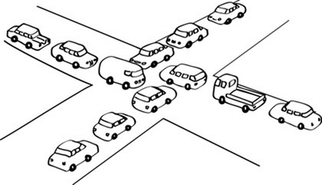
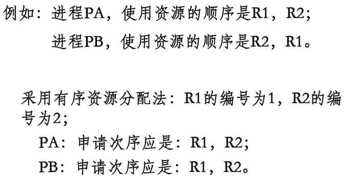
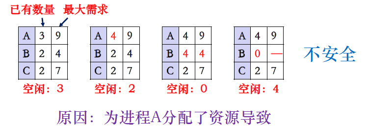
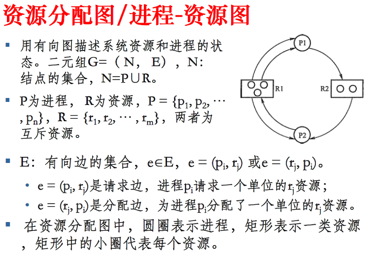
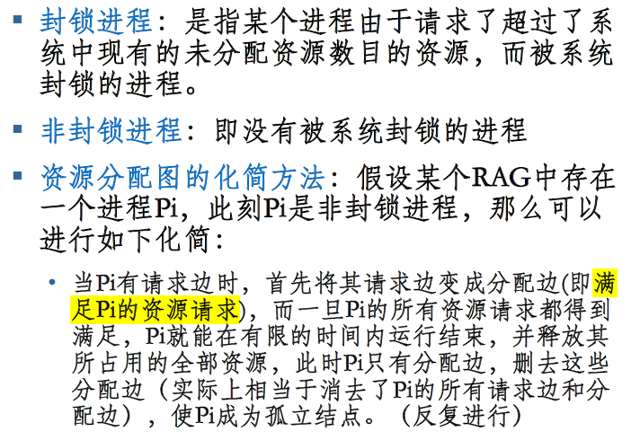
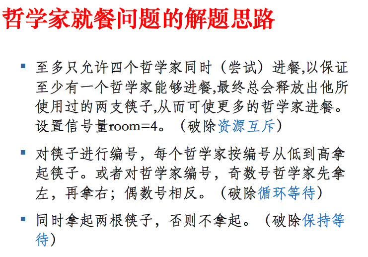
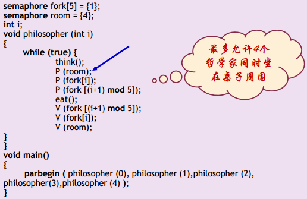

# 第四章 进程管理

# 4.4 死锁

> ### Week 11 :kissing_closed_eyes:

[TOC]

## 4.4.1 死锁的概念

**死锁**（Deadlock）：由于资源占用的互斥，当某个进程提出资源申请之后，使得一些进程在无外力协助的情况下，永远分配不到必需的资源而无法运行。

> 有一组进程、一组互斥资源（路口四辆车），相互之间形成循环等待

==死锁发生**原因**==：:japanese_goblin:

- 竞争资源
- 并发执行的顺序不当

竞争资源引起死锁

- **可剥夺资源**：是指某进程在获得这类资源后，该资源可以再被其他进程或系统剥夺。 如 CPU、内存。
- **非可剥夺资源**：当系统把这类资源分配给某进程后，再不能强行收回，只能在进程用完后自行释放。如 磁带机、打印机。
- **临时性资源**：这是指由一个进程产生，被另一个进程使用，短时间后便无用的资源，故也称为 **消耗性资源** 。如 消息、中断。

### **死锁发生的四个必要条件**

1. **互斥条件**：指进程对所分配到的资源进行排它性使用，即在**一段时间内某资源只由一个进程占用**。如果此时还有其它进程请求资源，则请求者只能等待，直至占有资源的进程用毕释放。
2. **请求和保持条件**：指进程已经保持至少一个资源，但又**提出了新的资源请求**，而该资源已被其它进程占有，此时<u>请求进程阻塞</u>，但又<u>对自己已获得的其它资源保持不放</u>。
3. **不剥夺条件**：指进程已获得的资源，在**未使用完之前，不能被剥夺**，只能在使用完时由自己释放。
4. **环路等待条件**：指在发生死锁时，必然存在一个**进程资源的环形链**，即进程集合$\{P_0,P_1,P_2,··· ,P_n\}$中的 $P_0$ 正在等待一个 $P_1$ 占用的资源； $P_1$ 正在等待 $P_2$ 占用的资源，……，$P_n$ 正在等待已被 $P_0$ 占用的资源。

活锁和饥饿：

- **活锁（livelock）**：是指任务或者执行者没有被阻塞，由于某些条件没有满足，导致一直重复尝试，失败，尝试，失败 。

  > 活锁和死锁的区别：处于活锁的实体是在不断的改变状态，即所谓的“活”，而处于死锁的实体表现为等待；活锁有可能自行解开，死锁则不能 。避免活锁的简单方法是采用先来先服务的策略 。

- **饥饿（starvation）**：某些进程可能由于资源分配策略的不公平导致**长时间等待**。当等待时间给进程推进和响应**带来明显影响**时，称发生了进程饥饿，当饥饿到一定程度的进程所赋予的**任务即使完成也不再具有实际意义时称该进程被饿死** 。

## 4.4.2 处理死锁的基本方法

###  不允许死锁发生

#### 预防死锁（静态）：防患于未然，破坏死锁的产生条件

1. **打破互斥条件**：==允许进程同时访问某些资源==。但是，**有的资源是不允许被同时访问**的，像打印机等等，这是资源本身的属性。

2. **打破占有且申请条件**：==可以实行资源预先分配策略==。只有当系统 **能够满足当前进程的全部资源需求** 时，才**一次性地**将所申请的资源**全部分配**给该进程，否则不分配任何资源。由于运行的进程已占有了它所需的全部资源，所以不会发生占有资源又申请资源的现象，因此不会发生死锁。

   缺点：

   - 在许多情况下，由于进程在执行时是动态的，**不可预测** 的，因此不可能知道它所需要的全部资源。
   - **资源利用率低** 。无论资源何时用到，一个进程只有在占有所需的全部资源后才能执行。即使有些资源最后才被用到一次，但该进程在生存期间却一直占有。这显然是一种极大的资源浪费；
   - **降低进程的并发性** 。因为资源有限 ，又加上存在浪费，能分配到所需全部资源的进程个数就必然少了。

3. **打破不可剥夺条件**：==允许进程**强行从占有者那里夺取某些资源**==。就是说，当一个进程已占有了某些资源，它又申请新的资源，当不能立即被满足时，**须释放所占有的全部资源**，以后再重新申请。它所释放的资源**可以分配给其它进程**。这就相当于该进程占有的资源被隐蔽地强占了。

   - 这种预防死锁的方法实现起来困难，会降低系统性能。

4. **打破循环等待条件**：==**实行资源有序分配策略**==。即把**资源**事先分类编号，按号分配，使进程在申请、占用资源时不会形成环路。所有进程对资源的请求必须严格按资源序号递增的顺序提出。**进程占用了小号资源，才能申请大号资源**，就不会产生环路，从而预防了死锁。这种策略与前面的策略相比，资源的利用率和系统吞吐量都有很大提高。

   

   缺点：

   - 限制了进程对资源的请求，同时给系统中所有资源合理编号也是件困难事，并 **增加了系统开销**
   - 为了遵循按编号申请的次序，暂不使用的资源也需要提前申请，从而 **增加了进程对资源的占用时间** 

#### 避免死锁（动态）：在资源分配之前进行判断，银行家算法

不限制进程有关资源的申请，而是分配资源时判断是否会出现死锁，有则加以避免；否则分配资源。

- **安全序列**：
  
  - 系统中的所有进程能够按照某一种次序分配资源，并且依次地运行完毕
  - 若存在安全序列$\{P_0,P_1,P_2,··· ,P_n\}$​，则系统安全；否则系统不安全
  - 安全序列$\{P_0,P_1,P_2,··· ,P_n\}$​的组成：对于每一个进程 $P_i$，它需要的附加资源可以被系统中当前可用资源加上所有进程 $P_j$ 当前占有资源之和所满足
  
- **安全状态**：
  
  - 安全状态：系统存在一个进程执行序列$<p_1,p_2,··· ,p_n>$​可顺利完成
  
  - 系统进入不安全状态（四个必要条件同时发生）也未必产生死锁。但产生死锁后，系统一定处于不安全状态
  
    

银行家算法（DJ，1965）：保证银行家借出去的资金在有限时间内可收回

- 一个顾客贷款最大需求量不超过银行家现有资金时即纳客。可分期贷款，但总数不超过最大需求量
- 现有资金不能满足尚需贷款额时，可推迟支付，但顾客总应在有限时间内得到贷款
- 顾客得到资金，一定可在有限时间归还
- 具体见PPT/P26~34
- 特点：
  - 允许互斥、部分分配和不可抢占，可提高资源利用率；
  - 要求事先说明最大资源要求，在现实中很困难。

### 允许死锁发生

#### 检测死锁

保存资源的请求和分配信息，利用某种算法对这些信息加以检查，是否有循环等待

资源分配图（RAG，Resource Allocation Graph）算法：

- ==系统中某个时刻 t 为死锁状态的充要条件是 **t 时刻系统的资源分配图是 不可完全化简 的** 。==
- 在经过一系列的简化后，若能消去图中的所有边，使所有的进程都成为孤立结点，则称该图是 **可完全化简的**；反之的是 **不可完全化简的**。
- 教程：https://blog.csdn.net/qq_39328436/article/details/111123779
  - 对每个资源，划掉出边数个资源
  - 对每个进程的出边，看申请资源能否被满足
  - 若能被满足，把所有边和对应的资源消除掉
  - **当且仅当**系统资源分配图不可完全化简，系统是死锁状态

#### 解除死锁

死锁解除重要的是以最小的代价恢复系统的运行死锁解除后，释放资源的进程应恢复它原来的状态，才能保证该进程的执行不会出现错误

方法：

- **撤消进程** ：使全部死锁的进程夭折掉；按照某种顺序逐个地撤消（回退）进程，直至有足够的资源可用，死锁状态消除为止

- **剥夺资源** ：使用挂起/激活挂起一些进程，剥夺它们的资源以解除死锁，待条件满足时，再激活进程 。

实质：如何让释放资源的进程能够继续运行

- 选择一个牺牲进程
- 重新运行或回退到某一点开始继续运行
- 回退到足以解除死锁即可

须注意的问题：

- 怎样保证不发生“饥饿”现象，如何保证并不总是剥夺同一进程的资源
- “最小代价”，即最经济合算的算法，使得进程回退带来的开销最小。

