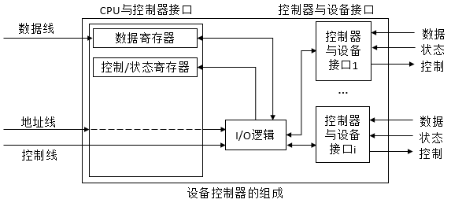
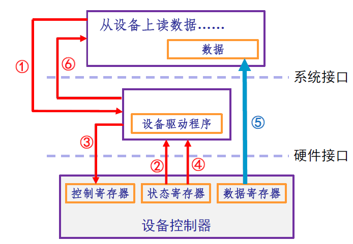
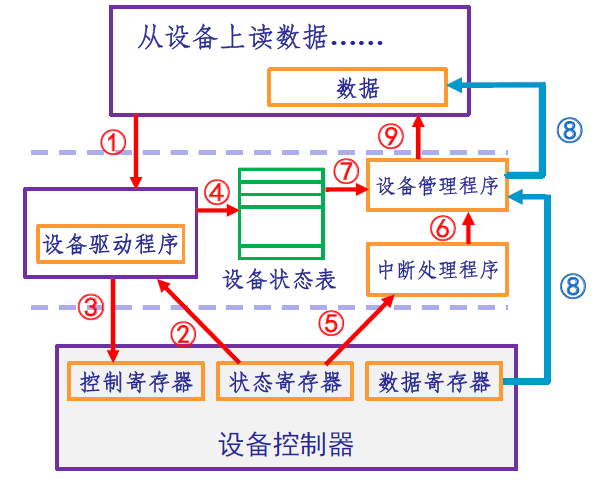
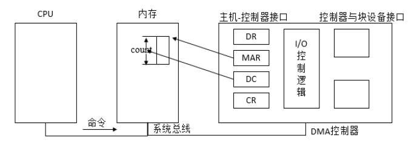
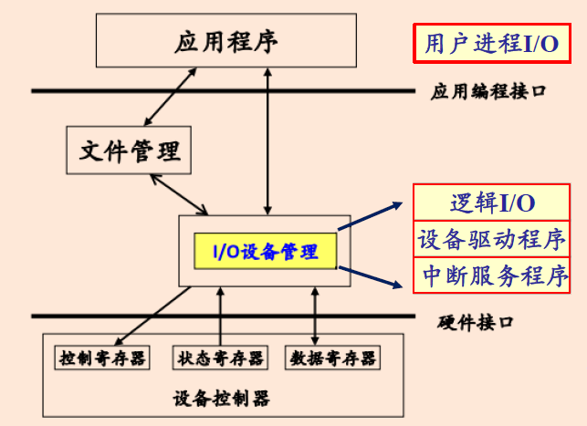
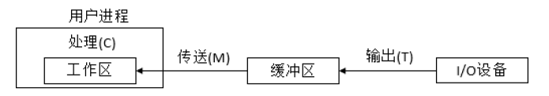
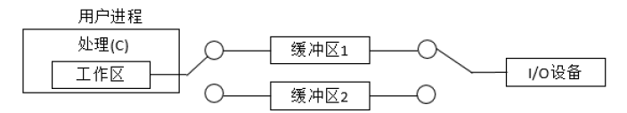
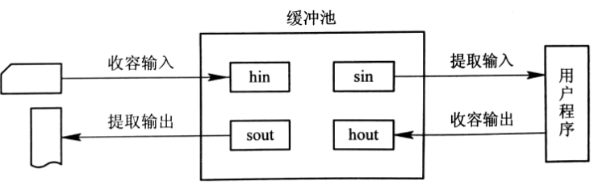
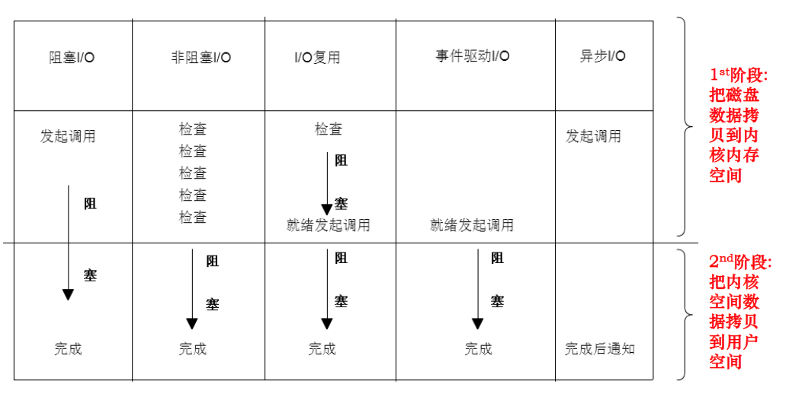

# 第五章 I/O管理

> ### Week 11~12 :kissing_closed_eyes:

[TOC]

## 5.1  I/O硬件组成

> [!IMPORTANT]
>
> 总线（Bus）是接入I/O设备的主要方式。

### 设备控制器

控制器的功能：

- 接收和识别 CPU 给来的命令
- 数据交换：CPU 与控制器、控制器与设备
- 设备状态的了解和报告
- 设备地址识别
- 缓冲区
- 对设备传来的数据进行差错检测

组成：

- 控制器与 CPU 接口：==数据寄存器、控制寄存器、状态寄存器==，采用内存映射或专门的 I/O 指令
- 控制器与设备接口：==数据信号、控制信号、状态信号==
- I/O 逻辑：用于实现 CPU 对 I/O 设备的控制

### I/O 端口地址与 I/O 端口地址空间

- 接口电路中每个寄存器具有唯一的地址
- 所有 I/O 端口地址形成 I/O 端口的地址空间（受 OS 保护）

I/O 指令形式与 I/O 地址是相互关联的，主要有以下形式：

- **内存映像编址**（内存映像 I/O 模式）：控制器的内存/寄存器作为物理内存空间的一部分
  - 优点：
    - **不需要特殊的保护机制来阻止用户进程**进行相应的 I/O操作
      - 操作系统要避免把包含了控制寄存器的那部分地址空间放入用户的虚拟地址空间中
    - 可以引用内存的每一条指令 都可以适用于 **引用控制寄存器**
  - 缺点：
    - **不允许**对一个控制寄存器的内容进行**高速缓存**
      - 如果我们把设备控制寄存器进行了高速缓存，那么第一次引用的时候就把它放入了高速缓存
      - 以后再对它的引用都是从高速缓存当中取值，而不会再去对设备进行相应的检测

- **I/O 独立编址**（ I/O 专用指令）：Intel 体系架构 in/out 指令
  - 优点：
    - 外设不占用内存的地址空间
    - 编程时，易于区分是对内存操作还是对 I/O 操作
  - 缺点：
    - I/O 端口操作的指令类型少，操作不灵活

## 5.2  I/O 控制方式

### 程序控制I/O（PIO）

也称轮询或查询方式 I/O。

- 它**由 CPU 代表进程向 I/O 模块发出指令**，然后进入轮询状态
- 直到操作完成之后进程才能够继续执行

工作过程：

1. 应用程序提出了一个读数据的**请求**
2. 设备驱动程序检查设备的**状态**
3. 如果状态正常，就给设备发出相应的**控制命令**
4. 不断地去测试这个设备是否完成了这次执行过程，实际上就是一个**轮询**
5. 设备控制器完成操作，**把数据送给应用程序**
6. 应用程序继续进行相应的处理

### 中断驱动方式（Interrupt-driven I/O）

- 当 I/O 操作结束后由**设备控制器**主动地来通知 CPU 说这次结束
- 而**不是由 CPU 不断地轮询**看看设备的状态

工作过程：

1. 用户程序提出 I/O **请求**；
2. 设备驱动程序检查设备的**状态**；
3. 如果设备已经准备好，那么就向设备**发出控制命令**；
4. 将**状态记录在设备状态表**中， CPU 继续其它工作。
5. 设备完成工作后向 CPU **发中断信号，转入中断处理程序**
6. 中断处理程序发现这是一个正常地完成了控制命令的信号后，把**结果提交给设备管理程序**；
7. 设备管理程序会**从设备状态表里查询**是哪一个请求的完成；
8. 把相应的**数据送到应用程序**；
9. 通知应用程序可以继续执行。

### 直接存储访问方式（DMA，Direct Memory Access）

- 是由一个**专门的控制器**来完成数据从内存到设备或者是从设备到内存的**直接传输工作**

  > 前两种都需要占用一定的CPU资源，而DMA适用于将大量数据读入内存时

工作过程：

1. 由程序**设置 DMA 控制器中的若干寄存器值**（如内存始址，传送字节数），然后**发起 I/O 操作**；
   - **命令/状态寄存器（CR）**：用于接收从 CPU 发送来的 I/O 命令，或有关控制信息，或设备的状态。
   - **内存地址寄存器（MAR）**：在输入时，它存放把数据从设备传送到内存的**起始目标地址**；在输出时，它存放由内存到设备的**内存源地址**
   - **数据寄存器 （DR）**：用于暂存从设备到内存，或从内存到设备的数据
   - **数据计数器（DC）**：存放本次 CPU 要读或写的字（节）数
2. DMA 控制器完成**内存与外设的成批数据交换**；
3. 在**操作完成**时由 DMA 控制器向 CPU **发出中断**。

优点：

- CPU 只需干预 I/O 操作的开始和结束，而后续成批的数据读写则无需 CPU 控制，适于高速设备

缺点：

- 数据传送的方向、存放数据的内存地址及传送数据的长度等==都由 CPU 控制==，占用了 CPU 时间
- ==每个设备占用一个 DMA 控制器==，当设备增加时，需要增加新的 DMA 控制器

DMA和中断方式的区别：

- 中断：**每个数据**传送完成后中断CPU；DMA：**一批数据**传送完成后中断CPU
- 中断：程序切换，**需要保护和恢复现场**；DMA：不需要**CPU干预**，只有开始和结束才需要
- 中断：有对**异常事件**的处理能力；DMA：适用于**数据块**的传输

### 通道技术（Channel）

与DMA原理几乎一样，进一步减少CPU的干预

- 通道是一个特殊功能的处理器，它**有自己的指令和程序**专门负责**数据输入输出的传输控制**
- CPU 将“传输控制”的功能下放给通道后**只负责“数据处理”功能**。这样，通道与 CPU **分时使用内存**，实现了 **CPU 内部运算与 I/O 设备的并行工作**。
- 优点：执行一个通道程序可以完成几组 I/O 操作，与 DMA 相比，减少了 CPU 干预。
- 缺点：费用较高。
- 种类
  - 字节多路通道：以字节为单位交叉工作，适于打印机等低速或中速IO设备
  - 数据选择通道：数据组方式，每次传送一批数据，效率很高，但只能为一台设备服务
  - 数组多路通道：分时工作且选择通道传输速率高；多道程序设计技术，使得与通道连接的设备可以并行工作

通道与DMA：

- DMA：数据传送方向、存放数据的内存始址和数据块长度都由CPU控制，只能控制一台或少数几台同类设备

- 通道：是特殊的处理器，有更强的独立处理I/O的功能，**可同时控制多种设备**

## **5.3  I/O 管理概述**

### 外设管理目的：

- **提高效率**：提高 I/O 访问效率，匹配 CPU 和多种不同处理速度的外设
- **方便用户使用**：对不同类型设备统一使用方法，协调对设备的并发使用
- **方便控制**：方便 OS 内部对设备的控制：增加和删除设备，适应新的设备类型

### 外设管理功能

- **提供设备使用的用户接口**：命令接口和编程接口
- **设备分配和释放**：使用设备前，需要分配设备和相应的通道、控制器
- **设备的访问和控制**：包括并发访问和差错处理
- **I/O 缓冲和调度**：目标是提高 I/O 访问效率

软件角度，由操作系统负责完成I/O请求：

- 逻辑 I/O：完成设备无关的操作，如设备分配，设备回收，数据准备等
- 设备驱动程序：负责对设备控制器进行控制（通过读写其中的寄存器）。
- 中断服务程序：设备工作结束后负责向 CPU 发中断信号。

> 硬件设备抽象为控制器：控制寄存器、状态寄存器、数据寄存器。OS控制这些寄存器，达到控制设备的目的

I/O管理的特点：性能是系统性能的瓶颈；外设资源种类多、繁杂各异，并发；与其他功能联系紧密，特别是文件系统

### 分类

- 按数据组织：块设备、字符设备（2021期末填空6）
- 按用途：存储设备、传输设备、人机交互设备
- 资源分配角度：独占设备、共享设备、虚设备

### I/O管理的目标和任务

1. 按照用户请求，控制设备操作，完成 I/O 设备与内存间的数据交换，最终完成用户的I/O 请求
2. 建立方便、统一的独立于设备的接口
3. 充分利用各种技术提高 CPU 与设备、设备与设备之间的并行工作能力，充分利用资源（并行性）
4. 保护：设备传送管理数据应安全、不被破坏、保密

## 5.4  I/O 软件的组成

### 分层设计思想

把I/O软件**组织成多个层次**

- 每一层执行OS所需功能的一个子集。
  - 依赖于低层所执行的更原始的功能，从而隐藏功能细节
  - 同时给更高层提供服务
- 低层考虑硬件特性，向高层软件提供接口
- 高层不依赖于硬件，向用户提供友好、清晰、简单、功能更强的接口

### 设备独立性

逻辑设备和物理设备：

- 在应用程序中，使用逻辑设备名称来请求使用某类设备

- 系统在实际执行时，需使用物理设备名称

系统应当能将逻辑设备名称转换为某物理设备名称（类似逻辑、物理地址）

好处：设备分配时的灵活性、易于实现I/O重定向

> 实现了应用程序与物理设备无关

### 逻辑设备名到物理设备名的映射

逻辑设备表（LUT，Logical Unit Table）：用于将应用程序中所使用的逻辑设备名映射为物理设备名

- 每个表目包含三项：逻辑设备名、物理设备名、设备驱动程序的入口地址
- LUT的设置：在整个系统中设置一张LUT（单用户）or 为每个用户设置一张LUT（用户登录则建立一个进程，将LUT放入进程的PCB）

### 设备驱动程序

- 设备驱动程序存放与设备密切相关的代码，每个程序处理一种设备类型
- 任务：接收来自与设备无关的上层软件的抽象请求，并执行这个请求
- 每一个控制器都设有一个或多个设备寄存器，用来存放向设备发送的命令和参数
- 特点：
  - 是 I/O 进程与设备控制器之间的通信程序
  - 驱动程序与 I/O 设备的特性紧密相关
  - 与 I/O 控制方式紧密相关
  - 与硬件紧密相关
- **组成**：
  - 自动配置和初始化子程序
  - I/O操作子程序
  - 中断服务子程序
- 共性：核心代码、核心接口、核心机制与服务、动态可加载、动态性
- 接口：
  - 驱动程序初始化函数
  - 驱动程序卸载函数，申请设备函数，释放设备函数
  - I/O 操作函数
  - 中断处理函数
- 与应用程序的区别：不以main开始，以一个模块初始化函数作为入口；初始化后不再运行，等待系统调用

## 5.5  I/O 设备管理

### 数据结构

1. **设备控制表**（DCT，Device Control Table）：每个设备一张，描述设备特性、状态和控制器的连接情况
   - 设备请求队列队首指针：指向队首PCB
   - 设备状态：使用时忙标志位置1
   - 控制器表指针：指向设备所连接的控制器的控制表
   - 重复执行次数
2. **控制器控制表**（COCT，COntroller Control Table）：每个设备控制器一张，描述 I/O 控制器的配置和状态
   - 如 DMA 控制器所占用的中断号、 DMA 数据通道的分配
3. **通道控制表**（CHCT，CHannel Control Table）：每个通道一张，描述通道工作状态
4. **系统设备表**（SDT，System Device Table）：反映系统中设备资源的状态，记录所有设备的状态及其设备控制表的入口
   - SDT 表项的主要组成：
     - DCT 指针：指向相应设备的 DCT
     - 设备使用进程标识：正在使用该设备的进程标识
     - DCT 信息：为引用方便而保存的 DCT 信息，如：设备标识、设备类型等

设备分配时应考虑的因素：

- 设备固有属性：独享、共享、虚拟设备
- 设备分配算法：先来先服务、优先级高者优先
- 设备分配中的安全性（safety）：死锁问题

用户空间的I/O软件：SPOOLing（Simultaneous Peripheral Operation On Line）技术，假脱机技术

- ==**SPOOLing 程序和外设进行实际 I/O**==
  - SPOOLing 程序预先从外设读取数据并加以缓冲，在以后需要的时候输入到应用程序；
  - SPOOLing 程序接受应用程序的输出数据并加以缓冲，在以后适当的时候输出到外设。
- 应用程序进行 I/O 操作时，只是和 SPOOLing 程序交换数据，可以称为“虚拟 I/O”
- 组成：
  - 输入井和输出井
  - 输入缓冲区和输出缓冲区
  - 输入进程SPi和输出进程SPo
- 特点：
  - 高速虚拟I/O操作
  - 实现对独享设备的共享

## 5.6  I/O 缓冲管理

缓冲技术可以提高外设利用率：匹配CPU与外设的不同处理速度；减少对CPU的中断次数；提高CPU和I/O设备之间的并行性

### 单缓冲（single buffer）

每当用户进程发出一个 I/O 请求时，操作系统便在主存中为之分配一个缓冲区

- T和C可以并行，系统对每一块数据的处理时间为`Max(C, T) + M`。T和C可以并行

  

### 双缓冲（double buffer）

两个缓冲区， CPU 和外设都可以连续处理而无需等待对方。**要求 CPU 和外设的速度相近。**

- 系统处理一块数据的时间可以粗略地认为是`Max(C+M, T)`。T和C+M可以并行

  

### 环形缓冲（circular buffer）

CPU和外设处理速度差大，双缓冲效果不好而引入

循环缓冲区的组成：

- 多个缓冲区，在循环缓冲区中包括多个缓冲区，每个缓冲区的大小相同，作为输入的 **多缓冲区可分为三种类型** ，用于装输入数据的 **空缓冲区 R** 、已 **装满数据的缓冲区 G** 以及计算进程 **正在使用的工作缓冲区 C**
- 多个指针，作为输入的缓冲区可设置 **三个指针** ，用于 指示计算进程下一个**可用缓冲区 G** 的指针 `Nextg`、 指示输入进程下次**可用的空缓冲区 R** 的指针 `Nexti`、以及用于指示计算进程正**在使用的缓冲区 C** 的指针 `Current`

### 缓冲池（buffer pool）

为了管理方便，将相同类型的缓冲区链成一个队列，形成了：空缓冲队列 emq ，输入队列 inq，输出队列 outq 

缓冲区可以工作在收容输入、提取输入、收容输出、提取输出四种工作方式下。

## 5.7  I/O 性能问题

解决途径：

- 使 CPU 利用率尽可能不被 I/O 降低
  - 缓冲技术减少或缓解速度差异，异步I/O
- 使 CPU 尽可能摆脱 I/O

五种模型：

> 可以提高I/O性能的技术：DMA，预先读，延时写，异步I/O，缓冲，SPOOLing