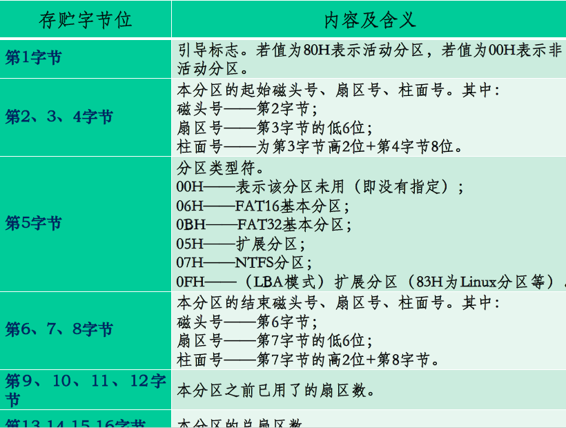
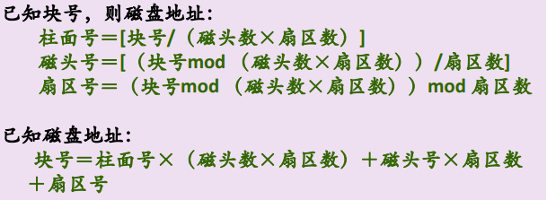
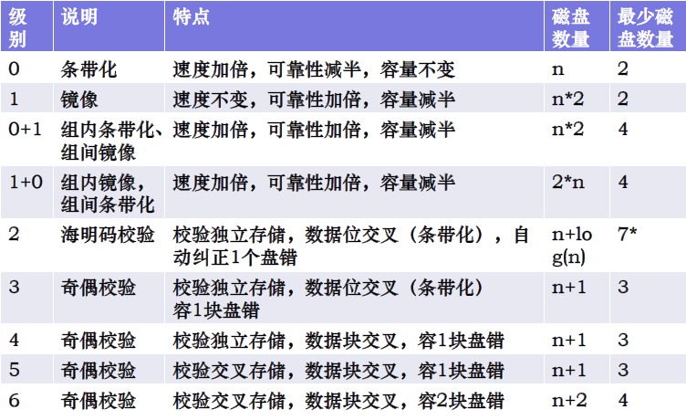

# 第六章 磁盘管理

> ### Week 12 :drooling_face:

[TOC]

## 6.1 磁盘的历史及工作原理

历史：磁带 - 温彻斯特硬盘 - 硬盘

基本概念：

- **扇区**（sector）：盘片被分成许多扇形的区域
- **磁道**（track）：盘片上以盘片中心为圆心，不同半径的同心圆。
- **柱面**（cylinder)：硬盘中，不同盘片相同半径的磁道所组成的圆柱。
- 每个磁盘有两个面，每个面都有一个 **磁头**（head）。==无法实现多个磁头分别独立寻道==

每个磁道的扇区数**并非常量**。绝大多数磁盘都有**缺陷扇区**，因此映射必须用其他空闲扇区代替这些缺陷扇区

缺陷：

- 实际扇区数比标签标定的大，其中 **一部分用于存储硬盘的固件（硬盘控制器使用）**；
- 一部分是用户存储数据的区域，即 **工作区** ，也就是 **硬盘标定容量的扇区**；
- 剩下的就是**保留区** ，超过在固件里定义的硬盘容量的那些扇区就称为保留扇区。
- P表：永久缺陷列表，记录硬盘生产过程中产生的缺陷
- G表：增长缺陷列表，记录硬盘使用过程中由于磁介质性能变弱而引起的缺陷

> 磁盘是一种**块设备**，而非字符设备；容量一般不如磁带，但有更好的随机访问性能

## 6.2 磁盘的组织与调度算法

### 6.2.1 主引导扇区（MBR）

MBR（Master Boot Record）：硬盘的0柱面、0磁头、1扇区，占用512字节，用于硬盘启动时将系统控制权转给用户指定的、在分区表中登记了的==某个操作系统分区==

内容在硬盘分区时由分区软件（如FDISK）写入该扇区

==与操作系统无关==，有公共引导的特性

结构：

- 前446字节：**启动代码及数据**
- 447~510字节：**分区表**（DPT），由**4个**16字节数据的分区项组成，记录启动时需要的分区参数
- 后两字节：**幻数**（Magic Number）AA和55，若没有则认为没有分区

### 6.2.2 分区表（DPT）

- 由于 MBR 的限制 只能有 4 个主分区，系统必须装在主分区上面 。
- 硬盘分区有三种，==主磁盘分区、扩展磁盘分区、逻辑分区==。
- 一个硬盘主分区至少有 1 个，最多 4 个，扩展分区可以没有，最多 1 个。且主分区 + 扩展分区总共不能超过 4 个。逻辑分区可以有若干个。
- 主分区**只能有一个是激活的**（active），其余为 inactive

分出主分区后，其余部分可分成扩展分区，可全分，也可不全分（剩下的浪费）

扩展分区不能直接用，必须分为若干逻辑分区，故**所有逻辑分区都是扩展分区的一部分**

- 第0字节：自举标志，值为0x80则为活动分区，0x00为非活动分区
- 第4字节：分区类型

### 6.2.3 容量及访问时间

#### 容量

**8.46GB问题**：如6.2.2图。

- 柱面号最大值为 2^10 = 1024 （0~1023）
- 扇区号不会超过 2^6-1 = 63 （0~63）
- 磁头号不会超过 2^8 = 256 （0~255）
- 这个扇区之前所有物理扇区包含的字节数：1024\*256\*63\*512 Bytes = 8.46GB

**磁盘地址（CHS: Cylinder, Head, Sector）与块号（LBA: Logic Block Address）的转换**：

#### 访问时间

- **寻道时间**：

  - 把磁臂（磁头）从当前位置移动到指定磁道上所经历的时间。该时间是 **启动** 磁盘的 **时间 s** 与磁头**移动 n 条磁道** 所花费的时间之和。
    $$
    T_s=mn+s,\;其中\;m\;是一个常数 。
    $$

- **旋转延迟时间**：注意是一半
  $$
  T_r=1/(2r)=(每转用时)/2
  $$

  - 硬盘典型的旋转速度为 3600 r/min，每转需时 16.7ms，平均旋转延迟时间 $T_r$ 为 8.3 ms（前数/2）。
  - 软盘旋转速度为 300 或 600 r/min，每转需时0.1~0.2s，平均 $T_r $​为 50~100 ms。

- **传输时间**：

  - 是指把数据从磁盘读出，或向磁盘写入数据所经历的时间， $T_t $​的大小与 **每次所读/写的字节数 b** ，旋转速度 r 以及 **磁道上的字节数 N** 有关
    $$
    T_t=b/(rN)
    $$

  - 典型：N=一个扇区=512B，旋转速度r=3600\~15000RPM，故硬盘1s可传输的数据为2\~50MB

- **访问时间**$T_a$​​ = 寻道时间 + 旋转延迟时间 + 传输时间

### 6.2.4 磁盘调度算法

#### 先来先服务算法（FCFS）

- 算法思想：**按访问请求到达先后次序**服务
- 优点：简单、公平
- 缺点：效率不高，相邻两次请求可能从最内到最外柱面寻道，磁头反复移动，增加服务时间，对机械亦不利。适用于I/O较少的场合

#### 最短寻道时间优先算法（SSTF，Shortest Seek Time First）

- 算法思想：优先选择**距当前磁头最近的访问请求**进行服务，主要考虑寻道优先。当IO请求间隔较大时，SSTF将退化成FCFS
- 优点：改善了磁盘平均服务时间
- 缺点：不保证平均寻到时间最短，可能产生“饥饿”现象，造成某些访问请求长期等待得不到服务

#### 扫描算法（SCAN）

- 算法思想：当有访问请求时，**磁头按一个方向移动**，在移动过程中对遇到的访问请求**进行服务**，然后**判断该方向上是否还有访问请求**，如果有则继续扫描；否则改变移动方向，并为经过的访问请求服务，如此反复。
- 优点：克服了最短寻道优先的缺点，**既考虑了距离，同时又考虑了方向**
- 缺点：但由于是摆动式的扫描方法，**两侧磁道被访问的频率仍低于中间磁道**，所有柱面访问机会并不均等。

#### 循环扫描算法（CSCAN）

- 算法思想：
  - 按照所要访问的柱面位置的次序去选择访问者。
  - 移动臂到达最后一个柱面后，立即带动读写磁头快速返回到 0 号柱面——**只在一个扫描方向上**处理IO请求
  - 返回时不为任何的等待访问者服务。
  - 返回后可再次进行扫描。
- 由于 SCAN 算法偏向于处理那些接近最里或最外的磁道的访问请求，所以使用改进型的 C-SCAN 算法**消除了对两端磁道请求的不公平**
- > 引入CSCAN算法的目的是解决两侧磁道不公平的问题。SCAN已经很好解决了的饥饿问题，饥饿问题不是引入CSCAN的目的

改进SCAN/C-SCAN：只需到达最远端的请求，**无需到达磁盘端点**——LOOK/C-LOOK调度

- 朝一个给定方向移动前会查看是否有请求

N-Step-SCAN：

- 将磁盘请求队列分成 ==若干个长度为 N 的== **子队列** ，解决磁头粘黏问题
- N 很大～SCAN；N = 1～FCFS

## 6.3 磁盘空间的管理

### 6.3.1 位图

- 用一串二进制位反映磁盘空间中分配使用情况，每个物理块对应一位，**分配的物理块为 0 ，否则为 1**。
- 申请物理块时，可以在位示图中查找 1 的位，返回对应的物理块号；归还时，将对应位转置为 1 。

### 6.3.2 空闲表法

- 将所有空闲块记录在一个表中，即空闲表；
- 主要记录两项内容：起始块号，块数

### 6.3.3 空闲链表法

- 把所有空闲块链成一个表，链会很长。

### 6.3.4 成组链接法

- 把空白物理块分成组，再通过指针把组与组之间链接起来，这种管理空白块的方法称为成组链接法。
- 优点：
  - 空白号登记不占用额外空间
  - 节省时间
  - 采用后进先出的栈结构思想

## 6.4 RAID

> ### Flash Disk - 详见PPT

廉价冗余磁盘阵列（Redundant Arrays of Inexpensive Disks, RAID）

- 基本思想：把多个相对便宜的硬盘组合起来，成为一个硬盘阵列组，使性能达到甚至超过一个价格昂贵、容量巨大的硬盘。
- 比单个硬盘的好处：

  - 增强数据集成度，增强容错功能，增加处理量或容量。

  - 磁盘阵列对于电脑来说，看起来就像一个单独的硬盘或逻辑存储单元。

主要利用 **数据条带**、**镜像** 和 **数据校验** 技术来获取高性能、可靠性、容错能力和扩展性。组合运用这三种技术，可将RAID分为不同等级

#### RAID0——条带化（Stripe）存储

Theoretically，有 N 个磁盘组成的 RAID0 是单个磁盘读写速度的 N 倍

以位/字节为单位分割数据，==并行读写==于多个磁盘上，故有很高的数据传输率，但没有数据冗余，不算真正的RAID，==磁盘平均损坏时间是单个磁盘的1/N==

#### RAID1——镜像（Mirror）存储

它是==通过磁盘数据镜像==实现数据冗余，在成对的独立磁盘上产生互为备份的数据。当原始数据繁忙时，可直接从镜像拷贝中读取数据。因此 RAID 1 **可以提高读取性能，但并不提高写入性能**！

成本最高，但提供了很高的数据安全性和可用性。某磁盘失效时，可自动切换到镜像磁盘上读写，无需重组失效的数据

#### RAID2——海明码（Hamming Code）校验条带存储

将数据条块化地分布于不同的硬盘上，条块单位为 **位或字节** ，使用海明码来提供错误检查及恢复

> 海明码长度：$2^P\ge P+D+1$

特点：并未广泛使用；

- 并行存取，各个驱动器同步工作。
- 使用海明编码来进行错误检测和纠正，数据传输率高。
- 需要多个磁盘来存放海明校验码信息，冗余磁盘数量与数据磁盘数量的==对数==成正比。

#### RAID3——奇偶校验（XOR）条带存储

共享校验盘，数据条带存储单位为==字节==。**使用简单的奇偶校验**，用<u>单块磁盘</u>存放奇偶校验信息。如果一块磁盘失效，奇偶盘及其他数据盘可以重新产生数据；如果奇偶盘失效则不影响数据使用。

对于大量的连续数据可提供很好的传输率，但对于随机数据来说，奇偶盘会成为写操作的瓶颈。

- 将磁盘分组，**读写要访问组中所有盘**，每组中有一个盘作为校验盘。
- 校验盘一般采用奇偶校验。
- 简单理解：先将分布在各个数据盘上的一组数据加起来，将和存放在冗余盘上。一旦某一个盘出错，只要将冗余盘上的和减去所有正确盘上的数据，得到的差就是出错的盘上的数据。
- 缺点：恢复时间较长。

#### RAID4——奇偶校验（XOR）条带存储

共享校验盘，数据条带存储单位为==块==。使用 **一块磁盘作为奇偶校验盘** ，每次写操作都需要==访问奇偶盘==，这时奇偶校验盘会成为写操作的瓶颈，因此 RAID4 在商业环境中也很少使用。

冗余代价和 RAID3 相同，但访问数据方法与 RAID3 不同（RAID3 中，一次磁盘访问将对磁盘阵列中的所有磁盘进行操作）。

出现的原因：希望使用较少的磁盘参与操作，以使磁盘阵列可以并行进行多个数据的磁盘操作。

#### RAID5——奇偶校验（XOR）条带存储

数据条带存储单位为==块==，校验数据分布式存储，不单独指定的奇偶盘，而是在所有磁盘上 **交叉地存取数据及奇偶校验信息** 。在 RAID 5 上，读/写指针可同时对阵列设备进行操作，提供了更高的数据流量。

更适合于小数据块和随机读写的数据

#### RAID6——奇偶校验（XOR）条带存储

数据条带存储单位为==块==，两个独立的奇偶校验信息块，使用不同算法，容错2块盘，**可靠性非常高**。

写入数据要访问 1 个数据盘和 2 个冗余盘，比RAID5有更大的“写损失”，写性能差

RAID比较：

## 6.5 提高I/O速度

主要途径：

- 选择性能好的磁盘
- 并行化
- 采用适当的调度算法
- 设置磁盘高速缓冲区
- 缓存
- 优化数据布局：物理块（连续摆放），索引节点（减少与数据块的距离/与数据块结合）

> 以下可以提高磁盘IO性能的手段：全选
>
> A. 采用更高转数的磁盘
>
> B. 采用Flash替代旋转式磁盘
>
> C. 增大磁盘控制器上的缓存
>
> D. 消除文件碎片

## 6.6 磁盘管理实例
