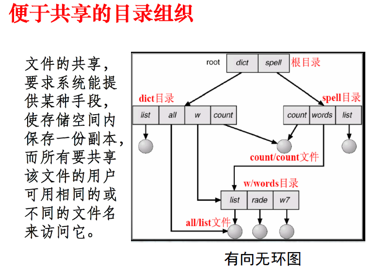
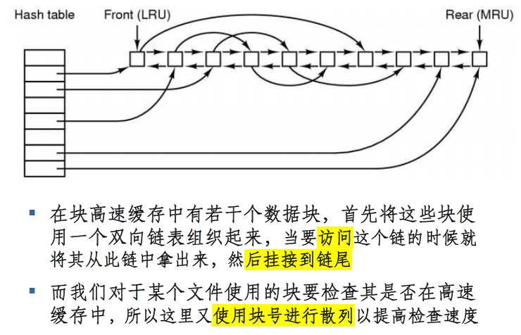

# 第七章 文件系统

> ### Week 13 :upside_down_face:

[TOC]

## 7.1 文件系统基本概念

### 7.1.1 文件系统的概念

**定义**：操作系统中与文件管理有关的那部分**软件**和被管理的**文件**以及实施管理所需要的**数据结构**的总体

**目的**：为系统管理者和用户提供了对文件的 ==透明存取==（**按名存取**）

**任务**：统一管理磁盘空间，实现按名存取，提供统一、方便使用、易于维护的用户接口，提供访问权限（文件保护），提高性能

### 7.1.2 文件系统的模型

三个层次：

1. **文件系统接口**（最接近用户），给用户提供两种类型接口：

   - **命令行接口**：用户和文件系统交互的接口，键盘终端键入
   - **程序接口**：用户程序和文件系统的接口，系统调用

   基本操作：create open delete close seek rename read write ...

2. **对象操作管理的软件集合**

   核心部分：文件存储空间、文件目录、VA->PA、文件读写管理、文件共享和保护

3. **文件系统管理的对象及其属性**

   1. **文件**：文件管理的直接对象

   2. **目录**：包含文件名和文件所在的PA（or指针）

      对目录的组织和管理是方便用户和提高对文件存取速度的关键

   3. **磁盘存储空间**：文件和目录所占用，提高外存利用率、提高对文件的检索速度

### 7.1.3 文件的概念

文件是一个单独**连续的逻辑地址空间**，与进程的地址空间无关

文件是一组带标识（**文件名**）的、在逻辑上有完整意义的数据项（字节）的序列

- 包括两部分：文件体（文件本身的内容）、文件说明（文件存储和管理的相关信息）

文件的**本质**是==一组字节序列==：持久化、规范化。一切皆文件：所有IO设备都可看成是文件

**文件管理**：

- 用户视角：使用**逻辑文件**，关心对外用户接口
- OS视角：组织和管理**物理文件**

**文件名**：有限长度的字符串，Unix区分大小写，Windows不区分

**文件类型**（UNIX）：普通文件、目录文件、特殊（设备）文件、管道文件、套接字

> 2021期末考过：
>
> ==流式文件==：构成文件的基本单位是**字符**。文件是有逻辑意义、无结构的一串字符的集合；
>
> ==记录式文件==：文件由**若干记录**组成，可以按记录进行读写、查找等操作。每条记录有其内部结构
>
> 文件存取方式：顺序存取/随机存取

### 7.1.4 目录的概念

目录是由文件说明索引组成的用于文件检索的特殊文件

**目录内容**：文件属性信息，其中一部分是用户可获取的

- 文件名：字符串
- 别名数目
- 文件类型：有多种划分方法
- 地址信息：存放位置、文件长度（以字节、字或存储块为单位）
- 访问控制信息：文件所有者、访问权限
- 使用信息：创建时间、最后一次读/写访问的时间和用户

**文件目录分类**

- **单级文件目录**：每个表目有文件名、物理地址、文件结构、存取控制、管理信息
  - 结构简单，文件多时，检索时间长，有命名冲突，不便于实现共享
- **两级目录**：在根目录下，每个用户对应一个目录，在用户目录下是该用户的文件，而不再有下级目录。适用于多用户系统，各用户可有自己的专用目录。
- **多级目录（层次目录）**：==最常用==
  - 较高目录级，其目录表目为**下一级目录名**以及**一个指向其目录的指针**
  - 最后一级目录，指针指向文件的物理地址
  - 指定需要访问的文件：
    - 绝对路径名：从根目录开始依次经由的各级目录名，加上最终的文件名，是唯一的
    - 相对路径：结合当前路径使用
    - 当前目录（工作目录）：指定一个目录作为当前的工作目录
    - 上一级目录：“..”。对根目录而言是它本身
  - 特点：层次清楚，可解决文件重名问题，查找速度快。但目录级别太多时，会增加路径检索时间

## 7.2 文件系统实现方法

### 7.2.1 文件的实现

**文件控制块**（FCB，File Control Block）：为管理文件而设置的数据结构，保存管理文件所需的所有有关信息（文件属性或元数据）

- **基本信息**：

  - **文件名**：字符串，通常在不同系统中允许不同的最大长度。可以修改。

  - **物理位置**

  - **文件逻辑结构**：有/无结构（记录文件、流式文件）

  - **文件物理结构**（顺序、索引等），**不包含文件描述符**

- **访问控制信息**：

  - **文件所有者（属主）**：通常是创建文件的用户，或者改变已有文件的属主

  - **访问权限**（控制各用户可使用的访问方式）：读、写、执行、删除等

- **使用信息**：创建时间、上一次修改时间、当前使用信息等

  > UNIX中的inode是FCB的一种实现

**文件逻辑结构**：提高检索效率，便于修改，降低文件存储费用

**文件物理结构**：文件==在存储介质上的存放方式==，表示了一个文件在文件存储介质上的位置、链接和编目的方法。主要结构：连续、索引、串联

- **连续结构**：适用于变化不大的顺序访问的文件（数码相机、MP3等适用）

  - 优点：结构简单、实现容易，无需额外空间开销；支持顺序和随机存取；速度快
  - 缺点：文件长度一经固定便不易改变；不利于文件的动态增加和修改，容易产生碎片

- **串联/链接结构**：按顺序由串联的块组成

  - 各物理块最后一个（第一个）字作为链接字指出后继块的物理地址。链首指针存放在该文件目录中，文件结尾块的指针为$\wedge$，表示文件至本块结束
  - 优点：空间利用率高，文件动态扩充和修改容易，顺序存取效率高
  - 缺点：随机存取效率低，==访问文件的最后内容需要访问整个文件==（作业6）；可靠性问题（某数据块损坏，影响该数据块之后的所有数据块）；链表指针占用空间

- **索引结构**：一个文件的信息存放在若干个不连续物理块中

  - 系统为每个文件建立一个专用数据结构：==索引表==，并将这些物理块的块号存放在该索引中。

  - 索引表就是磁盘块地址数组，其中第 i 个目录指向文件的第 i 块。它和数据文件构成**索引文件**

  - 每个文件索引表长度不一样，不能存在FCB中，FCB只记录索引表的地址

  - 访问需两步：

    - 查索引区，由逻辑块号查得物理块号
    - 查数据区，由物理块号从磁盘上获得所要求的数据

  - 优点：顺序随机存取均可，可动态增长、插入删除，能充分利用外存空间

  - 缺点：带来系统开销：内外存空间、存取时间

    > 可以多级索引：二级索引的地址放在一级索引中

### 7.2.2 目录的实现

分为两类：

- 直接法：目录项 = 文件名 + FCB（属性信息、在外存上的存放位置），如 Windows
- 间接法：目录项 = 文件名 + FCB 的地址（索引号），如 Unix

给定一个文件名，即可返回相应的FCB

长文件名问题（是目录项要提供的功能）：

- 法1：目录项中把文件名长度固定为255字符，缺点是浪费空间
- 法2：每个目录项长度可变，分为目录项长度、文件属性信息、文件名（仅此部分可变），缺点是文件删除后，空间不好回收利用
- 法3：目录项本身长度固定，把可变长度文件名统一放在目录文件末尾

符号文件目录的查询技术：顺序查询、Hash法

### 7.2.3 硬链接和软链接

### 7.2.4 内存中的文件系统

PPT/P90~92

### 7.2.5 文件的保护

**建立副本**

- 把同一个文件保存到多个存储介质上（同类或不同类）。出故障时，可备用副本替换
- 方法简单，但设备费用和系统开销增大。适用于短小且极为重要的文件

**定时转储**

- 每隔一定时间把文件转储到其他存储介质上，当文件发生故障，就用转储的文件来复原，把有故障的文件恢复到转储时刻文件的状态——UNIX

**文件一致性检查**

- **磁盘块的一致性**：==每个磁盘块== 设置 两个计数器
  - 一个记录在 **文件中** 出现的 **次数**
  - 另一个记录在 **空闲块** 中出现的 **次数**
  - 最终检查两个计数器是否存在不一致问题
- **文件的一致性**：==每个文件== 设置 两个计数器
  - 一个记录其 **i 节点** 被引用的 **次数**
  - 另一个记录 **文件目录中** 引用它的 **次数**
  - 最终检查两个计数器是否存在不一致问题

文件存取控制

- **文件保护机制**
  - 防止**未被核准**的用户存取文件
  - 防止一个用户**冒充**另一个用户来存取
  - 防止核准用户（包括文件主）**误用**文件
- **存取权限验证步骤**
  - 审定用户的**权限**
  - 比较用户的权限与**本次存取要求是否一致**
  - 将存取要求和被访问文件的**保密性**比较，看是否有冲突
- 实现方案：存取控制矩阵（表）、用户权限表、口令

### 7.2.7 文件系统的性能

提高文件系统性能的方法：尽可能减少磁盘访问次数

- 目录项（ FCB ）分解、当前目录、磁盘碎片整理
- 块高速缓存、磁盘调度、提前读取
- 合理分配磁盘空间、信息的优化分布
- RAID 技术等。

**块高速缓存**（Block Cache）：又称文件缓存、磁盘高速缓存、缓冲区高速缓存

- 是内存中为磁盘块设置的一个缓冲区，保存磁盘中某些块的副本

- 对文件系统操作时：

  - 检查所有读请求，看所需块是否在块高速缓存中。若在，直接读；否则先将数据块读入cache在拷贝到所需地方
  - 由局部性原理，未来可能还访问这一数据块

- 块高速缓存的组织方式：

  

- 置换：以后可能再次使用的块放在链尾，使用概率很小的块要剔除
- 写入策略：需要考虑该块是否会影响文件系统的一致性

LFS：基于日志结构的文件系统（Log-structured File System）

## 7.3 文件系统实例分析

详见PPT/P118~167

> **超级块**（super block）存储：文件系统类型、文件系统版本、数据块大小，不存储**文件逻辑块到物理块的映射信息**

> 在读写文件之前必须执行`open`操作；`open`操作将读取文件的属性信息和控制块信息；进程会记录所打开文件的信息

> `rename`操作需要修改相应的目录项和文件控制块；不能通过复制、删除、粘贴的方法rename，因为改变了文件的创建时间信息。

> 若一文件中的某数据块损坏，则连续文件和索引文件的其他数据块都不受影响，而对**串联文件**会影响该数据块之后的所有数据块
