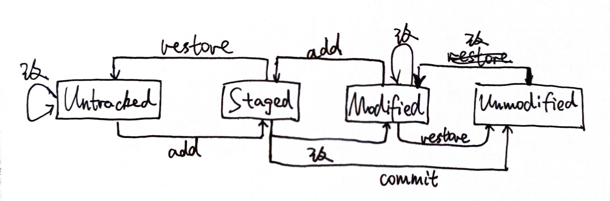

# lab 0 实验报告

>### 班级：222115
>
>### 学号：22373386
>
>### 姓名：高铭
---

## 一、思考题 (Thinking)

### Thinking 0.1 辨析Git中的4种状态转换关系
第一次执行`add`命令之前，`status`显示如下：
```
Untracked.txt:
位于分支 master

尚无提交

未跟踪的文件:
  （使用 "git add <文件>..." 以包含要提交的内容）
        README.txt
        Untracked.txt

提交为空，但是存在尚未跟踪的文件（使用 "git add" 建立跟踪）
```

```
Modified.txt:
位于分支 master
尚未暂存以备提交的变更：
  （使用 "git add <文件>..." 更新要提交的内容）
  （使用 "git restore <文件>..." 丢弃工作区的改动）
        修改：     README.txt

```
+ 可见两次`status`并不一样。初始，无论`README.txt`是否为空，状态均为`untracked（未跟踪）`，进行`add`操作则进入`staged（暂存）`状态。进行`commit`操作，进入`unmodified（未修改）`状态。此时再对`README.txt`修改，状态变为`modified（已修改）`。
+ 相同的是，这两个状态均需要使用`add`命令以进入`staged`状态。

### Thinking 0.2 Git command

上图为Git四种状态之间对应的指令图。由图可见:
+ `add the file` 对应 `add` 指令
+ `stage the file` 对应 `add` 指令
+ `commit` 对应 `commit` 指令

### Thinking 0.3 Git 撤销
##### 1. 代码文件`print.c`被错误删除时（尚未执行`git add`）:
+ 使用 `git checkout -- print.c` 或 `git restore print.c`，撤销对工作区的修改。

##### 2. 代码文件 `print.c` 被错误删除后，执行了`git rm print.c` 命令：
+ 第一步，使用 `git reset HEAD print.c` 或 `git restore --staged print.c`取消暂存；
+ 第二步，使用 `git checkout -- print.c` 或 `git restore print.c`，撤销对工作区的修改。

##### 3. 无关文件 `hello.txt` 已经被添加到暂存区时，在不删除此文件的前提下将其移出暂存区：
+ 使用 `git rm --cached hello.txt`，删除暂存区不再想跟踪的文件。

### Thinking 0.4 Git 版本回退
1. 执行 `git reset --hard HEAD^` 会回退至版本库中的**上一版本**，有几个`^`就回退至前几个版本，N个版本则用`HEAD~N`。
2. 执行 `git reset --hard <hash>` 会切换至当前hash值所代表的版本。

### Thinking 0.5 echo 的使用
```shell
$ echo first
    first
$ echo second > output.txt
    # output.txt
    second
$ echo third > output.txt
    # output.txt
    third
$ echo forth >> output.txt
    # output.txt
    third
    forth
```

### Thinking 0.6 文件操作
#### 文件内容
+ `command`文件内容：
```shell
echo 'echo Shell Start...' > test
echo 'echo set a = 1' >> test
echo 'a=1' >> test
echo 'echo set b = 2' >> test
echo 'b=2' >> test
echo 'echo set c = a+b' >> test
echo 'c=$[$a+$b]' >> test
echo 'echo c = $c' >> test
echo 'echo save c to ./file1' >> test
echo 'echo $c>file1' >> test
echo 'echo save b to ./file2' >> test
echo 'echo $b>file2' >> test
echo 'echo save a to ./file3' >> test
echo 'echo $a>file3' >> test
echo 'echo save file1 file2 file3 to file4' >> test
echo 'cat file1>file4' >> test
echo 'cat file2>>file4' >> test
echo 'cat file3>>file4' >> test
echo 'echo save file4 to ./result' >> test
echo 'cat file4>>result' >> test
```

+ `result`文件内容：
```shell
3
2
1
```

#### 结果解释说明：
+ 下述语句均被视作字符串，`test`中的`echo`语句直接输出：
```
Shell Start...
set a = 1
set b = 2
set c = a+b
save c to ./file1
save b to ./file2
save a to ./file3
save file1 file2 file3 to file4
save file4 to ./result
```
+ `echo c = $c` 语句输出当前c的值：`c = 3`。
+ `echo $c>file1` `echo $b>file2` `echo $a>file3` 分别将c, b, a的值3, 2, 1存入file1, file2, file3。
+ `cat file1>file4` `cat file2>>file4` `cat file3>>file4` 三条语句将file1, file2, file3的内容顺次写入file4中；`cat file4>>result` 将file4中的内容复制到result中，最后result中存的就分别是c、b、a的值。

#### 思考题：
1. 有区别。`echo echo Shell Start` 输出为 `echo Shell Start`；而 `` echo `echo Shell Start` `` 的输出为 `Shell Start`。因为反引号的作用为**隔离并执行指令**。
2. 有区别。若前序指令指定了`c`的值为`n`，那么：`echo echo $c>file1`指令的作用是将`echo n` 写入file1文件中；`` echo `echo $c>file1` ``的作用是将c的值写入file1文件中，然后在标准输出中输出空行。

## 二、难点分析
* 本次实验我学习了众多基础知识，包括许多bash常用命令，学会使用vim编辑器、tmux、gcc编译、编写shell脚本、Makefile的写法、git的基本操作等。对我而言，本次实验的难点在于Makefile与gcc编译的写法和git四种状态转换关系上。这些概念都是我第一次学习，因此使用起来比较陌生。
* 具体而言，线上实验的**Exercise 0.4**对我造成了很大困扰。通过查看指导书和实验讲解ppt，我了解到外层Makefile可以在command中使用 `$(MAKE) -C subdir` 语句调用子文件夹下的Makefile，从而完成一些复杂的操作；此外我也是第一次接触gcc -I指令，通过阅读指导书和ppt我了解到-I参数可以在编译时指定头文件目录。
* 有关git的四种状态，尽管完成实验并不需要了解太多，我还是花了较长时间理清了4种状态之间的关系，以及它们之间如何用语句切换，以便以后遇到版本回退或撤销操作能够得心应手。
* 细节方面，我了解到了bash中单引号和双引号的区别：单引号是全引用，字符串所见即所得；而双引号会把内容中的便秘昂等先解析出来。因此**Exercise 0.3**中使用`sed "s/$2/$3/g"`需要注意不能是单引号。

## 三、实验体会
我认为本次实验的难度并不大，最主要的是要熟悉实验环境和工具。这次实验我用大量时间熟悉了各类bash指令以及脚本和Makefile的编写方法，为以后的实验打好基础。在学习过程中，我逐渐摆脱了对GUI的依赖，习惯了CLI编程。尽管如此，我对于一些指令的使用仍不熟练，在用到的时候经常需要翻看指导书和预习指南。这需要我对这些指令继续多加练习，争取早日将基础知识烂熟于心。