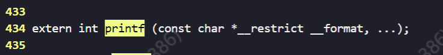
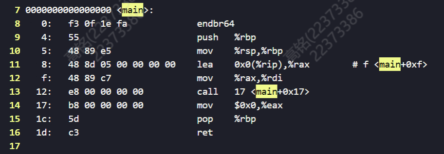
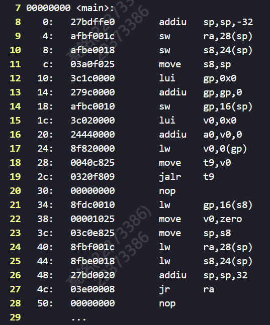
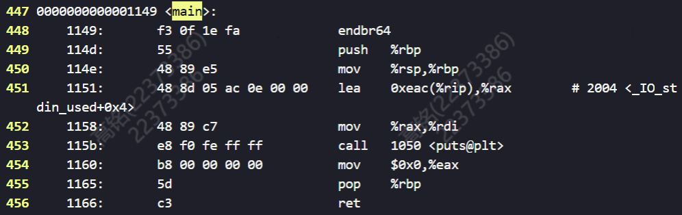
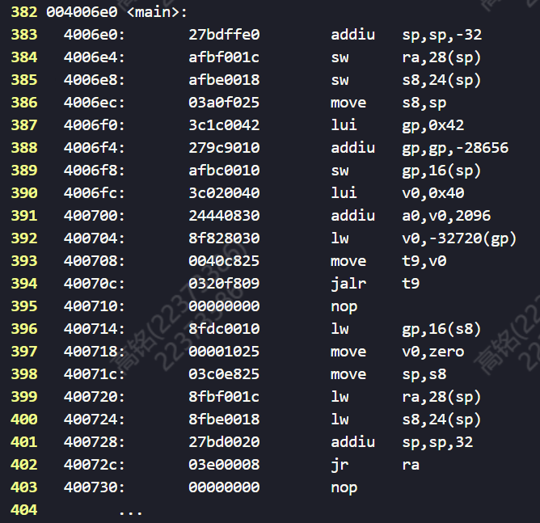
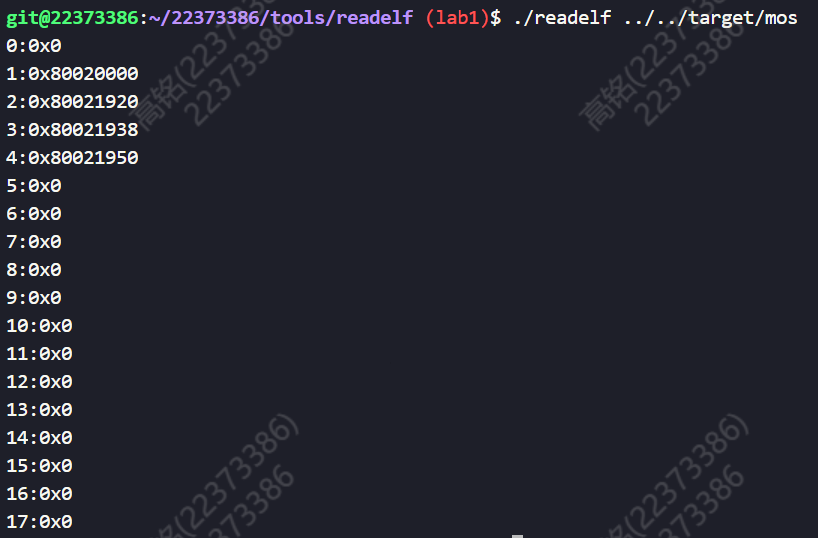

# lab 1 实验报告

>### 班级：222115
>
>### 学号：22373386
>
>### 姓名：高铭

---

## 一、思考题 (Thinking)

### Thinking 1.1

1. 预处理：并没有`printf`的定义。命令及结果如下：

```shell
mips-linux-gnu-gcc -E hello.c > preprocess.txt
```



2. 只编译而不链接：`printf`地址为0，说明`printf`的具体实现不在程序中。命令及反汇编结果如下：

```shell
# 原生x86工具链
gcc -c hello.c
objdump -DS hello.o > compile.txt
```



```shell
# MIPS交叉编译工具链
mips-linux-gnu-gcc -c hello.c
mips-linux-gnu-objdump -DS hello.o > compile.txt
```



3. 允许链接：call处的`printf`被填入地址。命令及反汇编结果如下：

```shell
# 原生x86工具链
gcc hello.c -o hello
objdump -DS hello > link.txt
```



```shell
# MIPS交叉编译工具链
mips-linux-gnu-gcc hello.c -o hello
mips-linux-gnu-objdump -DS hello > link.txt
```



由MIPS交叉编译工具链得出的结果可看出，链接过程中，一些`lui-addiu`指令和`lw`指令均由`printf`的地址覆盖，而在只编译不链接的情况下对应的地址为0.

执行指令`objdump --help`，得知：

```shell
-D, --disassemble-all    Display assembler contents of all sections
-S, --source             Intermix source code with disassembly
```

- `objdump -S <file(s)>`和-d类似，反汇编`file(s)`中的所有section；

- `objdump -S <file(s)>`将代码段反汇编的同时，将反汇编代码与源代码交替显示。

### Thinking 1.2

#### 1. 用所编写的`readelf`程序解析之前在`target`目录下生成的内核ELF文件



#### 2.为何编写的readelf程序不能解析readelf文件本身？

```shell
# Makefile
readelf: main.o readelf.o
        $(CC) $^ -o $@

hello: hello.c
        $(CC) $^ -o $@ -m32 -static -g
```

执行`readelf -h hello`，结果节选：

```
类别:                              ELF32
数据:                              2 补码，小端序 (little endian)
OS/ABI:                            UNIX - GNU
系统架构:                           Intel 80386
```

执行`readelf -h readelf`，结果节选：

```
类别:                              ELF64
数据:                              2 补码，小端序 (little endian)
OS/ABI:                            UNIX - System V
系统架构:                           Advanced Micro Devices X86-64
```

通过观察`tools/readelf/Makefile`文件，发现编译生成`hello`文件时多了`-m32`参数。该命令用于将程序编译为32位目标架构，生成与32位环境兼容的代码。可见，编译生成的`hello`文件是32位架构的，而`readelf`文件是64位架构的；而我们编写的`readelf.c`是用来对32-bit little-endian ELF文件的解析程序，不能解析64位ELF文件。

### Thinking 1.3

stage1：载入内存阶段，由`bootloader`在ROM中进行。操作系统初始化硬件设备，并为stage2做准备。

stage2：执行阶段，先初始化本阶段所需硬件设备，然后载入内核、设置启动参数，最后跳转到内核入口，完成启动。

在MOS实验中，QEMU模拟器支持直接加载ELF格式的内核，启动流程被简化为加载内核到内存，之后跳转到内核的入口，启动就完成了。

具体来说，

stage1：`kernel.lds`中的Linker Script将各个节调整到指定位置，于是段也被相应地调整，内核被加载到内存中的指定位置。

stage2：通过`ENTRY(_start)`设置程序入口为`_start`，正确地跳转到内核入口。

## 二、难点分析

我认为本次实验最大的难点在于`printk`函数的编写。阅读指导书了解到函数`for`循环中分为2部分，但对于第一部分找%的操作颇感迷惑。在各部分代码编写过程中，受到`switch`语句后面一句`fmt++;`的干扰，我总是在第一部分的代码中忘记加入`fmt++;`这一语句，导致调试中总是出很多奇怪的bug，并且也很难理清其中的逻辑。

第二部分中，需要注意到`print_num`传入的`u`是`unsigned long`类型，因此需要把传入的数转化为绝对值形式。

实验中第二大难点在于代码的阅读。`Makefile`乍看上去十分复杂，其中的调用关系也很繁多。我通过看指导书尝试理清了代码中各变量代表的含义，理解了各个`make`指令的作用。此外文件中的代码都很长，对于一些全局变量和宏定义常需要使用`grep`指令寻找出处。

另外的难点在于elf文件的解读上，需要理解`void*`到`Elf32_Ehdr*`和`Elf32_Shdr*`转换的合理性。还需要深刻理解elf文件的结构，从而才能知道如何输出文件中的所有节头信息。

## 三、实验体会

这次实验，我在阅读实验代码和理解指导书内容上花费了大量时间，用了很多精力去弄清楚各种文件、宏定义、函数之间的层次关系。相反，我感觉实验代码编写的耗时并不多，需要填写的代码量也很少。这反映了操作系统课程的学习要以代码阅读和知识理解为主，弄懂原理以后再写代码就会轻松很多。知识层面上，我理解了操作系统启动的基本流程，并且掌握了ELF文件的结构和功能，通过阅读`Makefile`代码，我也了解了今后MOS实验需要完成的操作。
