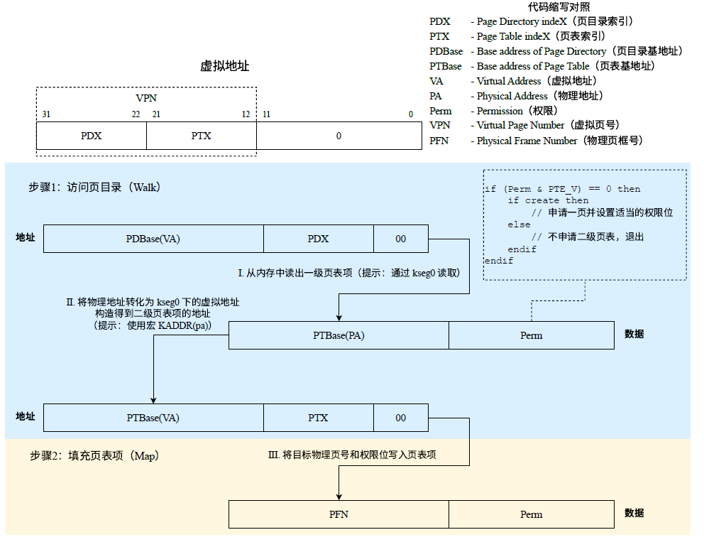

# lab 2 实验报告

---

## 一、思考题 (Thinking)

### Thinking 2.1

在编写的C程序中，指针变量中存储的地址被视为**虚拟地址**；MIPS 汇编程序中 `lw` 和 `sw` 指令使用的地址也被视为**虚拟地址**。


### Thinking 2.2

> 1. 从可重用性的角度，阐述用宏来实现链表的好处。
> 2. 查看实验环境中的`/usr/include/sys/queue.h`，了解其中单向链表与循环链表的实现，比较它们与本实验中使用的双向链表，分析三者在**插入与删除操作**上的性能差异。

1. 用宏实现链表的好处：

   - **统一代码风格**：MOS中的各类结构体都可以使用`queue.h`中的宏来定义。

   - **易于维护**：有关链表的操作（创建、遍历、插入、删除等）统一封装，可读性强、简化代码量。

   - **可重用性**：一些实现较为复杂的宏（`LIST_INSERT_BEFORE`、`LIST_INSERT_HEAD`等）可以用简单的宏（`LIST_NEXT`、`LIST_FIRST`），代码可重用性强。

   - **抽象和简化**：宏可以隐藏底层的实现细节，从而提供更简洁、更抽象的接口供开发人员使用。这种抽象性使得开发人员可以更专注于链表的功能而不用过多关注具体实现的细节。

2. 比较性能差异
   - **双向链表**：可以直接获取每一项的前后两项
     - **插入**：可以在**现有元素**之前或之后直接插入元素。**O(1)**
     - **删除**：可以任意删除**现有元素**之前或之后的元素。**O(1)**
   - **单向链表**：只能获取每一项的后面一项
     - **插入**：可以在**现有元素**之后、链表头部直接**O(1)**插入元素。若需要在某一项前面插入，需要**O(n)**遍历。
     - **删除**：链表头的元素可直接删除，其他元素只能**O(n)**顺序遍历删除
   - **单向循环链表**：由一对指针引导，一个指向列表的头部，另一个指向列表的尾部。
     - **插入**：同单向链表。
     - **删除**：链表头和尾的元素可直接删除，其他元素只能**O(n)**顺序遍历删除
   - **双向循环链表**：插入删除性能同双向链表


### Thinking 2.3

> 请阅读`include/queue.h`以及`include/pmap.h`, 将`Page_list`的结构梳理清楚，选择正确的展开结构。

由`include/pmap.h`关键代码：

```c
LIST_HEAD(Page_list, Page);
typedef LIST_ENTRY(Page) Page_LIST_entry_t;
struct Page {
    Page_LIST_entry_t pp_link;
    u_short pp_ref; 
}; 
```

应选C：

```c
struct Page_list{
    struct {
        struct {
            struct Page *le_next;
            struct Page **le_prev;
        } pp_link;
        u_short pp_ref;
    }* lh_first;
}
```


### Thinking 2.4

> - 请阅读上面有关TLB 的描述，从虚拟内存和多进程操作系统的实现角度，阐述ASID的必要性。
> - 请阅读MIPS 4Kc 文档《MIPS32® 4K™ Processor Core Family Software User’s Manual》的Section 3.3.1 与Section 3.4，结合ASID段的位数，说明4Kc 中可容纳不同的地址空间的最大数量。

ASID的必要性：

- 在多线程系统中，对于不同进程，相同的虚拟地址各自占用不同的物理地址空间，所以**同一虚拟地址通常映射到不同的物理地址（from 指导书）**。ASID的作用便是区分不同的地址空间。
- TLB中装着不同进程的页表项，只有在当前运行进程的ASID与虚拟页关联的ASID匹配时，TLB才会获取虚拟地址对应的物理页号，确保**每个进程的地址空间得到保护**。

- 在上下文切换时，使用ASID可以避免重写整个转换表和清空TLB及CPU缓存，从而大幅**提高上下文切换的效率**

  > The address space identifier (ASID) helps to reduce the frequency of TLB flushing on a context switch. The existence of the ASID allows multiple processes to exist in both the TLB and instruction caches.

ASID有8位，存储在`CP0 EntryHi`寄存器中。4Kc中可容纳不同的地址空间的最大数量为2 ^ 8 = 256。


> 
>
> The bottom portion of Figure 3-9 shows the virtual address for a 16-MByte page size. The remaining 8 bits of the address represent the VPN, that index the **256-entry page table**.


### Thinking 2.5

> - `tlb_invalidate`和`tlb_out`的调用关系？
> - 请用一句话概括`tlb_invalidate`的作用。
> - 逐行解释`tlb_out`中的汇编代码。

- `tlb_invalidate`中调用了`tlb_out`函数。

- `tlb_invalidate`可以删除（无效化）特定虚拟地址在TLB中的旧表项。

- `tlb_out`的基本思路：

  1. 将要查找的虚拟地址存入`EntryHi`寄存器
  2. 用`tlbp`指令在TLB中查找对应`Key`的旧表项，`Index`寄存器中保存找到的对应表项的索引
  3. 如果没有找到（索引小于0），则直接跳到最后；如果找到（索引大于等于0），将索引对应的TLB项清空（具体实现：将`EntryHi`和`EntryLo`寄存器清零后使用`tlbwi`指令）。
  4. 在函数最后，将调用该函数前`EntryHi`寄存器中的值恢复

  ```assembly
  LEAF(tlb_out) # 定义函数开头
  .set noreorder
  # 告诉汇编器不要重新排序指令，从而保持代码中指定的预期顺序
          mfc0    t0, CP0_ENTRYHI 
          # t0 = CPO_ENTRYHI, 把当前Key存储到t0，用于函数结束时恢复CP0_ENTRYHI
          mtc0    a0, CP0_ENTRYHI
          # CP0_ENTRYHI = a0, a0存放旧表项的Key，将旧表项的Key写入EntryHi寄存器
          nop
          /* Step 1: Use 'tlbp' to probe TLB entry */
          /* Exercise 2.8: Your code here. (1/2) */
          tlbp
          # 根据EntryHi中的Key查找TLB中与之对应的旧表项，将表项的索引存入Index寄存器
          nop
          /* Step 2: Fetch the probe result from CP0.Index */
          mfc0    t1, CP0_INDEX
          # t1 = CP0_INDEX, 把Index寄存器中的值暂存入t1
  .set reorder
          bltz    t1, NO_SUCH_ENTRY
          # 如果索引值小于0，即没有在TLB中找到EntryHi对应的表项，则跳转到NO_SUCH_ENTRY
  .set noreorder
  # 如果TLB中存在Key对应的表项，索引存在Index中：
          mtc0    zero, CP0_ENTRYHI
          # CP0_ENTRYHI = 0
          mtc0    zero, CP0_ENTRYLO0
          # CP0_ENTRYLO0 = 0
          mtc0    zero, CP0_ENTRYLO1
          # CP0_ENTRYLO1 = 0，上述三步向EntryHi和EntryLo0、EntryLo1中写入0，便于下面清空表项
          nop
          /* Step 3: Use 'tlbwi' to write CP0.EntryHi/Lo into TLB at CP0.Index  */
          /* Exercise 2.8: Your code here. (2/2) */
          tlbwi
  # 将EntryHi和EntryLo0、EntryLo1中的值（均为0）写入索引指定的表项，实现了旧表项的Key和Data被清零
  .set reorder
  
  NO_SUCH_ENTRY:
          mtc0    t0, CP0_ENTRYHI
          # CP0_ENTRYHI = t0, 把原来的VPN和ASID赋值回CP0_ENTRYHI
          j       ra
          # 函数返回
  END(tlb_out)
  ```


### Thinking A.1

> 在现代的64位系统中，提供了64位的字长，但实际上不是64位页式存储系统。假设在64位系统中采用三级页表机制，页面大小4KB。由于64位系统中字长为8B，且页目录也占用一页，因此页目录中有512个页目录项，因此每级页表都需要9位。因此在64位系统下，总共需要$3 × 9 + 12 = 39$​位就可以实现三级页表机制，并不需要64位。
>
> 现考虑上述39位的三级页式存储系统，虚拟地址空间为512GB，若三级页表的基地址为$PT_{base}$，请计算：
>
> - 三级页表页目录的基地址。
> - 映射到页目录自身的页目录项（自映射）。

- 三级页表二级页表的基地址：
  $$
  \begin{aligned}
  PD_{base}&=PT_{base}+(PT_{base}>>12)<<3+((PT_{base}>>12)<<3)>>12<<3\\
  &=PT_{base}+PT_{base}>>9+PT_{base}>>18
  \end{aligned}
  $$

- 映射到页目录自身的页目录项（自映射）：
  $$
  \begin{aligned}
  PDE_{self-mapping}&=PD_{base}+(PD_{base}>>9)<<3\\
  &=PT_{base}+PT_{base}>>9+PT_{base}>>18+PT_{base}>>27
  \end{aligned}
  $$


### Thinking 2.6

> 从下述三个问题中任选其一回答：
>
> - 简单了解并叙述X86体系结构中的内存管理机制，比较X86和MIPS在内存管理上的区别。
> - 简单了解并叙述RISC-V中的内存管理机制，比较RISC-V与MIPS在内存管理上的区别。
> - 简单了解并叙述LoongArch中的内存管理机制，比较LoongArch与MIPS在内存管理上的区别。

X86 体系结构中的内存管理机制：

- X86体系通过**分段**将**逻辑地址转换为线性地址**，通过**分页**将**线性地址转换为物理地址**。
- 逻辑地址由两部分构成，一部分是段选择器，一部分是偏移；段选择符存放在段寄存器中，偏移与对应段描述符中的基地址相加就是线性地址。
- 操作系统创建全局描述符表和提供逻辑地址，之后的分段操作x86的由CPU自动完成，并找到对应的线性地址。
  从线性地址到物理地址的转换是CPU自动完成的，转化时使用的Page Directory和Page Table等需要操作系统提供。

X86 和 MIPS 在内存管理上的区别

- TLB不命中：
  - MIPS触发TLB缺失和充填，然后CPU重新访问TLB
  - x86硬件MMU索引获得页框号，直接输出物理地址，MMU充填TLB加快下次访问速度
- 内存管理方式：
  - MIPS主要采用分页式内存管理
  - x86采用分段式和分页式内存管理
- 逻辑地址不同：
  - MIPS地址空间32位
  - x86支持64位逻辑地址，同时提供转换为32位定址选项
- 设计思路不同：
  - MIPS提供了更多的控制给操作系统，允许软件更灵活地管理内存
  - X86倾向于使用硬件自动处理


## 二、难点分析

本次实验大体分为4个部分：内核程序启动、物理内存管理、虚拟内存管理、TLB重填，难点分析以这4部分为基础开展。


#### 内核程序启动

在还没有建立内存管理机制的情况下，内核利用`kseg0`段的性质，将虚拟地址线性映射到物理地址，调用`mips_vm_init`函数，用`alloc`分配内存，建立内存管理机制。

我完成此处代码遇到的困难在于并不清楚应当使用哪些宏定义。事实上，需要用到的一些常量都定义在`include/mmu.h`文件中。Exercise 2.1即可使用`PPN(memsize)`快速得到页表数目。

#### 物理内存管理

物理内存管理使用链表法。

该部分中，第一大难点是LIST链表宏。MOS中使用的双向链表维护两个指针，`le_next`指向下一个元素，而`le_prev`指向**前一个元素链表项的指针**`le_next`，而非前一个元素。

特别地，链表宏使用`field`来包含`le_prev`和`le_next`。由于`le_prev`是二级指针，使用时尤其需要注意取地址的问题。


第二大难点是页控制块。要区别`Page`结构体和`Page_list`结构体，并且要熟悉`kern/pmap.c`中所有`page_`开头的函数，理解物理内存管理的目的就是维护`page_list_free`链表，完成初始化、分配物理页面、回收页面等操作。

特别要注意：操作页面`pp`时，除了要管理`pp_link`这一**指向链表结构体的指针**，还要维护物理内存被引用的次数`pp_ref`。

#### 虚拟内存管理

在`kuseg`中，使用两级页表进行虚拟地址到物理地址的转换。



这一部分是我认为lab2中理解起来最难的部分。主要原因在于需要阅读和理解的函数很多，函数传入的参数也十分繁多，并且还涉及许多指针相关内容。此外，函数中使用的英文缩写常常反应不过来是什么意思，函数调用的宏也需要时常翻到别的文件去查询含义。

在填写函数的时候，需要在理解上图含义的基础上逐步填写，理清各步使用的是虚拟地址还是物理地址。

#### TLB重填

我认为这一部分的重点在于理解TLB重填的过程和各个函数的调用关系。虽然一些Exercise需要填写的部分只是几条简单的MIPS指令，但是不需要填写的代码还是要花一些时间去搞懂。

此外，一些前面介绍和填写过的函数也在这部分利用。譬如，Exercise 2.8要填写的`_do_tlb_refill`函数就使用了之前介绍过的`page_lookup`和`passive_alloc`函数，而`passive_alloc`又用到了`page_alloc`和`page_insert`函数。调用关系复杂，而且传入参数变化多端，需要综合理解填写过的代码。


## 三、实验体会

做完整个实验，我感觉到lab2是个需要花心思去琢磨的实验。lab2做起来很费时间，需要对于二级页表的原理烂熟于心，并且能正确理解每个要填、要使用的变量、函数和宏是干什么用的。指导书的每一句话都有它写上去的用处，尽管有时显得比较啰嗦且难懂。

实验中经常会用到之前实现过的函数。用这些函数的时候，我发现我已经忘记这些函数是怎么实现的了，需要翻开指导书的相关章节重新阅读，再次熟悉函数的传参、用法、返回值等。希望做以后的实验时能够形成整体意识，对所实现的功能用图示表示，这样效率会更高。
