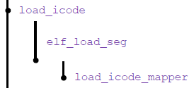
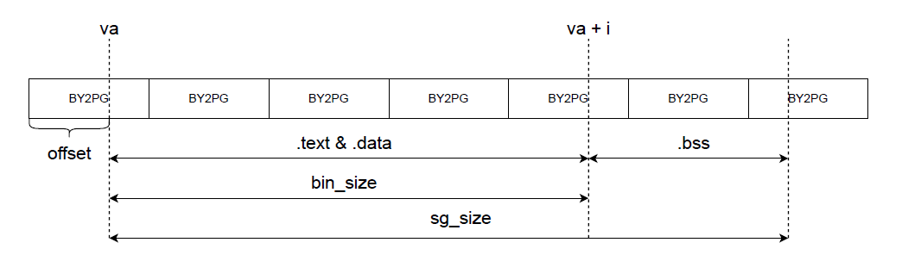
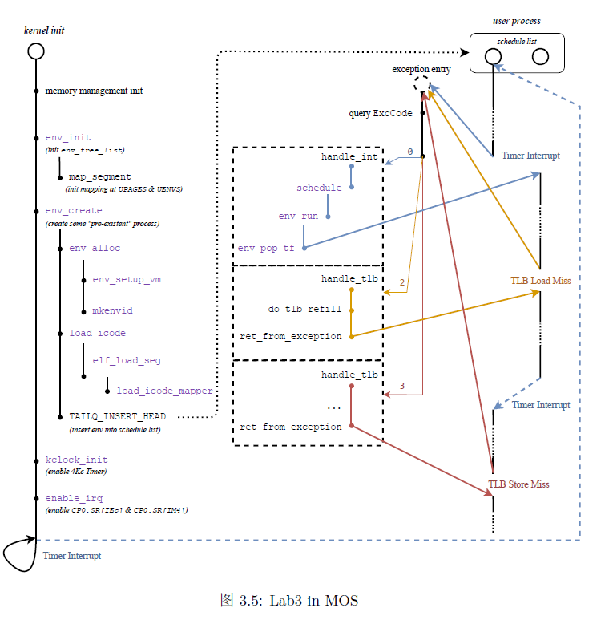

# lab 3 实验报告

>### 班级：**222115**
>
>### 学号：22373386
>
>### 姓名：高铭

---

## 一、思考题 (Thinking)

### Thinking 3.1

> 结合MOS 中的页目录自映射应用，解释代码中`e->env_pgdir[PDX(UVPT)] = PADDR(e->env_pgdir) | PTE_V` 的含义。

- `UVPT`（User Virtual Page Table）：**用户页表的虚拟基地址**，就是`PD_base`
- `PDX(UVPT)`：UVPT所在的**页目录号（**即UVPT >> 22）
- `e->env_pgdir`：进程e的**页目录**的**虚拟基地址**
- `e->env_pgdir[PDX(UVPT)]`：进程页目录中映射到自身的表项：`PD_base+(PD_base>>22)*4`
- `PADDR(e->env_pgdir) | PTE_V`：进程e的**页目录**的**物理地址**再加上**权限位**`PTE_V`

指导书*MOS 中的页目录自映射应用*中提到，在MOS 中，将页表和页目录映射到了用户空间中的 0x7fc00000-0x80000000（共 4MB）区域，这意味着 MOS 中允许在用户态下通过 UVPT 访问当前进程的页表和页目录。

这条语句便实现了页表自映射，将**进程页目录的起始物理地址映射到对应的页目录项**。


### Thinking 3.2

> `elf_load_seg` 以函数指针的形式，接受外部自定义的回调函数`map_page`。请你找到与之相关的`data `这一参数在此处的来源，并思考它的作用。没有这个参数可不可以？为什么？



与`elf_load_seg` 和`data`相关的三个函数的调用关系如上图，定义如下：

```c
static void load_icode(struct Env *e, const void *binary, size_t size);
int elf_load_seg(Elf32_Phdr *ph, const void *bin, elf_mapper_t map_page, void *data);
static int load_icode_mapper(void *data, u_long va, size_t offset, u_int perm, const void *src, size_t len);
```

在`load_icode`中，对`elf_load_seg` 的调用方式为：

`panic_on(elf_load_seg(ph, binary + ph->p_offset, load_icode_mapper, e));`

可见`data`就是进程控制块的指针`e`。****

不能没有这个参数，因为尽管在`elf_load_seg`中并不需要显式使用`e`，但在回调函数`load_icode_mapper`中，需要利用`struct Env *env = (struct Env *)data`进行转换，给指定的进程`env`分配所需的物理页面，并在页表中建立映射。


### Thinking 3.3

> 结合`elf_load_seg`的参数和实现，考虑该函数需要处理哪些页面加载的情况。



共三次用到了`map_page`函数（有三种需要加载页面的情况）：

1. 如果虚拟地址`va`没有按页对齐，需要把未对齐的那个页面剩下的所有`bin`数据加载到内存。记偏移量`offset = va - ROUNDDOWN(va, PAGE_SIZE)`，若`bin_size < PAGE_SIZE - offset`，则仅加载这`bin_size`大小，否则加载直至`PAGE_SIZE - offset`地址处（按页对齐）
2. 通过循环依次将段内页写入物理空间并建立映射，在最后一页中，`bin`文件大小小于一个页面，只写入`bin_size - i`字节。
3. 最后，如果文件`bin_size<sgsize`，要把空间用0填满。


### Thinking 3.4

> 这里的`env_tf.cp0_epc`字段指示了进程恢复运行时 PC 应恢复到的位置。我们要运行的进程的代码段预先被载入到了内存中，且程序入口为`e_entry`，当我们运行进程时，CPU 将自动从 PC 所指的位置开始执行二进制码。
>
> 思考上面这一段话，并根据自己在_Lab2_中的理解，回答：
>
> - 你认为这里的`env_tf.cp0_epc`存储的是物理地址还是虚拟地址?

- `env_tf.cp0_epc`存储的是**虚拟地址**。

- `env_tf.cp0_epc`字段指示了进程恢复运行时 PC 应恢复到的位置，EPC寄存器（Exception Program Counter）存储的是发生异常时的指令的PC地址，而根据lab2，CPU所读取的PC地址均应为虚拟地址。

- 此外，由`include/elf.h`中`e_entry`的定义也可知道`env_tf.cp0_epc`存储的是虚拟地址：

  ```c
  Elf32_Addr e_entry;  /* Entry point virtual address */
  ```

  

### Thinking 3.5

> 试找出0、1、2、3 号异常处理函数的具体实现位置。8 号异常（系统调用）涉及的`do_syscall()` 函数将在 _Lab4_ 中实现。

- 0号异常（`handle_int`）：表示中断，由时钟中断、控制台中断等中断造成

  - 在`kern/genex.S`中实现

  ```assembly
  NESTED(handle_int, TF_SIZE, zero)
          mfc0    t0, CP0_CAUSE
          mfc0    t2, CP0_STATUS
          and     t0, t2
          andi    t1, t0, STATUS_IM7
          bnez    t1, timer_irq
  timer_irq:
          li      a0, 0
          j       schedule
  END(handle_int)
  ```

- 1 号异常（`handle_mod`）：表示存储异常，进行存储操作时该页被标记为只读

- 2 号异常（`handle_tlb`）：表示TLB load 异常

- 3 号异常（`handle_tlb`）：表示TLB store 异常

  上述三个异常在`kern/genex.S`中，使用了`BUILD_HANDLER`宏函数，实现如下：

  ```assembly
  .macro BUILD_HANDLER exception handler
  NESTED(handle_\exception, TF_SIZE + 8, zero)
          move    a0, sp
          addiu   sp, sp, -8
          jal     \handler
          addiu   sp, sp, 8
          j       ret_from_exception
  END(handle_\exception)
  .endm
  ```

  这个宏的对给定`exception`构建了一段汇编语句，调用并返回对应的`handler`函数（`handler_mod`和`handler_tlb`），随后跳转到`ret_from_exception`恢复现场：

  ```assembly
  FEXPORT(ret_from_exception)
          RESTORE_ALL
          eret
  ```

  对1号和2、3号异常，有如下使用：

  ```assembly
  BUILD_HANDLER tlb do_tlb_refill		# 2、3号异常
  #if !defined(LAB) || LAB >= 4
  BUILD_HANDLER mod do_tlb_mod		# 1号异常
  BUILD_HANDLER sys do_syscall
  #endif
  BUILD_HANDLER reserved do_reserved
  ```

  可以看出，2、3号异常的`handler`为`do_tlb_refill`，1号异常的`handler`为`do_tlb_mod`

  

### Thinking 3.6

> 阅读`entry.S`、`genex.S`和`env_asm.S`这几个文件，并尝试说出时钟中断在哪些时候开启，在哪些时候关闭

`entry.S`中，时钟中断在**异常分发后需要关闭**（line 9）

```assembly
.section .text.tlb_miss_entry
tlb_miss_entry:
        j       exc_gen_entry

.section .text.exc_gen_entry
exc_gen_entry:
        SAVE_ALL
        mfc0    t0, CP0_STATUS
        and     t0, t0, ~(STATUS_UM | STATUS_EXL | STATUS_IE)
        # 保持处理器处于内核态(UM==0)，关闭中断，允许嵌套异常
        mtc0    t0, CP0_STATUS
		/* Exercise 3.9: Your code here. */
        mfc0    t0, CP0_CAUSE
        andi    t0, 0x7c        # 取得Cause的2~6位，即对应的异
        lw      t0, exception_handlers(t0)
        # 在数组中找到对应中断处理函数,存入t0
        jr      t0
```

`genex.S`的`handle_int`中，如果判断为时钟中断且开启，则调用`schedule`函数，进行进程调度，并调用`env_run`来运行进程。即时钟中断要**在进程调度时开启**。

```assembly
NESTED(handle_int, TF_SIZE, zero)
        mfc0    t0, CP0_CAUSE
        mfc0    t2, CP0_STATUS		# 时钟中断是否开启
        and     t0, t2
        andi    t1, t0, STATUS_IM7	# 是否为时钟中断
        bnez    t1, timer_irq
timer_irq:
        li      a0, 0
        j       schedule
END(handle_int)
```

`env_asm.S`中，`env_pop_tf`调用了宏`RESET_KCLOCK`，随后又在宏`RESTORE_ALL` 中恢复了`Status `寄存器，**开启了中断**。

```assembly
.text
LEAF(env_pop_tf)
.set reorder
.set at
        mtc0    a1, CP0_ENTRYHI
        move    sp, a0
        RESET_KCLOCK          # 开启中断
        j       ret_from_exception
END(env_pop_tf)
```


### Thinking 3.7

> 阅读相关代码，思考操作系统是怎么根据时钟中断切换进程的。

注意到是时钟中断，即0号异常，下面进行模拟：

1. **异常分发**

   出现时钟中断异常，处理器进入异常分发程序，即`kern/entry.S`中的`exc_gen_entry`。

2. **细分中断类型**

   获取`Cause`寄存器中的异常码（此处为0），以之为索引在`exception_handlers `数组（`kern/traps.c`）中找到并跳转到对应的中断处理函数（此处为`handler_int`）

3. **进程调度**

   跳转到`schedule`函数（`kern/sched.c`），执行时间片轮转算法的调度程序。


## 二、难点分析

本次实验的其中一个难点在于处理中断的过程，涉及了很多函数互相调用。lab3中主要涉及了0、1、2、3号异常，4个异常处理函数具体的实现位置在Thinking 3.5中已有所阐述。在完成这个思考题的过程中，我使用grep查找初步定位了实现位置，但起初并没有注意到`BUILD_HANDLER`宏函数，只找到了`handle_int`的实现。在仔细阅读`kern/genex.S`的代码后，搞懂了`handler_mod`和`handler_tlb`的实现方式。

对我来说的另外一个难点是Exercise 3.12。完成`schedule`函数时，我按照注释提示搭出了大致框架，在if语句内进行四个判断操作，在函数末尾进行`count`的自减，然后调用`env_run `函数，继续运行当前进程`curenv`。在if语句内，需要进行多种`TAILQ`链表宏操作，对我来说是个不小的挑战。此外，进行链表宏操作之前还要判断进程块`e`是否为`NULL`，我也用了很长时间的调试才意识到。


## 三、实验体会

lab3的代码填空比lab2简单许多，一些代码甚至只需复制粘贴即可。但这次实验涉及到的码量更大，不同函数之间的调用关系也很复杂，因此完成实验容易，但全面理解整个实验比较困难。



指导书最后一节的Lab3 in MOS图清晰展示了涉及内核初始化、用户进程、异常处理的函数的调用关系和流程。在做完整个实验后把这张图梳理一遍，让我对MOS系统有了更宏观的认识，而且和lab2之前的内容联系了起来。

对于实验逻辑的理解，应当从宏观入手，对于某个实现的函数，要把它放到整个系统宏观看待，搞清楚是谁在什么情况下才会调用这个函数，而这个函数又是通过封装哪些已有代码来实现的。理解这些内容以后，再从函数的具体实现上入手，逐行阅读代码，理清代码逻辑。