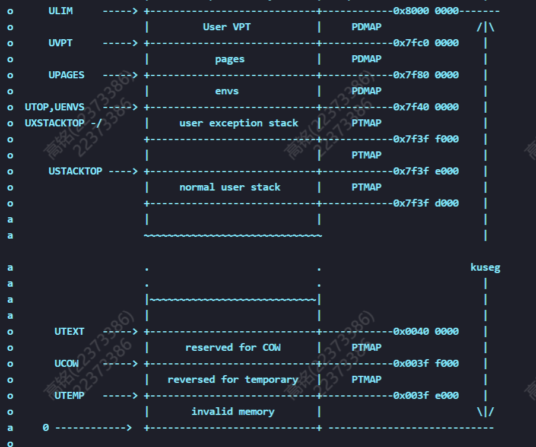
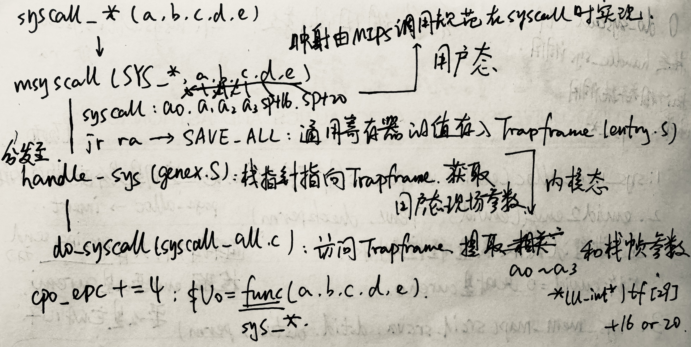
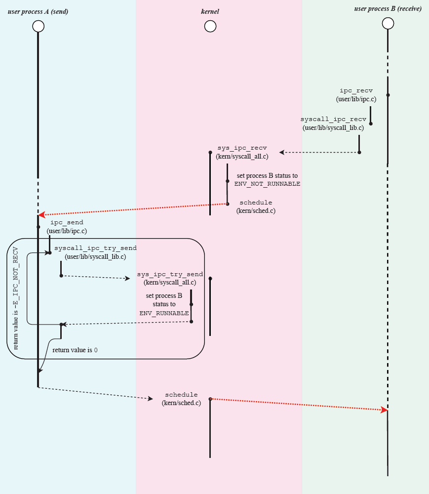
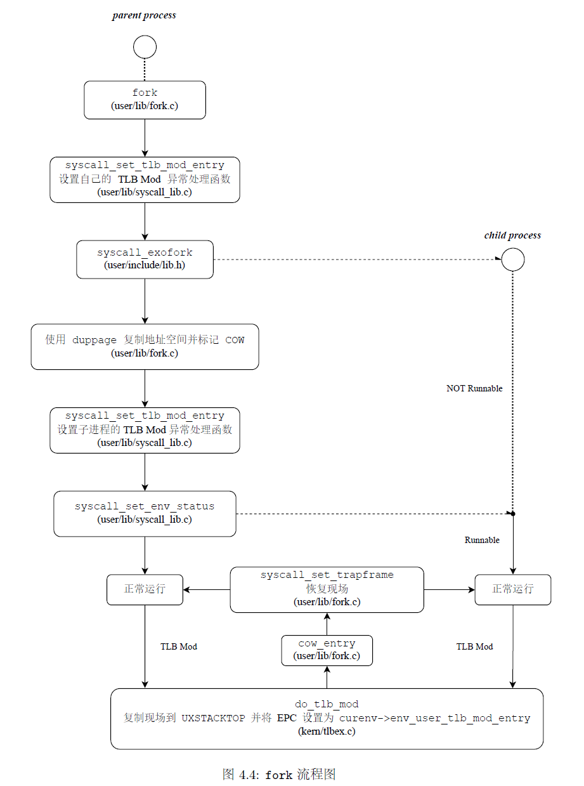
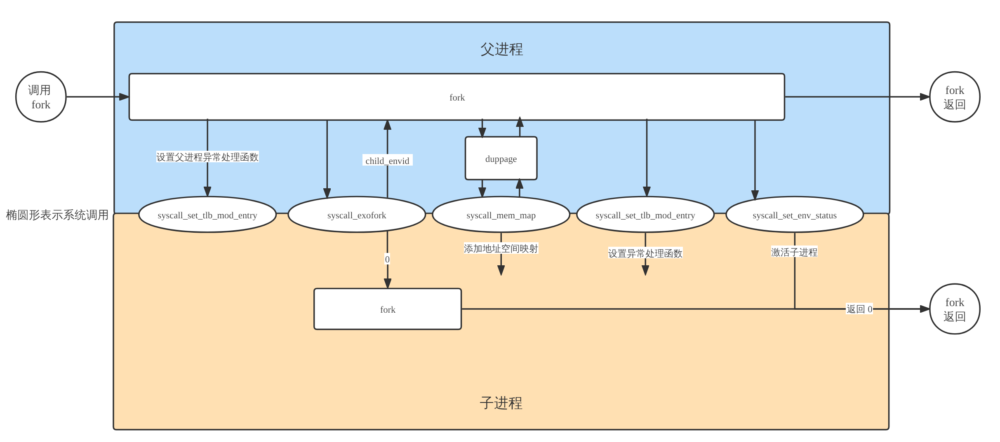

# lab 4 实验报告

---

## 一、思考题 (Thinking)

### Thinking 4.1

> 思考并回答下面的问题：
>
> - 内核在保存现场的时候是如何避免破坏通用寄存器的？
> - 系统陷入内核调用后可以直接从当时的`$a0-$​a3` 参数寄存器中得到用户调用`msyscall`留下的信息吗？
>
> - 我们是怎么做到让`sys`开头的函数“认为”我们提供了和用户调用`msyscall`时同样的参数的？
> - 内核处理系统调用的过程对`Trapframe`做了哪些更改？这种修改对应的用户态的变化是什么？

- 系统从用户态切换到内核态后，内核首先使用`SAVE_ALL`**把用户进程的现场保存到内核空间**，将通用寄存器的值保存在`TrapFrame`中。随后**内核空间的栈指针**`sp`指向保存的`TrapFrame`，得到用户态通用寄存器的值。系统调用结束以后又会重新把这些值放回通用寄存器（`RESTORE_ALL`），**保证了用户态的通用寄存器值不会改变**。

- 可以。因为用户态和内核态共用一套通用寄存器，而`$a0-$a3` 参数寄存器在陷入内核（`syscall_*`到`sys_*`）、保存现场（`SAVE_ALL`）的过程中都没有被破坏。  

- 用户调用`msyscall`时传入对应的`sys`函数调用号以及全部参数，根据MIPS调用规范，前者存入`$a0`寄存器中，后者存入`$a1~$a3`寄存器和栈帧中。在系统调用`do_syscall`中，我们通过`syscall_table`向量选择对应调用号的函数，然后按顺序将`$a1~$a3`寄存器和栈帧存储的参数赋值给`arg1~arg5`，这5个参数和`msyscall`中的参数一样

- `tf->cp0_epc += 4;` 更改了`cp0_epc`寄存器，使得返回用户态时，执行陷入内核指令的下一条指令。

  `tf->regs[2] = func(arg1, arg2, arg3, arg4, arg5);` 更改`$v0`寄存器，存储系统调用函数的返回值。


### Thinking 4.2

> 思考`envid2env`函数: 为什么`envid2env`中需要判断`e->env_id != envid`的情况？如果没有这步判断会发生什么情况？

`ENVX`的宏定义：` #define ENVX(envid) ((envid) & (NENV - 1))`

对于某一之前被调度过、目前在空闲链表中的进程块，轮到它再次被调度的时候会和上次有不同的`envid`。上次已被销毁的进程`envid`和再次调度的进程`envid`经过`ENVX`取低10位能够取得相同的值，对应同一进程控制块，但不是同一进程。`e->env_id != envid`的判断便考虑了这种`envid`属于已被销毁进程的情况。


### Thinking 4.3

> 思考下面的问题，并对这个问题谈谈你的理解：请回顾`kern/env.c`文件中`mkenvid()`函数的实现，该函数不会返回0，请结合系统调用和IPC部分的实现与`envid2env()` 函数的行为进行解释

回忆`mkenvid`的内容，进程编号的生成方法是`((++i) << (1 + LOG2NENV)) | (e - envs)`，这就决定了生成的`envid`永远大于0。MOS中，编号为0的进程块约定为当前进程块，系统调用和IPC均默认了这一设定。`envid2env`中有如下代码：

```c
if(envid == 0) {
        *penv = curenv;
        return 0;
} else {
        e = &envs[ENVX(envid)];
}
```

之所以这样做，是因为`curenv`**是内核态变量**，用户无法直接获取`curenv->env_id`，故用0来表示，方便用户进程调用内核接口时使用当前进程控制块。


### Thinking 4.4

> 关于`fork`函数的两个返回值，下面说法正确的是：
> A、`fork`在父进程中被调用两次，产生两个返回值
> B、`fork`在两个进程中分别被调用一次，产生两个不同的返回值
> C、`fork`只在父进程中被调用了一次，在两个进程中各产生一个返回值
> D、`fork`只在子进程中被调用了一次，在两个进程中各产生一个返回值

说法正确的是C. `fork`只在父进程中被调用了一次，在两个进程中各产生一个返回值


### Thinking 4.5

> 我们并不应该对所有的用户空间页都使用`duppage`进行映射。那么究竟哪些用户空间页应该映射，哪些不应该呢？请结合`kern/env.c`中`env_init`函数进行的页面映射、`include/mmu.h`里的内存布局图以及本章的后续描述进行思考。



我们只需要将`USTACKTOP`以下的页面进行映射即可（`fork`函数中`Step 3: Map all mapped pages below 'USTACKTOP' into the child's address space.`）。

从`USTACKTOP`到`UTOP`之间的内存，invalid memory并不会写入，user exception stack用来处理**页写入异常**，不会在处理COW异常时调用`fork()`，因此不需要共享。

`UTOP`以上至`ULIM`的内存，User VPT以上的部分是用户页表；`UENVS`和`UPAGES`以上的内存与页表是内核相关页表，**用户进程无权写入，且所有进程共享**，无需使用`duppage`进行父子进程间的映射。

因此`USTACKTOP`以上的页面均无需映射。


### Thinking 4.6

> 在遍历地址空间存取页表项时你需要使用到`vpd`和`vpt`这两个指针，请参考`user/include/lib.h`中的相关定义，思考并回答这几个问题：
>
> - `vpt`和`vpd`的作用是什么？怎样使用它们？
> - 从实现的角度谈一下为什么进程能够通过这种方式来存取自身的页表？
> - 它们是如何体现自映射设计的？
> - 进程能够通过这种方式来修改自己的页表项吗？

- ```c
  #define vpt ((volatile Pte *)UVPT)
  #define vpd ((volatile Pde *)(UVPT + (PDX(UVPT) << PGSHIFT)))
  ```

  `vpt`**指向了**用户页表基地址，`vpd`**指向了**用户页目录基地址。`vpt`加上页表偏移即为页表项，`vpd`加上页目录偏移即为页目录项。给定`vpn`（`va`的高20位），页表项就是`vpt[vpn]`，页目录项就是`vpd[vpn>>10]`。

- `vpt`指向了`UVPT`，这里就是用户地址空间的页表基地址。通过自映射运算，`(UVPT + (PDX(UVPT) << PGSHIFT))`就是页目录基地址。

- 页目录自映射`PD_base = PT_base + offset`，页目录基地址的偏移就是`PDX(UVPT)`。可知`vpd`的设置满足了自映射的设计。

- 不能。进程页表在用户态是只读的，**只能通过系统调用进行修改**。


### Thinking 4.7

> 在`do_tlb_mod`函数中，你可能注意到了一个向异常处理栈复制`Trapframe`运行现场的过程，请思考并回答这几个问题：
>
> - 这里实现了一个支持类似于“异常重入”的机制，而在什么时候会出现这种“异常重入”？
> - 内核为什么需要将异常的现场`Trapframe`复制到用户空间？

- 如果在其他的用户态异常处理函数中出现`tlb_mod`异常，就会发生异常重入，更新异常处理栈。
- 因为根据MOS的微内核设定，页写入异常处理在用户态中进行，而用户态只能访问`USTACKTOP`以下的2GB空间，因此需要通过`tf`保存现场，后续再用`syscall_set_trapframe`恢复事先保存好的现场。


### Thinking 4.8

> 在用户态处理页写入异常，相比于在内核态处理有什么优势？

首先，用户态处理页写入异常可以省去了跳转进入内核态的上下文切换操作，性能开销低。

其次，用户态处理隔离了许多内核态才有的权限，避免改变不必要的内存空间，减少错误发生的可能性。


### Thinking 4.9

> 请思考并回答以下几个问题：
>
> - 为什么需要将`syscall_set_tlb_mod_entry`的调用放置在`syscall_exofork`之前？
> - 如果放置在写时复制保护机制完成之后会有怎样的效果？

- 因为第一次 `syscall_set_tlb_mod_entry` 是针对父进程设置的。子进程在设置成`RUNNABLE` （父进程的最后一条指令）后会从 `syscall_exofork` 逐级调用的 `syscall` 指令之后开始执行。如果在 `syscall_exofork` 之后再 `syscall_set_tlb_mod_entry`，那么子进程也会执行这个系统调用。**但是这样也能正确工作，是因为在子进程 `RUNNABLE` 之前父进程已经设置了子进程的 `tlb_mod_entry`。**

- 父进程运行时在函数调用（如`syscall_set_tlb_mod_entry`）等情形下会修改栈。在栈空间的页面标记为写时复制之后（`duppage`），父进程继续运行并修改栈，就会触发 TLB Mod 异常。所以在写时复制保护机制完成之前就需要 `syscall_set_tlb_mod_entry`，否则子进程修改`tlb_mod_entry`之前的栈内容出错。


## 二、难点分析

本次实验根据两次上机的考点，可分为两个部分。第一部分为系统调用和进程间通信机制（IPC），第二部分为fork机制和写时复制技术。

### 第一部分

该部分中，我认为比较复杂的部分是系统调用的全过程。指导书中的图4.1给出了syscall过程流程图，展示了用户空间到内核空间一系列函数调用的关系，用户态到内核态的转变是由msyscall函数实现的。这张图言简意赅，但一些关键的实现并未展示，因此我花了一张字儿多的图，展示了一些函数的内部实现。



从上至下，从用户态至内核态，传入的5个参数伴随始终，我将其设为abcde。在用户态中，这五个参数分别存入`a1`、`a2`、`a3`寄存器和`sp+16`、`sp+20`栈中，经由`SAVE_ALL`保存进`Trapframe`。随后在内核态中，这五个参数还可以通过访问`Trapframe`来获取，实现了参数从用户态到内核态的传递。至于函数名，我们通过枚举类型，将函数名作为第六个参数传入了`a0`寄存器，也实现了传递。

在IPC部分，指导书给出的流程图（图4.3）已十分详尽，在此将图贴出。



进程B接收消息，进程A发送消息，二者分别需要系统调用`syscall_ipc_recv`和`syscall_ipc_try_send`来实现消息的传递和进程块的设置。值得注意的是，这两个系统调用是由更高一层的`ipc.c`中的函数调用的，指导书中并未详细提及，但lab4-1的上机测试中有所涉及。

```c
void ipc_send(u_int whom, u_int val, const void *srcva, u_int perm) {
        int r;
        while ((r = syscall_ipc_try_send(whom, val, srcva, perm)) == -E_IPC_NOT_RECV) {
                syscall_yield();
        }
        user_assert(r == 0);
}

u_int ipc_recv(u_int *whom, void *dstva, u_int *perm) {
        int r = syscall_ipc_recv(dstva);
        if (r != 0) {
                user_panic("syscall_ipc_recv err: %d", r);
        }
        if (whom) {
                *whom = env->env_ipc_from;
        }
        if (perm) {
                *perm = env->env_ipc_perm;
        }
        return env->env_ipc_value;
}
```

`ipc_send`函数就是通过循环调用`syscall_ipc_try_send`，直至返回正常值才跳出循环，否则用户进程放弃CPU，转而调度其他进程；`ipc_recv`函数也调用了`syscall_ipc_recv`，返回了用户态当前进程的ipc值。

特别地，函数中的`env`定义自`libos.c`，意义是用户态下的当前进程，类似于内核态下的`curenv`。

### 第二部分



该部分的难点在于理解`fork`函数的执行过程。指导书的图4.4给出了流程图，展现了`fork`函数使用的系统调用函数及其顺序。

对我来说，比较难掌握的是`do_tlb_mod`函数和`cow_entry`函数的原理和触发时间。它们是在TLB Mod异常触发后由`kern/entry.S`中的代码分发调用的。`cow_entry`是用户态下处理写时复制的函数，体现了MOS微内核的思想。函数中几次系统调用作用不同：

- ```c
  syscall_mem_alloc(0, (void *)UCOW, perm);
  ```

  - 目的是给当前进程在UCOW处申请一个临时物理页。

- ```c
  memcpy((void *)UCOW, (void *)ROUNDDOWN(va, PAGE_SIZE), PAGE_SIZE);
  ```

  - 将原页面的内容复制到新分配的页面。

- ```c
  syscall_mem_map(0, (void *)UCOW, 0, (void *)va, perm);
  ```

  - 将新分配的页面映射到`va`，替换产生TLB Mod异常的页。

- ```c
  syscall_mem_unmap(0, (void *)UCOW);
  ```

  - 取消当前进程中UCOW与物理页的映射。

经过`syscall_set_trapframe`后，异常处理结束，返回用户态继续正常运行。



除此之外，本次实验中还涉及若干次特殊的恢复。

1. `fork`创建的子进程的第一次启动：

   - 内核复制了父进程`syscall_exofork`时的上下文

     ```c
     e->env_tf = *((struct Trapframe *)KSTACKTOP - 1);	// kern/syscall_all.c
     ```

   - 恢复后，子进程如同调用了`syscall_exofork`，返回0，之后继续运行`fork`的剩余部分

2. 触发TLB Mod异常，实现写时复制过程中的异常恢复：

   - 内核在`do_tlb_mod`中设置了调用`cow_entry`的上下文

     ```c
     tf->cp0_epc = curenv->env_user_tlb_mod_entry;	// kern/tlbex.c
     ```

   - 子进程恢复后，如同调用`cow_entry`函数，实现了在用户态中进行异常处理

3. 用户态完成TLB Mod的处理后：

   - `cow_entry`调用`syscall_set_trapframe`设置上下文触发TLB Mod时的上下文

     ```c
     int r = syscall_set_trapframe(0, tf);		// user/lib/fork.c
     ```

   - 恢复后，从出发写时复制的指令处继续执行


## 三、实验体会

本次实验的内容比较多，系统调用和fork是两个非常重要且内容繁多的部分，我猜想这也是将lab4分两次exam的原因。

在完成系统调用部分的时候，能够清晰地感受到内核态和用户态之间隔着一道看不见摸不着的障壁，而正是系统调用sys_*函数打破了这堵障壁，实现了丰富多样的功能，用户态能进行的操作也增多了不少。

完成fork部分的时候，最明显的感受就是写时复制技术虽然能大大提高效率，但也增加了不少思维量和代码量，哪些功能在内核态的do_tlb_mod处完成，哪些功能在用户态的cow_entry处完成，功能与功能之间的顺序为何 如此排列，脑子里需要有很清晰的框架，我认为这也是这次实验最折磨人的地方。

虽然花了很长时间弄清代码背后的原理，但能较为通透地理解复杂系统背后的运行机制，还是颇为值得的！
