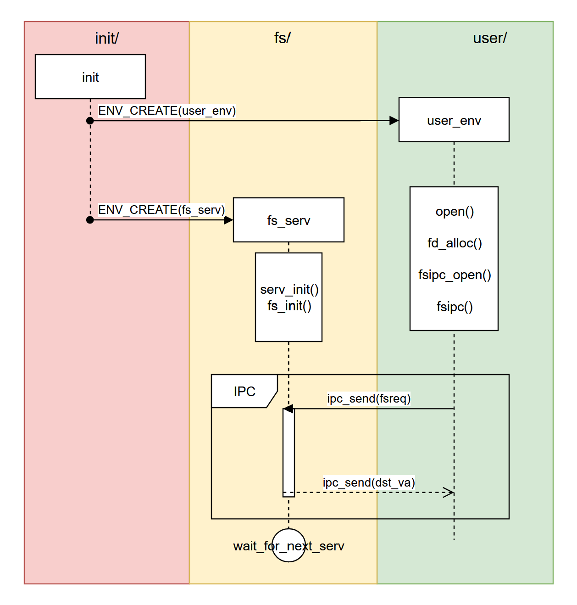
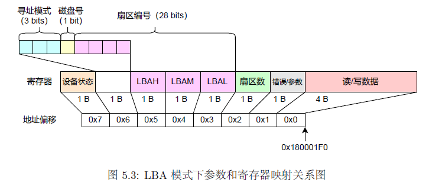
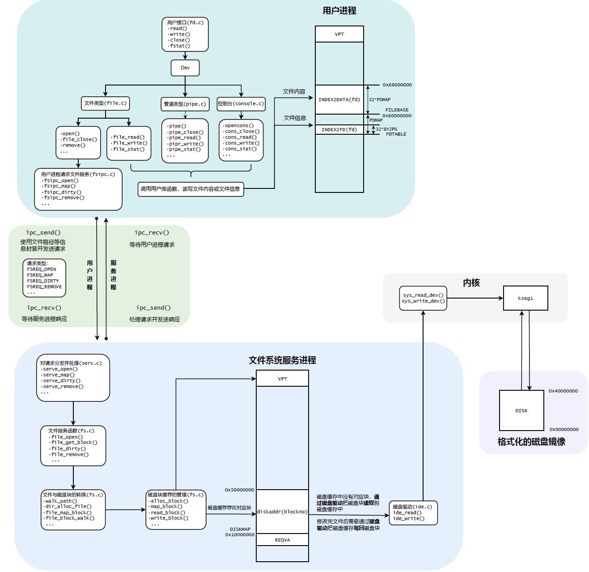

# lab 5 实验报告

>### 班级：**222115**
>
>### 学号：22373386
>
>### 姓名：高铭

---

## 一、思考题 (Thinking)

### Thinking 5.1

> 如果通过`kseg0`读写设备，那么对于设备的写入会缓存到 Cache 中。这是一种**错误**的行为，在实际编写代码的时候这么做会引发不可预知的问题。请思考：这么做这会引发什么问题？对于不同种类的设备（如我们提到的串口设备和 IDE 磁盘）的操作会有差异吗？可以从缓存的性质和缓存更新的策略来考虑。

- 对外设通过 kseg0 进行读写时，如果外设对内存进行更新，此时cache中有旧的数据刚完成缓存，由于 cache 只在 CPU 写地址或没有相关地址的缓存时才更新，会造成刚完成缓存的部分无法更新到内存，产生错误。
- 有差异。串口设备读写比 IDE 磁盘更频繁，而且 IDE 不主动修改内存内容，使得串口发生错误的概率比IDE高。


### Thinking 5.2

> 查找代码中的相关定义，试回答一个磁盘块中最多能存储多少个文件控制块？一个目录下最多能有多少个文件？我们的文件系统支持的单个文件最大为多大？

```c
#define BLOCK_SIZE PAGE_SIZE
#define PAGE_SIZE 4096
#define FILE_STRUCT_SIZE 256
#define NINDIRECT (BLOCK_SIZE / 4)
```

- 一个磁盘块大小`BLOCK_SIZE`为 4KB，一个文件控制块大小`FILE_STRUCT_SIZE`为 256B，故一个磁盘块中只多有 4K/256=16 个文件控制块
- 一个目录最多指向`NINDIRECT`（1024）个磁盘块，每个磁盘块最多存储 16 个文件控制块，故一个目录最多能有 1024*16=16384 个文件。
- 一个文件最多有 1024 个磁盘块，每个磁盘块大小为 4KB，故单个文件最大为 1024*4KB=4MB。


### Thinking 5.3

> 请思考，在满足磁盘块缓存的设计的前提下，我们实验使用的内核支持的最大磁盘大小是多少？

在 fs/serv.h 中规定：`#define DISKMAX 0x40000000`，这是虚存地址空间中缓冲区的最大容量，因此内核支持最大磁盘的大小是 2^30=1GB.


### Thinking 5.4

> 在本实验中，`fs/serv.h`、`user/include/fs.h`等文件中出现了许多宏定义，试列举你认为较为重要的宏定义，同时进行解释，并描述其主要应用之处。

- fs/serv.h

  ```c
  #define PTE_DIRTY 0x0004 // file system block cache is dirty
  #define SECT_SIZE 512                     /* Bytes per disk sector */
  #define SECT2BLK (BLOCK_SIZE / SECT_SIZE) /* sectors to a block */
  #define DISKMAP 0x10000000
  #define DISKMAX 0x40000000
  ```

  `PTE_DIRTY`：页面修改位，主要用于写回修改的磁盘镜像，在 fs.c 的`va_is_dirty`和`dirty_block`中有使用。

  `DISKMAP`表示磁盘镜像缓存的起始地址，`DISKMAX`表示磁盘缓存的最大大小，在 fs.c 中的`disk_addr()`中有使用。

  `SECT2BLK`用来表示一个磁盘块中有多少扇区数，实际值为 4096/512=8，在`write_block`和`read_block`中有所使用

- user/include/fs.h

  ```c
  #define BLOCK_SIZE PAGE_SIZE
  #define BLOCK_SIZE_BIT (BLOCK_SIZE * 8)
  #define MAXNAMELEN 128
  #define MAXPATHLEN 1024
  #define FILE2BLK (BLOCK_SIZE / sizeof(struct File))
  ```

  `BLOCK_SIZE`和`BLOCK_SIZE_BIT`分别以字节和位为单位描述了⼀个磁盘块的大小，而后者在 tools/fsformat.c 中用于位图操作，主要在`init_disk()`函数中使用。

  `MAXNAMELEN`是`f_name`的最长长度，`MAXPATHLEN`是请求路径的最长长度。

  `FILE2BLK`用来表示一个磁盘块中有多少文件，在`for`循环遍历磁盘块中的文件块时能用到。


### Thinking 5.5

> 在 Lab4 “系统调用与`fork`” 的实验中我们实现了极为重要的`fork`函数。那么`fork`前后的父子进程是否会共享文件描述符和定位指针呢？请在完成上述练习的基础上编写一个程序进行验证。

`fork`前后的父子进程**会**共享文件描述符和定位指针。

```c
#include <lib.h> 
int main()
{
	int fd; 
	int envid = fork();
	fd = open("/test", O_RDWR);
	debugf("envid = %d, fd = %d\n", envid, fd); 
}
```

运行结果为如下：

```
envid = 6146, fd = 0
envid = 0, fd = 0
```

从结果可看出，父子进程拥有相同的 file descriptor，而且文件描述符和该返回值一一对应，因此fork前后父子进程会共享文件描述符，该结构体的成员变量`fd_offset`自然也一一对应。


### Thinking 5.6

> 请解释`File`、 `Fd`、 `Filefd`结构体及其各个域的作用。比如各个结构体会在哪些过程中被使用，是否对应磁盘上的物理实体还是单纯的内存数据等。说明形式自定，要求简洁明了，可大致勾勒出文件系统数据结构与物理实体的对应关系与设计框架。

`File`是文件控制块：

```c
struct File {
        char f_name[MAXNAMELEN]; 	// 文件名，最大长度128
        uint32_t f_size;         	// 文件大小，以字节为单位
        uint32_t f_type;         	// 文件类型：普通文件为FTYPE_REG，目录为FTYPE_DIR
        uint32_t f_direct[NDIRECT];	// 文件直接指针，记录文件数据块在磁盘上的位置，最多为10个
        uint32_t f_indirect;		// 文件间接指针，存储指向文件内容的磁盘块的指针

        struct File *f_dir;			// 指向文件的目录
        char f_pad[FILE_STRUCT_SIZE - MAXNAMELEN - (3 + NDIRECT) * 4 - sizeof(void *)];
    	// 为了使文件结构体达到FILE_STRUCT_SIZE（256字节），填充剩余字节
} __attribute__((aligned(4), packed));
```

`Fd`是文件描述符

```c
struct Fd {
        u_int fd_dev_id;	// 外设id。不同dev_id会调用不同的文件服务函数
        u_int fd_offset;	// 读写偏移量，在seek()时会被修改
        u_int fd_omode;		// 文件打开方式，包括只读、只写、读写
};
```

`FileFd`与`Fd`可以发生强制类型转换

```c
struct Filefd {
        struct Fd f_fd;			// 文件描述符
        u_int f_fileid;			// 文件id
        struct File f_file;		// 对应文件的文件控制块
};
```


### Thinking 5.7

> 图 5.9 中有多种不同形式的箭头，请解释这些不同箭头的差别，并思考我们的操作系统是如何实现对应类型的进程间通信的



红色是操作系统进程，黄色是文件服务进程，绿色是用户进程。

操作系统进程中，`init`执行完毕后，分别指向 fs/ 和 user/ 的代表创建相应进程。随后文件系统开始初始化，用户进程调用`open()`函数，该函数依次调用`fd_alloc()`和`fsipc_open()`函数，后者又调用`fsipc()`函数，进行IPC过程，将请求传输给文件服务进程。这一过程即中间的`ipc_send(fsreq)`。

最后文件服务进程会通过`ipc_send(dst_va)`把用户进程的服务信息传回用户进程，将打开文件的相关信息传入`fd`结构体。


## 二、难点分析

既然 lab5 原本也准备两次上机，那么我猜测这次实验也可以分为两个重难点，一个是IDE磁盘驱动，一个是文件系统结构，二者有递进关系，而且较为独立。在此权且记录我产生较多困惑的地方。

IDE磁盘驱动方面，有关 PIIX4 I/O 关键寄存器映射的内容是较为复杂的。指导书讲的很清楚，也有很多图示供我们参考，这使得`ide_write`只需照葫芦画瓢地实现即可。有关这里边`MALTA_IDE_DATA`宏的理解，助教指导视频也说明了，它并不是一个单纯的虚拟地址，而是一种和磁盘的通信方式，这样就可以理解为什么在`for`循环中进行系统调用`syscall_read_dev`时不对磁盘地址自增了。



在文件系统详细结构的部分，花了我很长时间理解的是`f_indirect`。指导书中说它指向一个间接磁盘块，起初我并没有注意到这句话，一知半解。在复习的过程中，通读tools/fsformat.c中的代码，看到`save_block_link`函数中，有这样一句代码：`((uint32_t *)(disk[f->f_indirect].data))[nblk] = bno;`。回望指导书中的内容，`f->f_indirect`实际上就是文件`f`一系列间接磁盘块（最多1024个）的起始地址，`[nblk]`就是数组`data`的偏移量，存储了第n个磁盘块的编号。


## 三、实验体会

我认为这次实验是OS实验中最难的一次之一，因为文件系统当中涉及的代码实在是太多了，单fs/fs.c文件就有800行代码，而这些代码之间又有错综复杂的调用关系，一环扣一环，若是刨根问底很容易把人绕晕。



但是，好在这次实验对我们的要求似乎并没有那么深入，指导书中5.4和5.5两节并未要求我们掌握太多代码，对于一些功能只是蜻蜓点水一般地带过。尽管如此，我在开始接触lab5的时候还是被指导书开头的文件系统总览图唬住了。一个个白框，一条条函数，一根根箭头，错综复杂。在完成课下实验的时候，我总是会翻回来看这张图，看看自己在实现哪一部分的功能，保持一种大局观。我认为这种大局观对我大有裨益，不把自己陷入一些无关紧要的代码之中，提高效率。

作为最后一次设置考试的实验，我认为这次上机还是比较友善的，这次上机无论是exam还是extra都给出了详细的实现步骤，只需要按步骤写代码，同时注意一些细节就可以了。虽然最后的extra还是没做出来，但还是感谢出题助教的良苦用心，让我的OS上机实验有个能够接受的收尾~